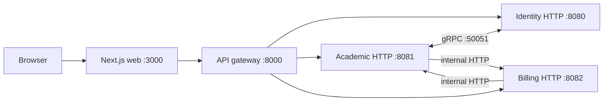

# KelolaKelas current-state documentation

This is an evidence-based onboarding and operations guide for the implementation found on 2026-09-14 (Asia/Jakarta). It describes code as it exists; it is not a design proposal or deployment runbook.

## Scope and snapshot

| Repository | Branch | HEAD | State at inspection |
|---|---|---|---|
| `kelolakelas-web` | `main` | `eafb01bcc2ff355d35d8cdf2d1c01c19d0f81be4` | clean |
| `kelolakelas-api-gateway` | `main` | `c093ae1717c371238ebf132df70520c4c0aaf6e8` | clean |
| `kelolakelas-identity-service` | `main` | `cd3a215e4d53e3079d4190b45ed268ca725d1e14` | clean |
| `kelolakelas-academic-service` | `main` | `d974e46ff6bbebcbdcfbf0ed0643fb3a82908b5c` | clean |
| `kelolakelas-billing-service` | `main` | `33f32202b20d0cafedd2f13fdbaa765341ff92f0` | clean |

**Implemented:** KelolaKelas is a Next.js App Router UI, a Gin reverse-proxy gateway, and separate identity, academic, and billing Go services. The code configures PostgreSQL per stateful service, Redis for gateway rate limiting and identity permission caching, identity gRPC on `:50051`, Duitku payment requests, Resend email, and optional Google Maps geocoding. See [architecture](docs/02-architecture.md).

## Navigation

- [Executive summary](docs/00-executive-summary.md), [system context](docs/01-system-context.md), and [architecture](docs/02-architecture.md)
- [Local development](docs/03-local-development.md), [configuration](docs/04-configuration.md), [security](docs/05-security.md), [testing](docs/06-testing-and-quality.md), and [operations](docs/07-operations.md)
- [Known gaps and risks](docs/08-known-gaps-and-risks.md)
- Components: [web](docs/components/web.md), [gateway](docs/components/api-gateway.md), [identity](docs/components/identity-service.md), [academic](docs/components/academic-service.md), [billing](docs/components/billing-service.md)
- API: [overview](docs/api/overview.md), [endpoint matrix](docs/api/endpoint-matrix.md), [authentication](docs/api/authentication.md), [gateway](docs/api/gateway.md), [identity](docs/api/identity.md), [academic](docs/api/academic.md), [billing](docs/api/billing.md)
- Data and flows: [data overview](docs/data/overview.md), [authentication](docs/flows/authentication.md), [academic](docs/flows/academic.md), [billing](docs/flows/billing-and-subscriptions.md), [callback](docs/flows/payment-callback.md)
- Reference: [repository map](docs/reference/repository-map.md), [dependencies](docs/reference/dependency-matrix.md), [environment](docs/reference/environment-variables.md), [ports](docs/reference/ports-and-protocols.md), [glossary](docs/reference/glossary.md), [evidence index](docs/reference/evidence-index.md)

## Conventions and limitations

**Implemented** means confirmed in executable source. **Configured** means a setting/dependency exists but execution was not established. **Inferred** is a code-supported conclusion. **Not found** means searched but absent. **Unknown** cannot be settled statically.

The review was static: services, migrations, seeders, payment callbacks, email delivery, and external APIs were deliberately not run. Generated Swagger is useful but route registration and handler code win where they disagree. This independent repository has no declared documentation license because none was found in the source repositories.
