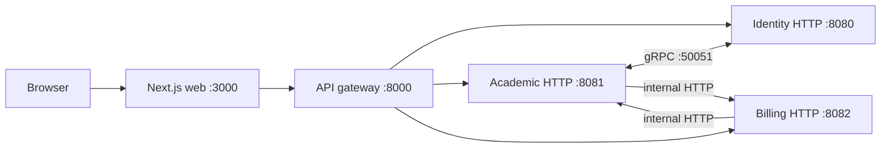

# KelolaKelas current-state documentation

This is an evidence-based onboarding and operations guide for the implementation found on 2026-09-21 (Asia/Jakarta). It describes code as it exists; it is not a design proposal or deployment runbook.

## Scope and snapshot

| Repository | Branch | HEAD | State at inspection |
|---|---|---|---|
| `kelolakelas-web` | `main` | `123e2c76d8796ca4f0381a4835171d62612e251b` | KEL-103 Creator request and platform decision screens (PR #33); PR CI gate passed |
| `kelolakelas-api-gateway` | `main` | `7659e14a50083be8ddeee72ffaa7caa3f373800e` | KEL-103 platform queue proxy (PR #21); PR and post-merge CI gate passed |
| `kelolakelas-identity-service` | `main` | `fd033ccac7649e34f3b0bce85eadd4321dce95f5` | KEL-103 pending cross-tenant Creator queue (PR #24); PR and post-merge CI gate passed |
| `kelolakelas-academic-service` | `main` | `e27fd61737c29ed25a6aa2260c80cdeff9ec2b8b` | KEL-52 ended schedules excluded from catalog/enrollment (PR #22); PR and post-merge CI gate passed |
| `kelolakelas-billing-service` | `main` | `9ee1dc233d08bcefa566fcde97cc62fd90cbdd0e` | KEL-80 merged; `billing:read` checks send the token's `member_id`, a tenant token without a usable `member_id` is 403 (PR #16); PR and post-merge CI gate passed |

**Implemented:** KelolaKelas is a Next.js App Router UI, a Gin reverse-proxy gateway, and separate identity, academic, and billing Go services. The code configures PostgreSQL per stateful service, Redis for gateway rate limiting and identity permission caching, identity gRPC on `:50051`, Duitku payment requests, Resend email, and optional Google Maps geocoding. Parent enrollment now uses the public catalog detail page to select an owned student and schedule before redirecting to the backend-provided checkout URL, and a parent can cancel their own pending enrollment, which withdraws the invoice and returns the seat; the parent enrollment screen exposes that cancellation through a keyboard-accessible in-page confirmation rather than a browser prompt. The gateway strips the client-supplied `X-Tenant-ID` and `X-Internal-Service-Credential` from every inbound request and republishes the tenant header from the verified JWT claim on protected routes. It also bounds every proxied request in time and body size, and answers a downstream timeout with `504`, an unreachable downstream with `502`, and an oversized body with `413`, all as one JSON error envelope. Academic session and schedule mutations resolve the target resource through the caller's tenant in SQL, so a session or schedule owned by another tenant is reported as not found with no data change. The web app can now end the browser session: a logout control in the tenant shell and the parent surfaces deletes the auth and tenant cookies, purges the client cache, and returns the user to `/login`. A tenant can now see the enrollments of its own classes with each row's payment status at `/dashboard/tenant/enrollments`, behind the academic `enrollment:read` permission, with the newest billing transaction joined per row. Role and permission decisions are now tenant-scoped: identity only counts an assignment when the role belongs to the tenant being operated on or is a system role, an invitation is rejected when the role it would grant is neither, and academic sends that tenant on every internal permission check. Academic enforces those permissions on catalog, student, and enrollment operations for tenant-side callers, while parent tokens skip the lookup and remain governed only by the handler's owned-resource rules. Billing can now recover a durable enrollment job that exhausted its retry limit: two internal-credential endpoints list reconciliation rows by status and move permanently failed ones back to pending without waiting for a provider callback, and every reconciliation transition is written to the service log with the transaction and enrollment ids. Invitation creation now reports the email delivery outcome: identity answers 201 with `data.email_sent` and an outcome-specific message, logs delivery failures with the invitation and tenant IDs, and bounds the Resend call with a 10-second timeout, while the members screen mirrors the outcome and keeps the invite form open when the email did not go out. See [architecture](docs/02-architecture.md).

## Navigation

- [Executive summary](docs/00-executive-summary.md), [system context](docs/01-system-context.md), and [architecture](docs/02-architecture.md)
- [Local development](docs/03-local-development.md), [configuration](docs/04-configuration.md), [security](docs/05-security.md), [testing](docs/06-testing-and-quality.md), and [operations](docs/07-operations.md)
- [Known gaps and risks](docs/08-known-gaps-and-risks.md)
- Planning: [AI orchestrator implementation plan](docs/planning/ai-orchestrator-implementation-plan.md)
- Runbooks: [AI orchestrator operations](docs/runbooks/ai-orchestrator-operations.md)
- Components: [web](docs/components/web.md), [gateway](docs/components/api-gateway.md), [identity](docs/components/identity-service.md), [academic](docs/components/academic-service.md), [billing](docs/components/billing-service.md)
- API: [overview](docs/api/overview.md), [endpoint matrix](docs/api/endpoint-matrix.md), [authentication](docs/api/authentication.md), [gateway](docs/api/gateway.md), [identity](docs/api/identity.md), [academic](docs/api/academic.md), [billing](docs/api/billing.md)
- Data and flows: [data overview](docs/data/overview.md), [authentication](docs/flows/authentication.md), [academic](docs/flows/academic.md), [billing](docs/flows/billing-and-subscriptions.md), [callback](docs/flows/payment-callback.md)
- Reference: [repository map](docs/reference/repository-map.md), [dependencies](docs/reference/dependency-matrix.md), [environment](docs/reference/environment-variables.md), [ports](docs/reference/ports-and-protocols.md), [glossary](docs/reference/glossary.md), [evidence index](docs/reference/evidence-index.md)

## Conventions and limitations

**Implemented** means confirmed in executable source. **Configured** means a setting/dependency exists but execution was not established. **Inferred** is a code-supported conclusion. **Not found** means searched but absent. **Unknown** cannot be settled statically.

The review was static: services, migrations, seeders, payment callbacks, email delivery, and external APIs were deliberately not run. Generated Swagger is useful but route registration and handler code win where they disagree. This independent repository has no declared documentation license because none was found in the source repositories.
