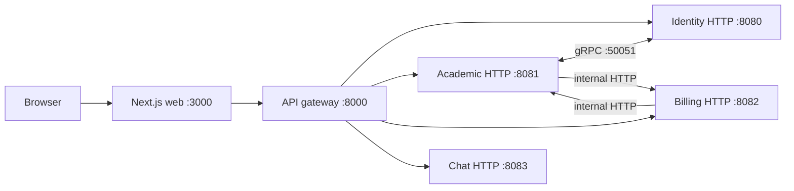

# KelolaKelas current-state documentation

This is an evidence-based onboarding and operations guide for the implementation found on 2026-09-21 (Asia/Jakarta). It describes code as it exists; it is not a design proposal or deployment runbook.

## Scope and snapshot

| Repository | Branch | HEAD | State at inspection |
|---|---|---|---|
| `kelolakelas-web` | `main` | `5ca96f5d74bdf8ea587694fe3afea10f9f0ade1e` | KEL-138 session contract correction (PR #72), operator E2E passed; KEL-138 tenant session reschedule and substitute tutor (PR #71); PR gate passed; KEL-164 platform withdrawal decision history (PR #70); PR gate passed; KEL-157 parent inbox system notification rendering (PR #69); PR gate passed; KEL-141 parent progress portal with shared navigation and child-scoped sessions, attendance and reports (PR #68); PR gate passed; KEL-146 platform withdrawal queue and manual decision page (PR #67); PR gate passed; KEL-145 tenant finance dashboard (PR #66); PR gate passed; KEL-151 parent latest transaction and renewal bill (PR #65); PR gate passed; KEL-161 tenant voucher dashboard (PR #64); PR gate passed; KEL-137 tutor session list + mass attendance (PR #63); PR gate passed; KEL-136 role-aware tenant nav filter via own-membership read (PR #62); PR gate passed; KEL-149 label Ditangguhkan untuk enrollment suspended (PR #61); PR gate passed; KEL-114 pointer cursor on clickable elements via @layer base in globals.css (PR #60); PR gate passed; KEL-112 weekly slot generator in ScheduleForm (PR #59); PR gate passed; KEL-130 add-student trigger on every populated class-detail enrollment branch (PR #58); PR and post-merge CI gate passed; KEL-113 class creation form without class-level capacity (PR #57); PR and post-merge CI gate passed; KEL-127 in-page VA/QRIS checkout and card redirect (PR #56); PR `gate` passed; KEL-124 chat entry points from schedule requests and student reports (PR #55); PR `gate` passed; KEL-131 parent enrollment history envelope unwrapping (PR #54); PR `gate` passed; KEL-123 parent/tenant chat inbox and realtime (PR #53); PR `gate` passed |
| `kelolakelas-api-gateway` | `main` | `ffef116afeb18b3f9cfface22b9196888b31b6c0` | KEL-159 public review and protected review write proxies (PR #38); PR and post-merge gate passed; KEL-161 tenant voucher proxy (PR #37); PR and post-merge gate passed; KEL-147 tenant transaction CSV export proxy (PR #36); PR and post-merge gate passed; KEL-144 platform withdrawal queue/decision protected proxies to billing (PR #35); PR and post-merge gate passed; KEL-143 tenant withdrawal request/history/detail/cancel protected proxies to billing (PR #34); PR and post-merge gate passed; KEL-142 wallet/ledger/bank-account protected proxies to billing (PR #33); PR and post-merge gate passed; KEL-136 protected `GET /api/v1/members/me/membership` proxy to identity (PR #32); PR gate passed; KEL-122 REST chat + ticket WebSocket proxies to chat-service (PR #31); PR and post-merge CI gate passed |
| `kelolakelas-identity-service` | `main` | `ac9be487fd6d00ff300f0ccf9d082c94f5320ff4` | KEL-165 member list default joined_at sort, stable pagination and unknown-sort 400 (PR #38); PR and post-merge gate passed; KEL-144 `tenant.PlatformAdminService/CheckActive` live assignment + factor verdict (PR #37); PR and post-merge gate passed; KEL-136 `GET /api/v1/members/me/membership` own role + permissions read (PR #36); PR gate passed; KEL-135 `tenant.MembershipService/CheckActiveMembership` for substitute-tutor validation (PR #35); PR and post-merge CI gate passed; KEL-117 `chat:manage` catalog entry and system Creator grant (migration 000014, default seed, PostgreSQL integration tests; PR #34); PR and post-merge CI gate passed |
| `kelolakelas-academic-service` | `main` | `641311f1c42f349880d988af929e5fe01c33ac5b` | KEL-159 parent class reviews, public review list and catalog rating aggregate (PR #45); PR and post-merge gate passed; KEL-140 parent-scoped session/attendance/report reads with ownership predicate, parent mutations 403 (PR #44); PR and post-merge gate passed; KEL-134 attendance per sesi termasuk reschedule + bulk idempoten (PR #43); PR and post-merge gate passed; KEL-135 session read `schedule:read` guard, `mine=true` from JWT, substitute-tutor active-membership gate, report Update/Delete tutor-assignment guard (PR #42); PR and post-merge gate passed; KEL-149 suspend/resume/end enrollment internal (PR #41); PR and post-merge gate passed; KEL-132 private schedule capacity must be exactly 1 (PR #40); PR and post-merge gate passed; KEL-128 private approval passes verified parent email and private flag (PR #39); KEL-125 optional payment channel for enrollment invoices (PR #38); PR and post-merge gate passed; KEL-118 internal chat contexts for private schedule requests and reports (PR #37); PR and post-merge CI gate passed |
| `kelolakelas-billing-service` | `main` | `1a513ad7c59981d3bb455da776619a4b74f6088d` | KEL-163 platform withdrawal decision history status=decided (PR #34); PR and post-merge gate passed; KEL-150 renewal grace-period suspend/resume reconciliation (PR #33); PR and post-merge gate passed; KEL-161 tenant voucher CRUD (PR #32); PR and post-merge gate passed; KEL-147 tenant transaction paid-date filter + CSV export (PR #31); PR and post-merge gate passed; KEL-144 atomic platform withdrawal paid/rejected decisions with wallet, ledger, and audit evidence (PR #30); PR and post-merge gate passed; KEL-143 atomic tenant withdrawal holds, cancellation ledger release, account snapshot and Rp 50.000 default minimum (PR #29); PR and post-merge gate passed; KEL-142 wallet balance + paged ledger reads (billing:read, parent 403, no-wallet zero) and bank-account CRUD + atomic set-primary (billing:withdraw, masked, single-primary partial index) (PR #28); PR and post-merge gate passed; KEL-128 private invoice email claim, retry worker and migration (PR #27); PR and post-merge gate passed; KEL-126 scoped VA/QR instructions and nullable migration (PR #26); PR and post-merge gate passed; KEL-125 selected invoice channel, replay and expiry preservation (PR #25); PR and post-merge gate passed; KEL-99 new transactions priced from identity's applied platform fee policy with an immutable per-transaction snapshot (migration `20260928000000`), fail-closed 503 and 422 `platform_fee_exceeds_gross` (PR #24); PR and post-merge CI gate passed |
| `kelolakelas-chat-service` | `main` | `db7136962a3fff585fece2992c3025e1f8215296` | KEL-154 internal system notifications `POST /internal/notifications` (idempotent, credential-guarded, parent-only; PR #4); PR and post-merge CI gate passed; KEL-121 ticket-based realtime WebSocket, in-memory single-instance fan-out (PR #3); PR and post-merge CI gate passed; not yet gateway-routed |

**Implemented:** KelolaKelas is a Next.js App Router UI, a Gin reverse-proxy gateway, and separate identity, academic, and billing Go services. The code configures PostgreSQL per stateful service, Redis for gateway rate limiting and identity permission caching, identity gRPC on `:50051`, Duitku payment requests, Resend email, and optional Google Maps geocoding. Group-class parent enrollment now uses the public catalog detail page to select an owned student, schedule and payment method before showing backend VA/QRIS instructions in-page or redirecting card payment to the backend-provided hosted checkout URL, and a parent can cancel their own pending enrollment, which withdraws the invoice and returns the seat; the parent enrollment screen exposes that cancellation through a keyboard-accessible in-page confirmation rather than a browser prompt. The gateway strips the client-supplied `X-Tenant-ID` and `X-Internal-Service-Credential` from every inbound request and republishes the tenant header from the verified JWT claim on protected routes. It also bounds every proxied request in time and body size, and answers a downstream timeout with `504`, an unreachable downstream with `502`, and an oversized body with `413`, all as one JSON error envelope. Academic session and schedule mutations resolve the target resource through the caller's tenant in SQL, so a session or schedule owned by another tenant is reported as not found with no data change. The web app can now end the browser session: a logout control in the tenant shell and the parent surfaces deletes the auth and tenant cookies, purges the client cache, and returns the user to `/login`. A tenant can now see the enrollments of its own classes with each row's payment status at `/dashboard/tenant/enrollments`, behind the academic `enrollment:read` permission, with the newest billing transaction joined per row. Role and permission decisions are now tenant-scoped: identity only counts an assignment when the role belongs to the tenant being operated on or is a system role, an invitation is rejected when the role it would grant is neither, and academic sends that tenant on every internal permission check. Academic enforces those permissions on catalog, student, and enrollment operations for tenant-side callers, while parent tokens skip the lookup and remain governed only by the handler's owned-resource rules. Billing can now recover a durable enrollment job that exhausted its retry limit: two internal-credential endpoints list reconciliation rows by status and move permanently failed ones back to pending without waiting for a provider callback, and every reconciliation transition is written to the service log with the transaction and enrollment ids. Invitation creation now reports the email delivery outcome: identity answers 201 with `data.email_sent` and an outcome-specific message, logs delivery failures with the invitation and tenant IDs, and bounds the Resend call with a 10-second timeout, while the members screen mirrors the outcome and keeps the invite form open when the email did not go out. See [architecture](docs/02-architecture.md).

```mermaid
flowchart LR
  Browser --> Web[Next.js web :3000]
  Web --> Gateway[API gateway :8000]
  Gateway --> Identity[Identity HTTP :8080]
  Gateway --> Academic[Academic HTTP :8081]
  Gateway --> Billing[Billing HTTP :8082]
  Gateway --> Chat[Chat HTTP :8083]
  Academic <-->|gRPC :50051| Identity
  Academic -->|internal HTTP| Billing
  Billing -->|internal HTTP| Academic
```

**Implemented (KEL-119, KEL-120):** chat-service persists staff, private schedule-request and report conversations and text messages with direct authenticated HTTP access, academic context checks on creation, identity permission and tenant-name lookup, and service-owned PostgreSQL. Since KEL-121 it also serves ticket-based realtime WebSocket events (`message.created`, `conversation.read`) fanned out in-memory on a single instance. Since KEL-122 the gateway exposes the chat routes (seven protected REST routes plus the ticket WebSocket upgrade); since KEL-123 parent and tenant web dashboards provide chat inboxes, send/retry, and ticket-based realtime with REST fallback. See [chat component](docs/components/chat-service.md), [API](docs/api/chat.md) and [schema](docs/data/chat-schema.md).

## Navigation

- [Executive summary](docs/00-executive-summary.md), [system context](docs/01-system-context.md), and [architecture](docs/02-architecture.md)
- [Local development](docs/03-local-development.md), [configuration](docs/04-configuration.md), [security](docs/05-security.md), [testing](docs/06-testing-and-quality.md), and [operations](docs/07-operations.md)
- [Known gaps and risks](docs/08-known-gaps-and-risks.md)
- Planning: [AI orchestrator implementation plan](docs/planning/ai-orchestrator-implementation-plan.md), [backlog planning runs](docs/planning/README.md)
- Runbooks: [AI orchestrator operations](docs/runbooks/ai-orchestrator-operations.md)
- Components: [web](docs/components/web.md), [gateway](docs/components/api-gateway.md), [identity](docs/components/identity-service.md), [academic](docs/components/academic-service.md), [billing](docs/components/billing-service.md), [chat](docs/components/chat-service.md)
- API: [overview](docs/api/overview.md), [endpoint matrix](docs/api/endpoint-matrix.md), [authentication](docs/api/authentication.md), [gateway](docs/api/gateway.md), [identity](docs/api/identity.md), [academic](docs/api/academic.md), [billing](docs/api/billing.md), [chat](docs/api/chat.md)
- Data and flows: [data overview](docs/data/overview.md), [chat schema](docs/data/chat-schema.md), [authentication](docs/flows/authentication.md), [academic](docs/flows/academic.md), [billing](docs/flows/billing-and-subscriptions.md), [callback](docs/flows/payment-callback.md)
- Reference: [repository map](docs/reference/repository-map.md), [dependencies](docs/reference/dependency-matrix.md), [environment](docs/reference/environment-variables.md), [ports](docs/reference/ports-and-protocols.md), [glossary](docs/reference/glossary.md), [evidence index](docs/reference/evidence-index.md)

## Conventions and limitations

**Implemented** means confirmed in executable source. **Configured** means a setting/dependency exists but execution was not established. **Inferred** is a code-supported conclusion. **Not found** means searched but absent. **Unknown** cannot be settled statically.

The review was static: services, migrations, seeders, payment callbacks, email delivery, and external APIs were deliberately not run. Generated Swagger is useful but route registration and handler code win where they disagree. This independent repository has no declared documentation license because none was found in the source repositories.
