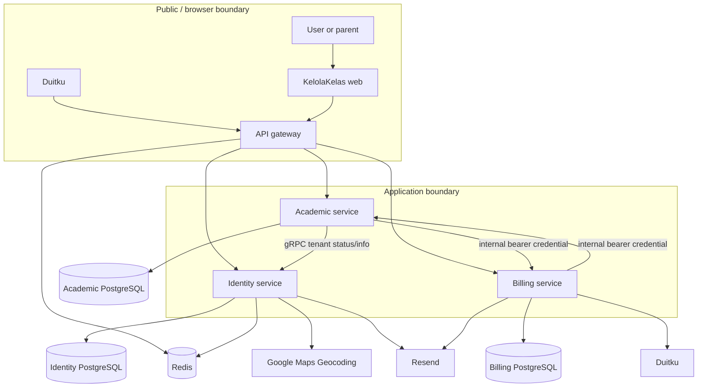

# System context

**Implemented:** direct downstream service access is technically possible because each service listens on an HTTP port and applies its own JWT middleware, while gateway code is a reverse proxy rather than a path transformer (`kelolakelas-api-gateway/internal/delivery/http/handler/proxy_handler.go:39-86`). Network exposure, TLS termination, and ingress controls are **Unknown**.

Trust boundaries are the browser-to-web/gateway edge, public payment callback, inter-service credential-protected HTTP routes, gRPC identity boundary, and third-party provider calls. The academic client explicitly uses insecure gRPC transport credentials (`kelolakelas-academic-service/pkg/grpcclient/tenant_client.go:25-36`) and identity starts `grpc.NewServer()` on all interfaces (`kelolakelas-identity-service/cmd/server/main.go:135-150`).
