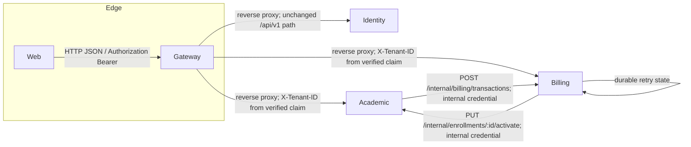

# Architecture

## Containers

| Component | Implementation | Primary responsibility | Evidence |
|---|---|---|---|
| Web | Next.js 16 / React 19 / TypeScript | pages, server actions, cookie-based browser session | `kelolakelas-web/package.json`, `app/**` |
| Gateway | Go / Gin / reverse proxy | route exposure, JWT check, CORS, Redis rate limiting, bounded proxying with one failure envelope | `kelolakelas-api-gateway/cmd/server/main.go`, `internal/delivery/http/router.go`, `internal/delivery/http/handler/proxy_handler.go` |
| Identity | Go / Gin / GORM | users, tenants, membership, roles, invitation/email, gRPC tenant data | `kelolakelas-identity-service/cmd/server/main.go` |
| Academic | Go / Gin / GORM | academic records, public catalog, enrollment lifecycle | `kelolakelas-academic-service/cmd/server/main.go` |
| Billing | Go / Gin / GORM | subscription transactions, Duitku callback, worker | `kelolakelas-billing-service/cmd/server/main.go` |

The gateway strips `X-Tenant-ID` and `X-Internal-Service-Credential` from every inbound request, and republishes `X-Tenant-ID` on protected routes from the verified JWT tenant claim only, so a caller cannot present a tenant or a service credential of its own. No service treats the header as authorization: academic and identity both resolve the tenant from the verified JWT claim only, and billing reads the claim value from the middleware context (see [ADR 0010](adr/0010-tenant-context-from-verified-jwt-claim-only.md) and [ADR 0017](adr/0017-gateway-context-header-trust-boundary.md)).

The gateway also bounds every proxied exchange: a per-request deadline (`PROXY_UPSTREAM_TIMEOUT_SECONDS`) and a request body limit (`PROXY_MAX_BODY_BYTES`), with configured `http.Server` read/write/idle timeouts. A downstream timeout is answered `504`, an unreachable downstream `502`, and an oversized body `413`, all in the shared `{status,message,data}` envelope and without internal detail (see [ADR 0021](adr/0021-bounded-gateway-proxy-and-error-envelope.md)).

**Implemented:** service identity is split by data store; migration foreign keys only refer to tables in the same database. IDs such as `tenant_id` and `parent_id` are application-level UUID references across stores, not database foreign keys. See [data overview](data/overview.md).

**Configured:** all Go services use Viper/godotenv. Explicit defaults are suitable for local development but do not establish a deployment design. See [configuration](04-configuration.md).
