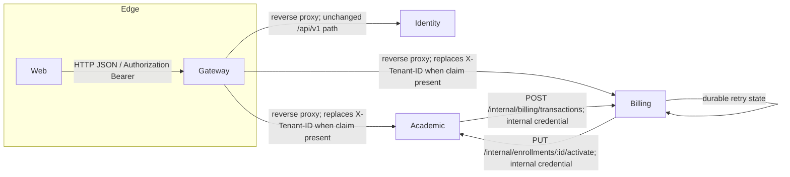

# Architecture

## Containers

| Component | Implementation | Primary responsibility | Evidence |
|---|---|---|---|
| Web | Next.js 16 / React 19 / TypeScript | pages, server actions, cookie-based browser session | `kelolakelas-web/package.json`, `app/**` |
| Gateway | Go / Gin / reverse proxy | route exposure, JWT check, CORS, Redis rate limiting | `kelolakelas-api-gateway/cmd/server/main.go`, `internal/delivery/http/router.go` |
| Identity | Go / Gin / GORM | users, tenants, membership, roles, invitation/email, gRPC tenant data | `kelolakelas-identity-service/cmd/server/main.go` |
| Academic | Go / Gin / GORM | academic records, public catalog, enrollment lifecycle | `kelolakelas-academic-service/cmd/server/main.go` |
| Billing | Go / Gin / GORM | subscription transactions, Duitku callback, worker | `kelolakelas-billing-service/cmd/server/main.go` |

**Implemented:** service identity is split by data store; migration foreign keys only refer to tables in the same database. IDs such as `tenant_id` and `parent_id` are application-level UUID references across stores, not database foreign keys. See [data overview](data/overview.md).

**Configured:** all Go services use Viper/godotenv. Explicit defaults are suitable for local development but do not establish a deployment design. See [configuration](04-configuration.md).
