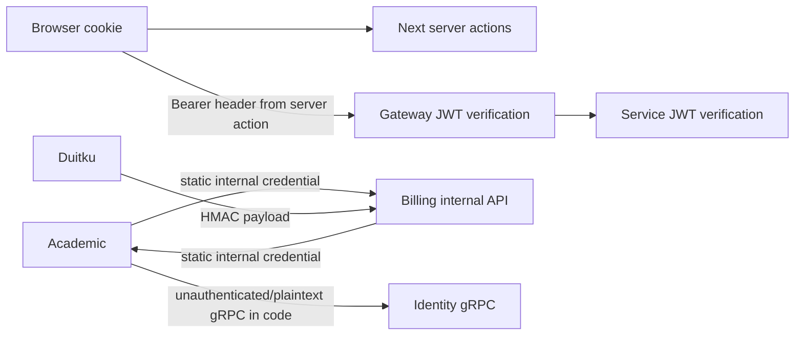

# Security and trust boundaries

## Implemented controls

- HS256 JWTs carry user, email, tenant, role, member, and parent claims; identity sets a 24-hour token lifetime (`kelolakelas-identity-service/pkg/jwt/jwt.go:17-54`, `cmd/server/main.go:61`).
- Gateway and services require `Authorization: Bearer <token>` on their protected route groups. Internal academic/billing routes require a static internal credential middleware (`internal/delivery/http/middleware/auth_middleware.go`).
- Identity rechecks the caller role against persisted role-permission assignments before tenant-administration mutations: invitation creation requires `member:invite`, tenant settings/location require `tenant:update`, and custom-role create/update/delete require `role:create`, `role:update`, and `role:delete`. A valid token without the required role permission receives 403; the existing tenant-ownership and immutable-system-role guards remain in the role use case (`kelolakelas-identity-service/internal/usecase/{invitation,tenant,role}_usecase.go`, `internal/repository/member_repository.go:78-81`).
- Academic checks the current persisted role-permission assignment in identity over the internal `tenant.PermissionService/CheckPermission` gRPC contract before category, class, schedule, and schedule-related session mutations. Missing/denied role permission returns 403; an identity lookup failure returns 503 before the academic handler runs (`kelolakelas-academic-service/internal/delivery/http/middleware/permission_middleware.go`, `kelolakelas-identity-service/internal/delivery/grpc/permission_service.go`).
- Gateway rate limiting uses atomic Redis `INCR` plus TTL; it sets rate-limit headers and returns 429 when exceeded (`kelolakelas-api-gateway/internal/delivery/http/middleware/rate_limit_middleware.go:15-121`).
- Duitku callbacks bind required fields and validate an HMAC before invoking the use case (`kelolakelas-billing-service/internal/delivery/http/handler/transaction_handler.go:220-247`; `pkg/duitku/client.go:96-112`).
- Web server actions store received tokens in HTTP-only, Lax cookies; `secure` is enabled only for `NODE_ENV=production` (`kelolakelas-web/app/(auth)/login/_actions/actions.ts:67-76`).

## Boundary diagram

Important limitations and remediation proposals are separated in [known gaps and risks](08-known-gaps-and-risks.md). Academic catalog mutation authorization is implemented, but authenticated is not equivalent to role-authorized for every operation.
