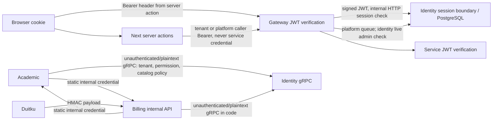

# Security and trust boundaries

## Implemented controls

- HS256 JWTs carry user, email, tenant, role, member, and parent claims; identity sets a 24-hour token lifetime (`kelolakelas-identity-service/pkg/jwt/jwt.go:17-54`, `cmd/server/main.go:61`).
- Gateway and services require `Authorization: Bearer <token>` on their protected route groups. Internal academic/billing routes require a static internal credential middleware (`internal/delivery/http/middleware/auth_middleware.go`).
- The gateway access log deliberately excludes credentials. It logs `URL.Path` rather than the request URI, so the query string — which carries the invitation `?token=…` on the public invitation verification route (`internal/delivery/http/handler/invitation_handler.go:131`) — never reaches the log, and neither the `Authorization` header nor the request body is logged. An inbound `X-Request-ID` is reused only when it is bounded to 64 characters of `a-z A-Z 0-9 - _ .`, so a caller cannot inject newline-separated records into the log stream. See [ADR 0015](adr/0015-gateway-request-correlation-and-access-log.md); `internal/delivery/http/middleware/{request_id,access_log}_middleware.go`.
- Identity rechecks the caller role against persisted role-permission assignments before tenant-administration mutations: invitation creation requires `member:invite`, tenant settings/location require `tenant:update`, and custom-role create/update/delete require `role:create`, `role:update`, and `role:delete`. Every one of those checks now also passes the tenant being operated on, and identity counts an assignment only when the role belongs to that tenant or is a system role (`roles.tenant_id IS NULL`), so a role owned by another tenant cannot satisfy a check. A role id that no longer exists yields no rows and is denied rather than reported as an error, so the caller learns nothing about whether the role still exists. Since KEL-76 the check also requires the token user's active, non-deleted membership in that tenant that still carries the token's role (pinned to the token's `member_id` claim when present), so a removed, deactivated or re-roled member is denied with a still-valid token, and a lookup error is never treated as allowed ([ADR 0034](adr/0034-permission-requires-active-membership.md)). A valid token without the required role permission receives 403; the existing tenant-ownership and immutable-system-role guards remain in the role use case (`kelolakelas-identity-service/internal/usecase/{invitation,tenant,role}_usecase.go`, `internal/repository/member_repository.go`).
- Identity validates the role an invitation would grant. `CreateInvitation` runs the `member:invite` check first and then resolves the requested `role_id`; a role that does not exist, belongs to a different tenant, or is not a system role is rejected with 400 and no invitation row is persisted and no email is sent. System roles seeded with a null tenant stay valid for every tenant (`kelolakelas-identity-service/internal/usecase/invitation_usecase.go`, `internal/delivery/http/handler/invitation_handler.go`).
- Identity guards member role changes (`PUT /api/v1/members/:id/role`, KEL-79). The `member:update` check (KEL-76 active-membership rule) runs first in the use case. `memberRepository.UpdateRole` then runs every remaining guard inside one transaction, before the write, so a rejected request leaves the membership unchanged. In order: the member must belong to the token's tenant (404); a caller may never change their own membership's role (409, matched on the `member_id` claim or, for tokens without it, the user id); the target role must belong to the tenant or be a system role (409); the system Creator role is never granted here (403, KEL-94); and a member whose current role is the system Creator keeps it (403) until a Creator demotion policy is decided. A member on the system Teacher role is no longer frozen and can be moved by any caller holding `member:update` ([ADR 0035](adr/0035-member-role-change-self-and-creator-guards.md); `internal/repository/member_repository.go`, `internal/usecase/member_usecase.go`, `internal/delivery/http/handler/member_handler.go`).
- Academic checks the current persisted role-permission assignment in identity over the internal `tenant.PermissionService/CheckPermission` gRPC contract before category, class, schedule, and schedule-related session mutations, and before the tenant-side student and enrollment operations. Student list/detail require `student:read`, student create/update/delete require `student:create|update|delete`, `POST /api/v1/tenants/:tenant_id/enrollments` requires `enrollment:create`, and enrollment list/detail require `enrollment:read`. The request carries `tenant_id` next to `role_id` and `permission`, and identity applies the same tenant-or-system-role rule, so a role lifted from another tenant cannot authorize an academic mutation. Academic takes the tenant from the same verified JWT claim the rest of the request uses and never from a header, and it refuses a caller whose claim has no usable tenant before consulting identity. Missing/denied role permission returns 403; an identity lookup failure, or a check slower than `IDENTITY_PERMISSION_TIMEOUT_MS` (default 3000, KEL-78), returns 503 before the academic handler runs. The student and enrollment routes are also reachable by parent tokens, which carry ownership instead of a role; those callers skip the check and are decided only by the handler's owned-resource rules, so a parent never triggers an identity lookup on them (`kelolakelas-academic-service/internal/delivery/http/middleware/permission_middleware.go`, `cmd/server/main.go`, `pkg/grpcclient/permission_client.go`, `kelolakelas-identity-service/internal/delivery/grpc/permission_service.go`). See [ADR 0002](adr/0002-academic-permission-enforcement.md) for the transition window: identity answers requests that omit `tenant_id` until `PERMISSION_REQUIRE_TENANT_ID=true` makes the field mandatory, which is what allows identity to be deployed before academic without an outage. Identity also accepts an optional `member_id` (KEL-76) that restricts `allowed` to that active membership with the same tenant and role. Since KEL-80 academic sends the verified token's `member_id` on every check and refuses a tenant caller without a usable (UUID, non-nil) `member_id` with 403 before identity is consulted, so a removed, deactivated or re-roled member's unexpired token is denied ([ADR 0034](adr/0034-permission-requires-active-membership.md)).
- Billing checks `billing:read` over the same `tenant.PermissionService/CheckPermission` contract before the tenant path of `GET /api/v1/billing/transactions` and `GET /api/v1/billing/transactions/:id` (KEL-57). The request carries the JWT `tenant_id`, `role_id` and (since KEL-80) `member_id`; a tenant token without a usable `role_id`, `tenant_id` or `member_id` is refused with 403 before identity is consulted, a denied check is 403 (including a removed, deactivated or re-roled member, whom identity denies through the `member_id` pin of ADR 0034), and an identity error, outage, or a check slower than `IDENTITY_PERMISSION_TIMEOUT_MS` (default 3000) is 503 with no transaction data. Parent tokens keep their `parent_id` scope and never consult identity. The Duitku webhook (HMAC) and the `/internal/billing/*` routes (internal credential) are outside the check. Before this change every active tenant member, including the built-in Teacher role, could read all tenant transactions (see [ADR 0024](adr/0024-billing-read-permission-on-tenant-transaction-reads.md); `kelolakelas-billing-service/cmd/server/routes.go`, `internal/delivery/http/middleware/permission_middleware.go`, `pkg/identity/permission_client.go`).
- Academic tenant scoping is derived only from the verified JWT claim. `tenantIDFromContext` ignores request headers entirely, so an authenticated caller cannot select a tenant its token does not carry; a missing claim is 403 and an unusable claim is 401, and unrecognised tenant errors fail closed. A non-parent enrollment call must also match its claim to the `:tenant_id` path segment, otherwise it receives 403 before any use case runs. The gateway strips `X-Tenant-ID` from every inbound request and republishes it from the verified claim on protected routes, so no caller-supplied tenant value reaches academic at all (see [ADR 0010](adr/0010-tenant-context-from-verified-jwt-claim-only.md) and [ADR 0017](adr/0017-gateway-context-header-trust-boundary.md); `kelolakelas-academic-service/internal/delivery/http/handler/tenant_context.go`).
- Academic session and schedule mutations scope tenant ownership in the SQL itself, not in a check around it. The five operations (reschedule, permanent schedule change, temporary and permanent tutor change, session attendees) resolve their target through `SessionRepository.GetByIDForTenant` / `ClassScheduleRepository.GetByIDForTenant`, which `JOIN classes` and filter on `c.tenant_id = ?`, so a resource owned by another tenant produces no row and is reported exactly like a missing one: 404, no data change, and no student data returned. The three bulk writes (`CancelFutureSessionsBySchedule`, `CancelFutureSessionsByClass`, `UpdateFutureSessionsTutor`) repeat the predicate as `class_id IN (SELECT id FROM classes WHERE tenant_id = ?)` so a statement can never widen across tenants even if a caller resolves the resource incorrectly, and the attendee read filters enrollments on `tenant_id` in the same statement that selects them. A repository failure is not flattened to 404 — only `gorm.ErrRecordNotFound` or a nil result maps to not found, and any other error propagates as a server error. `ChangeTutorTemporary` runs inside `txManager.WithTransaction` like the other four, so its scoped read and its write cannot be interleaved (see [ADR 0019](adr/0019-tenant-scoped-session-and-schedule-mutations.md); `kelolakelas-academic-service/internal/repository/{session,schedule,enrollment}_repository.go`, `internal/usecase/schedule_usecase.go`, `internal/delivery/http/handler/schedule_handler.go`).
- Identity tenant scoping is derived only from the verified JWT claim. Its `tenantIDFromContext` helper ignores request headers entirely, so an authenticated caller cannot select a tenant its token does not carry; a missing claim is 403 and an unusable claim is 401, and unrecognised tenant errors fail closed. Because login issues a nil `tenant_id` for a user without an active membership — which includes every parent — a parent is refused on every tenant-scoped identity route before any use case runs. The gateway strips `X-Tenant-ID` from every inbound request and republishes it from the verified claim on protected routes, so no caller-supplied tenant value reaches identity at all (see [ADR 0010](adr/0010-tenant-context-from-verified-jwt-claim-only.md) and [ADR 0017](adr/0017-gateway-context-header-trust-boundary.md); `kelolakelas-identity-service/internal/delivery/http/handler/tenant_context.go`).
- **Implemented (KEL-66):** identity issues random 256-bit password-reset tokens, persists only their SHA-256 hashes and expiry, and commits password replacement, token consumption and user-specific `session_valid_after` atomically. Gateway's protected routes validate a signed JWT against identity's durable boundary on every request; a revoked token gets 401, and an identity/DB outage gets 503, not a fail-open pass. The identity session-check endpoint is not proxied publicly. Direct academic/billing access remains outside this boundary. See [ADR 0030](adr/0030-password-reset-and-gateway-session-revocation.md); identity `internal/repository/password_reset_repository.go`, gateway `internal/delivery/http/middleware/auth_middleware.go`.
- **Implemented (KEL-103):** the browser's tenant Creator request screen sends only its tenant caller token, while the platform queue and decision screen send only its platform caller token. Scope checks in web are presentation safeguards, not authorization. Gateway protects the new cross-tenant GET queue with `RequirePlatform()`; identity's `RequireActivePlatform` rechecks the active assignment on each request, and existing decision transactions independently recheck it. A revoked admin's stale page cannot authorize a decision. The queue selects only decision fields, no token/hash/member details. See [ADR 0037](adr/0037-creator-request-browser-queue.md); identity `cmd/server/main.go`, gateway `internal/delivery/http/router.go`, web `lib/creator-requests.ts`.
- **Implemented (KEL-98):** gateway `RequirePlatform` and identity's live platform-assignment check both protect catalog-policy admin routes. Academic independently gates public catalog list and detail on identity's effective applied policy before SQL; unavailable or invalid policy gives 503 with no class data, while a closed policy gives empty list/404 detail. This new academic→identity RPC reuses the existing unauthenticated/plaintext gRPC listener, so network restriction remains essential. See [ADR 0036](adr/0036-applied-public-catalog-policy.md); identity `internal/delivery/grpc/catalog_policy_service.go`, academic `internal/usecase/catalog_policy.go`.
- Gateway rate limiting uses atomic Redis `INCR` plus TTL; it sets rate-limit headers and returns 429 when exceeded (`kelolakelas-api-gateway/internal/delivery/http/middleware/rate_limit_middleware.go:15-121`). The key's client IP is the socket address by default. A forwarded header is believed only from peers listed in `TRUSTED_PROXY_CIDRS`, so a caller outside those ranges cannot rotate `X-Forwarded-For` to escape the login limit. A zero-length prefix is refused at startup ([ADR 0025](adr/0025-gateway-client-ip-from-explicit-trusted-proxies.md); `kelolakelas-api-gateway/internal/delivery/http/client_ip_trust_test.go`).
- Duitku callbacks bind required fields and validate an HMAC before invoking the use case (`kelolakelas-billing-service/internal/delivery/http/handler/transaction_handler.go:220-247`; `pkg/duitku/client.go:96-112`).
- Web server actions store received tokens in HTTP-only, Lax cookies; `secure` is enabled only for `NODE_ENV=production` (`kelolakelas-web/app/(auth)/login/_actions/actions.ts:67-76`).

## Boundary diagram

Important limitations and remediation proposals are separated in [known gaps and risks](08-known-gaps-and-risks.md). Academic catalog, student, and enrollment tenant-side authorization is implemented, but authenticated is not equivalent to role-authorized for every operation: attendance and report routes, and the parent-only enrollment routes, are still decided by tenant scoping and ownership rather than by a permission.
