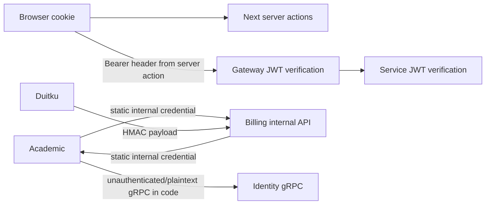

# Security and trust boundaries

## Implemented controls

- HS256 JWTs carry user, email, tenant, role, member, and parent claims; identity sets a 24-hour token lifetime (`kelolakelas-identity-service/pkg/jwt/jwt.go:17-54`, `cmd/server/main.go:61`).
- Gateway and services require `Authorization: Bearer <token>` on their protected route groups. Internal academic/billing routes require a static internal credential middleware (`internal/delivery/http/middleware/auth_middleware.go`).
- The gateway access log deliberately excludes credentials. It logs `URL.Path` rather than the request URI, so the query string — which carries `?invitation_token=…` on the public invitation verification route — never reaches the log, and neither the `Authorization` header nor the request body is logged. An inbound `X-Request-ID` is reused only when it is bounded to 64 characters of `a-z A-Z 0-9 - _ .`, so a caller cannot inject newline-separated records into the log stream. See [ADR 0015](adr/0015-gateway-request-correlation-and-access-log.md); `internal/delivery/http/middleware/{request_id,access_log}_middleware.go`.
- Identity rechecks the caller role against persisted role-permission assignments before tenant-administration mutations: invitation creation requires `member:invite`, tenant settings/location require `tenant:update`, and custom-role create/update/delete require `role:create`, `role:update`, and `role:delete`. A valid token without the required role permission receives 403; the existing tenant-ownership and immutable-system-role guards remain in the role use case (`kelolakelas-identity-service/internal/usecase/{invitation,tenant,role}_usecase.go`, `internal/repository/member_repository.go:78-81`).
- Academic checks the current persisted role-permission assignment in identity over the internal `tenant.PermissionService/CheckPermission` gRPC contract before category, class, schedule, and schedule-related session mutations. Missing/denied role permission returns 403; an identity lookup failure returns 503 before the academic handler runs (`kelolakelas-academic-service/internal/delivery/http/middleware/permission_middleware.go`, `kelolakelas-identity-service/internal/delivery/grpc/permission_service.go`).
- Academic tenant scoping is derived only from the verified JWT claim. `tenantIDFromContext` ignores request headers entirely, so an authenticated caller cannot select a tenant its token does not carry; a missing claim is 403 and an unusable claim is 401, and unrecognised tenant errors fail closed. A non-parent enrollment call must also match its claim to the `:tenant_id` path segment, otherwise it receives 403 before any use case runs. The gateway strips `X-Tenant-ID` from every inbound request and republishes it from the verified claim on protected routes, so no caller-supplied tenant value reaches academic at all (see [ADR 0010](adr/0010-tenant-context-from-verified-jwt-claim-only.md) and [ADR 0017](adr/0017-gateway-context-header-trust-boundary.md); `kelolakelas-academic-service/internal/delivery/http/handler/tenant_context.go`).
- Academic session and schedule mutations scope tenant ownership in the SQL itself, not in a check around it. The five operations (reschedule, permanent schedule change, temporary and permanent tutor change, session attendees) resolve their target through `SessionRepository.GetByIDForTenant` / `ClassScheduleRepository.GetByIDForTenant`, which `JOIN classes` and filter on `c.tenant_id = ?`, so a resource owned by another tenant produces no row and is reported exactly like a missing one: 404, no data change, and no student data returned. The three bulk writes (`CancelFutureSessionsBySchedule`, `CancelFutureSessionsByClass`, `UpdateFutureSessionsTutor`) repeat the predicate as `class_id IN (SELECT id FROM classes WHERE tenant_id = ?)` so a statement can never widen across tenants even if a caller resolves the resource incorrectly, and the attendee read filters enrollments on `tenant_id` in the same statement that selects them. A repository failure is not flattened to 404 — only `gorm.ErrRecordNotFound` or a nil result maps to not found, and any other error propagates as a server error. `ChangeTutorTemporary` runs inside `txManager.WithTransaction` like the other four, so its scoped read and its write cannot be interleaved (see [ADR 0019](adr/0019-tenant-scoped-session-and-schedule-mutations.md); `kelolakelas-academic-service/internal/repository/{session,schedule,enrollment}_repository.go`, `internal/usecase/schedule_usecase.go`, `internal/delivery/http/handler/schedule_handler.go`).
- Identity tenant scoping is derived only from the verified JWT claim. Its `tenantIDFromContext` helper ignores request headers entirely, so an authenticated caller cannot select a tenant its token does not carry; a missing claim is 403 and an unusable claim is 401, and unrecognised tenant errors fail closed. Because login issues a nil `tenant_id` for a user without an active membership — which includes every parent — a parent is refused on every tenant-scoped identity route before any use case runs. The gateway strips `X-Tenant-ID` from every inbound request and republishes it from the verified claim on protected routes, so no caller-supplied tenant value reaches identity at all (see [ADR 0010](adr/0010-tenant-context-from-verified-jwt-claim-only.md) and [ADR 0017](adr/0017-gateway-context-header-trust-boundary.md); `kelolakelas-identity-service/internal/delivery/http/handler/tenant_context.go`).
- Gateway rate limiting uses atomic Redis `INCR` plus TTL; it sets rate-limit headers and returns 429 when exceeded (`kelolakelas-api-gateway/internal/delivery/http/middleware/rate_limit_middleware.go:15-121`).
- Duitku callbacks bind required fields and validate an HMAC before invoking the use case (`kelolakelas-billing-service/internal/delivery/http/handler/transaction_handler.go:220-247`; `pkg/duitku/client.go:96-112`).
- Web server actions store received tokens in HTTP-only, Lax cookies; `secure` is enabled only for `NODE_ENV=production` (`kelolakelas-web/app/(auth)/login/_actions/actions.ts:67-76`).

## Boundary diagram

Important limitations and remediation proposals are separated in [known gaps and risks](08-known-gaps-and-risks.md). Academic catalog mutation authorization is implemented, but authenticated is not equivalent to role-authorized for every operation.
