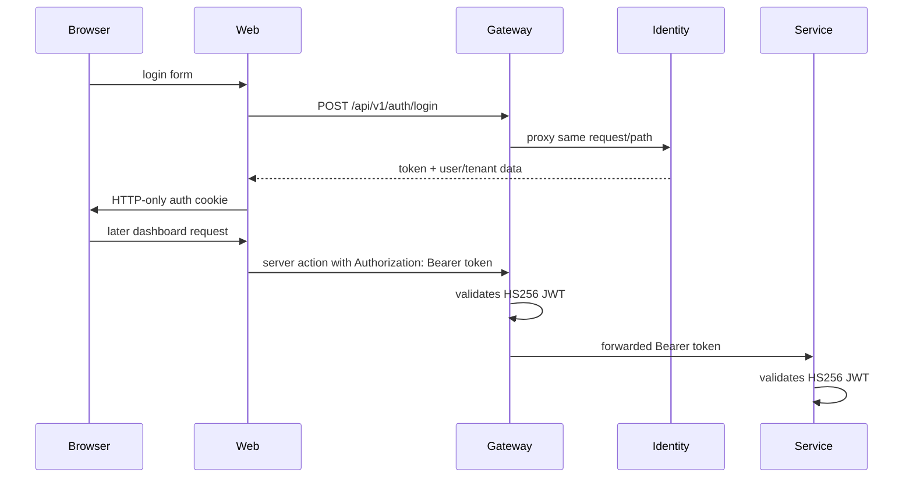

# Authentication and authorization

## Access token

Identity creates HS256 signed JWTs with `user_id`, `email`, optional `tenant_id`, `role_id`, `member_id`, `is_parent`, `iat`, and `exp`. Tokens last 24 hours. Gateway expects uppercase `Bearer`; identity accepts case-insensitive bearer scheme; academic and billing middleware have their own implementations. Evidence: identity `pkg/jwt/jwt.go`, gateway `middleware/auth_middleware.go`, each service `internal/delivery/http/middleware/auth_middleware.go`.

There is no implemented refresh endpoint or logout endpoint. The web proxy checks only cookie existence, not signature/expiry. Identity enforces permission checks for member role mutation and tenant administration: invitation creation requires `member:invite`, tenant settings/location mutation requires `tenant:update`, and custom-role mutation requires `role:create`, `role:update`, or `role:delete`. The service looks up the current persisted role permission at each protected mutation, so a valid token without a `role_id` or the required assignment receives 403. Other HTTP routes may still only require a valid token; this is an observed authorization limitation, not a claim that every resource lacks tenant scoping.

## Internal service credential

Academic `/internal/enrollments/:id/activate` and billing `/internal/billing/transactions` accept a static credential through the internal middleware. The exact header contract is `Authorization: Bearer <INTERNAL_SERVICE_CREDENTIAL>` (`kelolakelas-academic-service/internal/delivery/http/middleware/auth_middleware.go:13-42`, same billing path). It is distinct from the user JWT.
