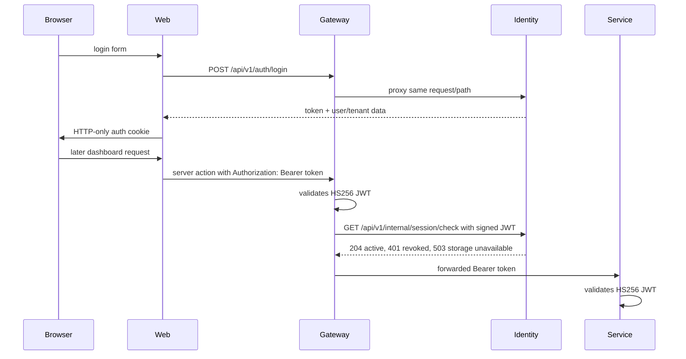

# Authentication and authorization

## Access token

Identity creates HS256 signed JWTs with `user_id`, `email`, optional `tenant_id`, `role_id`, `member_id`, `is_parent`, `iat`, and `exp`. Tokens last 24 hours. Gateway expects uppercase `Bearer`; identity accepts case-insensitive bearer scheme; academic and billing middleware have their own implementations. Evidence: identity `pkg/jwt/jwt.go`, gateway `middleware/auth_middleware.go`, each service `internal/delivery/http/middleware/auth_middleware.go`.

**Implemented (KEL-23):** ordinary login tracks failures per existing account in PostgreSQL, serialized on the user row. After `LOGIN_FAILURE_THRESHOLD` consecutive failures (default 5), the account rejects even the correct password until `LOGIN_LOCKOUT_MINUTES` elapse (default 15). Both lockout and incorrect credentials return the same 401 `Invalid email or password` body. A successful login clears the failure state; an expired lockout resumes with a fresh count. An unknown email performs a dummy bcrypt check before the same 401 response. Store errors return a generic 500; Redis is not required for tracking. Apply identity migration `000010_login_lockout.up.sql` before deploying. See [ADR 0038](../adr/0038-postgres-account-login-lockout.md) and identity [PR #26](https://github.com/kelolakelas/kelolakelas-identity-service/pull/26) (`f04ba1d4ecc452a0324fc74b8f33494f2af8e221`). This does not alter the separate platform-admin login.

There is no implemented refresh or logout endpoint. **Implemented (KEL-66):** `POST /api/v1/auth/password-reset/request` accepts `{ "email": "..." }` and returns the same generic 200 response for registered and unknown email, including delivery failure. `POST /api/v1/auth/password-reset/confirm` accepts `{ "token": "...", "password": "..." }`, returns 200 after atomic consumption and password replacement, and answers 400 `Invalid or expired reset token` for absent, used, rotated, or expired tokens; malformed input is 400. Both routes are public gateway proxies on the sensitive-login quota. Identity generates a 256-bit random token, stores only its SHA-256 hash and expiry, and emails a link under `APP_URL`; `PASSWORD_RESET_TTL_MINUTES` defaults to 60. Every protected gateway request checks the signed JWT against identity's per-user `session_valid_after` boundary: revoked or unknown sessions get 401, and identity/database unavailability gets 503 rather than passing through. The check endpoint is not publicly proxied. Evidence: identity `internal/usecase/auth_usecase.go`, `internal/repository/password_reset_repository.go`, `internal/delivery/http/handler/{auth_handler,session_handler}.go`, `migrations/000006_password_reset.up.sql`; gateway `internal/delivery/http/{router.go,middleware/auth_middleware.go}`; [ADR 0030](../adr/0030-password-reset-and-gateway-session-revocation.md). Direct academic/billing calls remain outside this revocation boundary.

Logout is a web-only operation: the `logoutAction` Server Action deletes the browser's auth and tenant cookies and redirects to `/login`, which is the same destination the proxy already uses for a cookie-less protected request. Because the token is a self-contained JWT with a 24-hour expiry and identity holds no denylist, a token captured before logout stays valid until it expires; see [ADR 0022](../adr/0022-web-logout-ends-browser-session-only.md) and the [authentication flow](../flows/authentication.md#logout). The web proxy checks only cookie existence, not signature/expiry. Identity enforces permission checks for member role mutation and tenant administration: invitation creation requires `member:invite`, tenant settings/location mutation requires `tenant:update`, and custom-role mutation requires `role:create`, `role:update`, or `role:delete`. The service looks up the current persisted role permission at each protected mutation, so a valid token without a `role_id` or the required assignment receives 403. Other HTTP routes may still only require a valid token; this is an observed authorization limitation, not a claim that every resource lacks tenant scoping.

## Internal service credential

Academic `/internal/enrollments/:id/activate` and billing `/internal/billing/transactions` accept a static credential through the internal middleware. The exact header contract is `Authorization: Bearer <INTERNAL_SERVICE_CREDENTIAL>` (`kelolakelas-academic-service/internal/delivery/http/middleware/auth_middleware.go:13-42`, same billing path). It is distinct from the user JWT.
