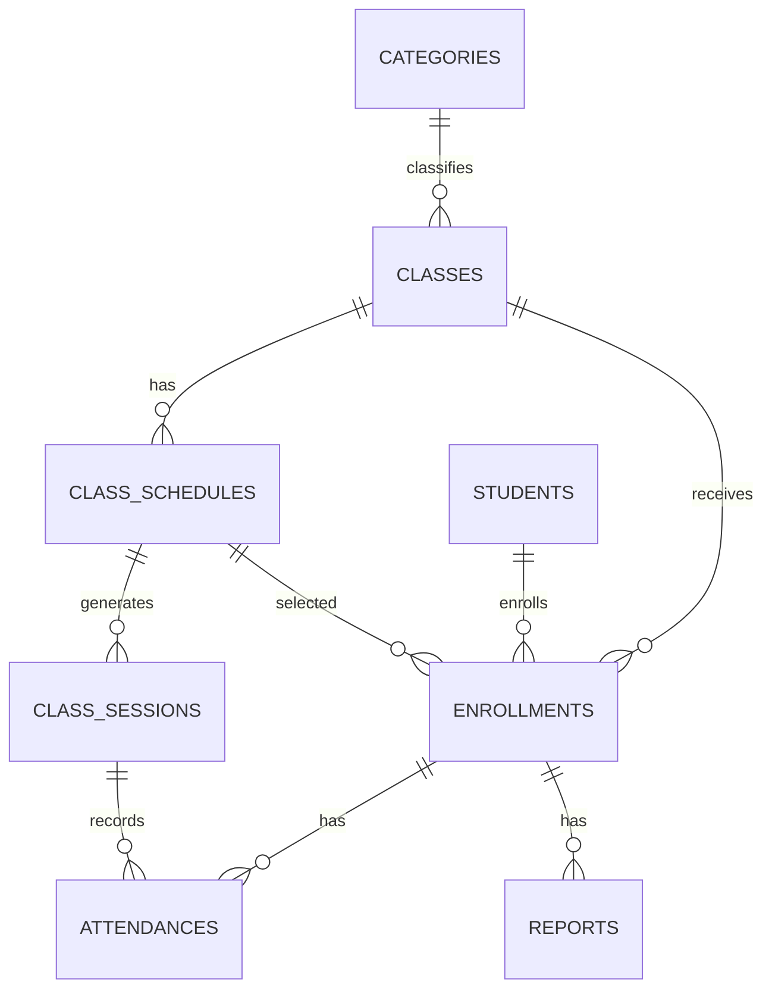

# Academic schema

**Implemented migration authority:** `kelolakelas-academic-service/migrations/00000000000000_init_schema.up.sql` plus migrations `000001`, `000003`, `000004`, and `00001786681222`.

| Table | Current key facts |
|---|---|
| `categories`, `classes` | tenant IDs; class FK to category; soft deletes; catalog composite index |
| `students` | parent ID, personal fields, soft delete |
| `enrollments` | student/class FKs; schedule FK; unique non-null idempotency key; partial unique active/pending student/class |
| `class_schedules`, `class_sessions` | schedule capacity positive; class FK; schedule/session enrolment FKs added conditionally |
| `attendances`, `student_notes`, `reports` | attendance unique `(session_id,enrollment_id)`; reports have enrollment FK and soft delete |
| `tenant_location_snapshots`, `seed_versions` | public-catalog tenant-location cache; seed tracking |

`class_schedules.capacity` is the current write target; `classes.capacity` is retained for compatibility according to migration `000004`. All times were migrated to PostgreSQL `time` in `00001786681222`.
