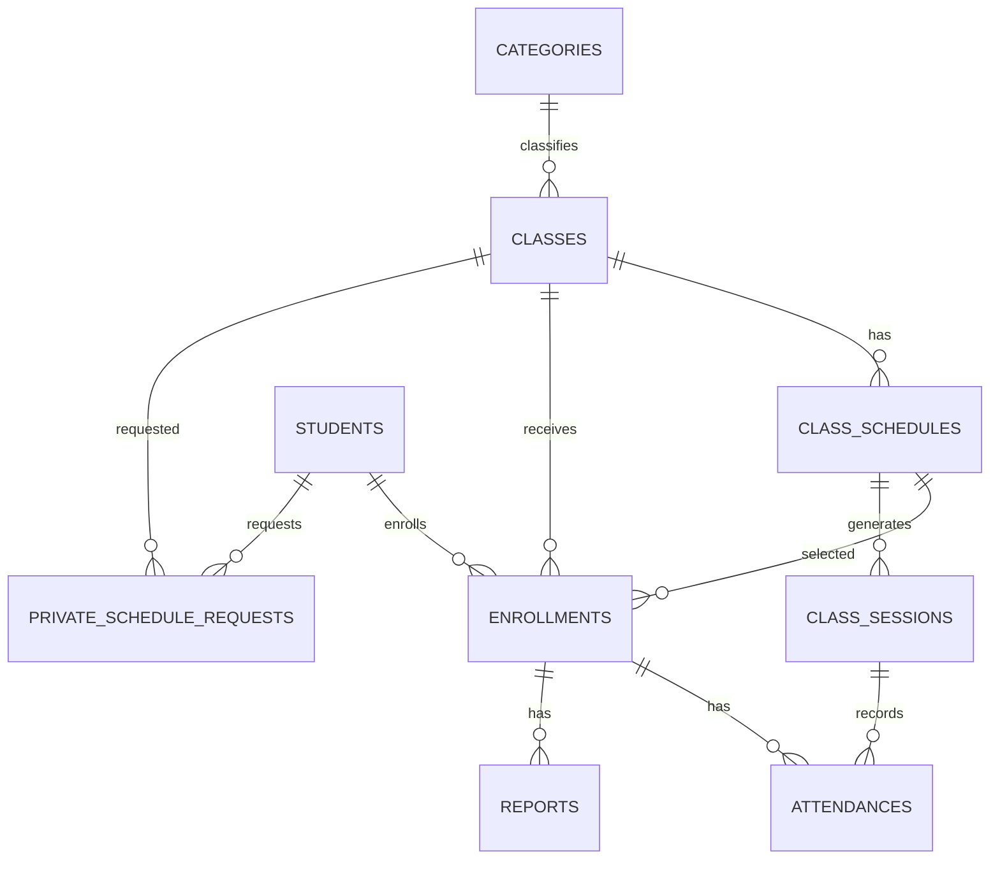

# Academic schema

**Implemented migration authority:** `kelolakelas-academic-service/migrations/00000000000000_init_schema.up.sql` plus subsequent migrations including `00001790600000_private_schedule_requests.up.sql` (KEL-107).

```mermaid
erDiagram
  CATEGORIES ||--o{ CLASSES : classifies
  CLASSES ||--o{ CLASS_SCHEDULES : has
  CLASSES ||--o{ ENROLLMENTS : receives
  STUDENTS ||--o{ ENROLLMENTS : enrolls
  CLASSES ||--o{ PRIVATE_SCHEDULE_REQUESTS : requested
  STUDENTS ||--o{ PRIVATE_SCHEDULE_REQUESTS : requests
  CLASS_SCHEDULES ||--o{ ENROLLMENTS : selected
  CLASS_SCHEDULES ||--o{ CLASS_SESSIONS : generates
  ENROLLMENTS ||--o{ ATTENDANCES : has
  CLASS_SESSIONS ||--o{ ATTENDANCES : records
  ENROLLMENTS ||--o{ REPORTS : has
```

| Table | Current key facts |
|---|---|
| `categories`, `classes` | tenant IDs; class FK to category; soft deletes; catalog composite index |
| `students` | parent ID, personal fields, soft delete |
| `private_schedule_requests` | UUID primary key; tenant, class and student IDs (class/student FKs), parent ID and email, billing cycle, JSONB weekly slots, optional note and rejection reason, status (`pending`, `approved`, `rejected`, `cancelled`), created/decided timestamps. Partial unique index on `(student_id, class_id)` where `status = 'pending'`; tenant/status and parent/created indexes support scoped lists (KEL-107). No enrollment or invoice is created by this table. |
| `enrollments` | student/class FKs; schedule FK; unique non-null idempotency key; partial unique active/pending student/class. Status `dropped` is also what billing-driven seat release writes when a payment fails or expires, which frees the seat because the capacity predicate counts only `pending`/`active` (KEL-26, [ADR 0012](../adr/0012-release-enrollment-seat-on-failed-payment.md)) |
| `class_schedules`, `class_sessions` | schedule capacity positive; class FK; schedule/session enrolment FKs added conditionally. `class_schedules.sessions_generated_until` (DATE, internal) is the last date already generated; partial unique index `uq_class_sessions_schedule_date (schedule_id, session_date) WHERE schedule_id IS NOT NULL` covers soft-deleted/cancelled/rescheduled rows too (migration `00001790492411`, KEL-90, [ADR 0042](../adr/0042-rolling-session-generation-horizon.md)) |
| `attendances`, `student_notes`, `reports` | attendance unique `(session_id,enrollment_id)`; reports have enrollment FK and soft delete |
| `tenant_location_snapshots`, `seed_versions` | public-catalog tenant-location cache; seed tracking |

`class_schedules.capacity` is the current write target; `classes.capacity` is retained for compatibility according to migration `000004`. All times were migrated to PostgreSQL `time` in `00001786681222`.
