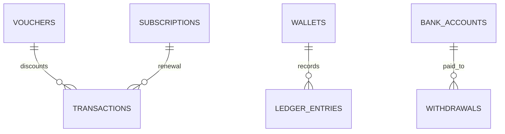

# Billing schema

**Implemented migration authority:** `kelolakelas-billing-service/migrations/00000000000000_init_schema.up.sql` plus migrations `000002` and `000003`.

| Table | Current key facts |
|---|---|
| `vouchers` | unique tenant/code, usage and validity fields, soft delete |
| `wallets`, `bank_accounts`, `ledger_entries`, `withdrawals` | wallet unique tenant; ledger uniqueness for payment event; bank account FK for withdrawal |
| `subscriptions` | unique enrollment ID; renewal migration adds tenant/parent/student/contact/class/amount fields |
| `transactions` | unique merchant order; stores amounts/status/provider/payment URL; unique enrollment index introduced by `000002`, then dropped in `000003` in favor of partial subscription-period uniqueness |
| `seed_versions` | seed tracking |

Foreign keys only connect voucher/subscription/wallet/bank-account tables locally. Enrollment, tenant, parent, and student UUIDs are not cross-database FKs.
