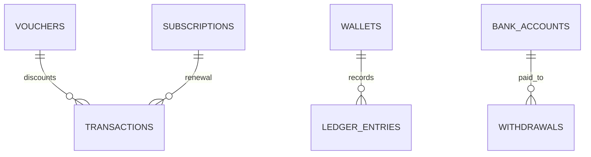

# Billing schema

**Implemented migration authority:** `kelolakelas-billing-service/migrations/00000000000000_init_schema.up.sql` plus migrations `000002_payment_idempotency`, `000003_subscription_renewals`, `20260915000000_payment_reconciliations`, `20260920000000_transaction_invoice_expiry`, `20260921000000_reconciliation_kind`, and `20260922000000_invoice_claim_recovery`.

| Table | Current key facts |
|---|---|
| `vouchers` | unique tenant/code, usage and validity fields, soft delete |
| `wallets`, `bank_accounts`, `ledger_entries`, `withdrawals` | wallet unique tenant; ledger uniqueness for payment event; bank account FK for withdrawal |
| `subscriptions` | unique enrollment ID; renewal migration adds tenant/parent/student/contact/class/amount fields |
| `transactions` | unique merchant order; stores amounts/status/provider/payment URL; unique enrollment index introduced by `000002`, then dropped in `000003` in favor of partial subscription-period uniqueness; `invoice_expires_at` holds the invoice deadline sent to Duitku and `expired_at` records when the local expiry worker moved the row to `expired` (both nullable, retained as evidence when a late payment still succeeds); `invoice_claimed_at` records when a request took exclusive ownership of creating the invoice and `invoice_failure_reason` records why the last attempt failed (both nullable; see the invoice claim recovery note below) |
| `payment_reconciliations` | one durable Academic job per transaction; `kind` is `activation` (confirm a paid seat, the default) or `release` (return the seat of a failed or expired payment, KEL-26); tracks attempts, lease, next retry, latest error, and terminal completion. `status` is one of `pending`, `processing`, `active`, or `terminal_failed`; KEL-29 added an internal endpoint that lists rows by any of those values and one that moves `terminal_failed` rows back to `pending`, so a job that exhausted `PAYMENT_RECONCILIATION_MAX_ATTEMPTS` can be retried without a provider callback |
| `seed_versions` | seed tracking |

Indexes on `transactions`: `idx_transactions_due_expiry` is a partial index on `invoice_expires_at` limited to `status = 'pending'`, which supports the expiry worker's due-row scan. Migration `20260920000000_transaction_invoice_expiry` also backfills `invoice_expires_at = created_at + interval '14 days'` for pre-existing `pending` rows so the worker does not expire them immediately. `idx_transactions_stale_invoice_claim` is a partial index on `invoice_claimed_at` limited to `status = 'creating'`, which supports the stale-claim lookup.

Migration `20260922000000_invoice_claim_recovery` adds `invoice_claimed_at` and `invoice_failure_reason` and creates `idx_transactions_stale_invoice_claim`. It backfills pre-existing `creating` rows with `invoice_claimed_at = updated_at` rather than the current time, deliberately: stamping them with `now()` would make a row whose request is genuinely still in flight immediately reclaimable and duplicate its invoice, while using each row's own age makes a long-stuck row reclaimable at once and lets `TRANSACTION_CLAIM_TIMEOUT_MINUTES` decide for recent ones. The `down` migration drops the index and both columns.

`payment_reconciliations.transaction_id` stays unique, which is what allows a single row to carry either an activation or a release for a transaction: the `kind` column added by `20260921000000_reconciliation_kind` names which action is owed, and `idx_payment_reconciliations_kind_due` covers `(kind, status, next_attempt_at)`. The migration's `DEFAULT 'activation'` gives every pre-existing row its original meaning.

Foreign keys only connect voucher/subscription/wallet/bank-account tables locally. Enrollment, tenant, parent, and student UUIDs are not cross-database FKs.
