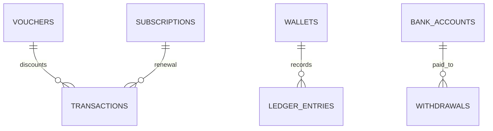

# Billing schema

**Implemented migration authority:** `kelolakelas-billing-service/migrations/00000000000000_init_schema.up.sql` plus migrations `000002_payment_idempotency`, `000003_subscription_renewals`, `20260915000000_payment_reconciliations`, and `20260920000000_transaction_invoice_expiry`.

| Table | Current key facts |
|---|---|
| `vouchers` | unique tenant/code, usage and validity fields, soft delete |
| `wallets`, `bank_accounts`, `ledger_entries`, `withdrawals` | wallet unique tenant; ledger uniqueness for payment event; bank account FK for withdrawal |
| `subscriptions` | unique enrollment ID; renewal migration adds tenant/parent/student/contact/class/amount fields |
| `transactions` | unique merchant order; stores amounts/status/provider/payment URL; unique enrollment index introduced by `000002`, then dropped in `000003` in favor of partial subscription-period uniqueness; `invoice_expires_at` holds the invoice deadline sent to Duitku and `expired_at` records when the local expiry worker moved the row to `expired` (both nullable, retained as evidence when a late payment still succeeds) |
| `payment_reconciliations` | one durable Academic activation job per paid transaction; tracks attempts, lease, next retry, latest error, and terminal completion |
| `seed_versions` | seed tracking |

Indexes on `transactions`: `idx_transactions_due_expiry` is a partial index on `invoice_expires_at` limited to `status = 'pending'`, which supports the expiry worker's due-row scan. Migration `20260920000000_transaction_invoice_expiry` also backfills `invoice_expires_at = created_at + interval '14 days'` for pre-existing `pending` rows so the worker does not expire them immediately.

Foreign keys only connect voucher/subscription/wallet/bank-account tables locally. Enrollment, tenant, parent, and student UUIDs are not cross-database FKs.
