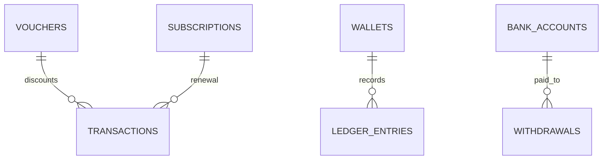

# Billing schema

**Implemented migration authority:** `kelolakelas-billing-service/migrations/00000000000000_init_schema.up.sql` plus migrations `000002_payment_idempotency`, `000003_subscription_renewals`, `20260915000000_payment_reconciliations`, `20260920000000_transaction_invoice_expiry`, `20260921000000_reconciliation_kind`, `20260922000000_invoice_claim_recovery`, `20260927000000_transaction_outcome_emails`, `20260927120000_transaction_enrollment_lookup_index`, `20260928000000_platform_fee_snapshot`, `20260929000000_transaction_payment_instructions`, `20260930000000_private_payment_email`, `20261001000000_bank_account_single_primary`, `20261002000000_withdrawal_request_cancel`, and `20261002010000_manual_withdrawal_decisions`.

```mermaid
erDiagram
  VOUCHERS ||--o{ TRANSACTIONS : discounts
  SUBSCRIPTIONS ||--o{ TRANSACTIONS : renewal
  WALLETS ||--o{ LEDGER_ENTRIES : records
  BANK_ACCOUNTS ||--o{ WITHDRAWALS : paid_to
```

| Table | Current key facts |
|---|---|
| `vouchers` | unique tenant/code, usage and validity fields, soft delete |
| `wallets`, `bank_accounts`, `ledger_entries`, `withdrawals` | wallet unique tenant; ledger uniqueness for payment event; bank account FK for withdrawal |
| `bank_accounts` primary rule (KEL-142) | partial unique index `uq_bank_accounts_tenant_primary` on `(tenant_id)` where `is_primary AND deleted_at IS NULL`: at most one primary per tenant; set-primary runs as a transactional clear-then-promote with row lock; history preserved by soft delete |
| `withdrawals` hold/snapshot (KEL-143) | nullable `idempotency_key` on older rows; new requests have a per-tenant key with partial unique index `uq_withdrawals_tenant_idempotency`; `bank_code_snapshot`, `account_number_snapshot`, `account_name_snapshot` are non-null with empty defaults for old rows, and `cancelled_at` is nullable; `(tenant_id,status)` index supports the open guard. `requested`/`processing` hold balance; tenant cancellation moves only `requested` to `cancelled` |
| `withdrawals` decision evidence (KEL-144) | migration `20261002010000_manual_withdrawal_decisions` adds nullable `decided_by`, `decided_at`, `transfer_reference`, `reject_reason` with `IF NOT EXISTS`; unique partial index `uq_withdrawals_transfer_reference` where the reference is not null; queue index `idx_withdrawals_requested_queue` on `(requested_at, id)` where `status = 'requested'`. Paid writes `transfer_reference`, rejected writes `reject_reason`; historical rows keep nulls. New ledger entry type `withdrawal_paid` joins `withdrawal_hold`/`withdrawal_release`; the signed ledger sum remains the available balance while open `requested`/`processing` rows equal the held balance |
| `subscriptions` | unique enrollment ID; renewal migration adds tenant/parent/student/contact/class/amount fields |
| `transactions` | unique merchant order; stores amounts/status/provider/payment URL; unique enrollment index introduced by `000002`, then dropped in `000003` in favor of partial subscription-period uniqueness; `invoice_expires_at` holds the invoice deadline sent to Duitku and `expired_at` records when the local expiry worker moved the row to `expired` (both nullable, retained as evidence when a late payment still succeeds); `invoice_claimed_at` records when a request took exclusive ownership of creating the invoice and `invoice_failure_reason` records why the last attempt failed (both nullable; see the invoice claim recovery note below); `va_number`, `qr_string`, and `app_url` are nullable provider instruction fields introduced by KEL-126; `paid_email_sent_at` and `failed_email_sent_at` are nullable conditional delivery claims, while `class_name` is a non-null snapshot defaulting to empty for historical rows |
| `payment_reconciliations` | one durable Academic job per transaction; `kind` is `activation` (confirm a paid seat, the default) or `release` (return the seat of a failed or expired payment, KEL-26); tracks attempts, lease, next retry, latest error, and terminal completion. `status` is one of `pending`, `processing`, `active`, or `terminal_failed`; KEL-29 added an internal endpoint that lists rows by any of those values and one that moves `terminal_failed` rows back to `pending`, so a job that exhausted `PAYMENT_RECONCILIATION_MAX_ATTEMPTS` can be retried without a provider callback |
| `seed_versions` | seed tracking |

**Implemented (KEL-143):** migration `20261002000000_withdrawal_request_cancel` adds the four destination/idempotency fields and `cancelled_at` with `IF NOT EXISTS`, then creates a partial unique index on `(tenant_id,idempotency_key)` for non-null keys and a tenant/status lookup index. Existing withdrawals keep null keys and empty snapshot fields; no unprovable historical bank destination is backfilled. The single-open guard is not a unique index: billing serializes request/cancel on the wallet row lock, reads open `requested`/`processing` requests inside the transaction, and maintains the balance and ledger in the same commit. The ledger already has a `(reference_id,reference_type,entry_type)` uniqueness backstop. Deploy the migration before the new billing binary; the down migration removes these added fields and indexes and would discard stored snapshots/keys, so do not roll back after accepting requests without a recovery plan. Evidence: billing `migrations/20261002000000_withdrawal_request_cancel.{up,down}.sql`, `internal/usecase/withdrawal_usecase.go`, `internal/repository/kel143_withdrawal_postgres_test.go`; [PR #29](https://github.com/kelolakelas/kelolakelas-billing-service/pull/29), squash `6c70af4d3fb76e7257c4b2c7e813771b414358c1`.

Indexes on `transactions`: `idx_transactions_due_expiry` is a partial index on `invoice_expires_at` limited to `status = 'pending'`, which supports the expiry worker's due-row scan. Migration `20260920000000_transaction_invoice_expiry` also backfills `invoice_expires_at = created_at + interval '14 days'` for pre-existing `pending` rows so the worker does not expire them immediately. `idx_transactions_stale_invoice_claim` is a partial index on `invoice_claimed_at` limited to `status = 'creating'`, which supports the stale-claim lookup. `idx_transactions_enrollment_created_at` (KEL-59) is a non-unique btree on `(enrollment_id, created_at)` that serves the per-enrollment lookups: `GetByEnrollmentID` (newest row per enrollment) and the transaction list filtered by `enrollment_id` and ordered by `created_at`. Those lookups were sequential scans from `000003` until this index.

Migration `20260927120000_transaction_enrollment_lookup_index` creates that index with `CREATE INDEX IF NOT EXISTS` and a new name. It is deliberately not `idx_transactions_enrollment_id`, because `000002`'s down file still drops that old unique index name. The index is non-unique, since one enrollment owns several transactions (renewals, retries). It is built without `CONCURRENTLY`, like the earlier migrations, so writes to `transactions` wait during the build and a failed build rolls back rather than leaving an INVALID index that `IF NOT EXISTS` would skip. The `down` migration drops only this index. No query or API changed. Evidence: `kelolakelas-billing-service/migrations/20260927120000_transaction_enrollment_lookup_index.{up,down}.sql`, `internal/migration/enrollment_index_migration_integration_test.go` (PostgreSQL, gated on `KEL59_TEST_ADMIN_DATABASE_URL`; EXPLAIN of the repository SQL moves from `Seq Scan` cost 514 to `Index Scan Backward using idx_transactions_enrollment_created_at` cost 9.12 on 12,000 rows), billing [PR #22](https://github.com/kelolakelas/kelolakelas-billing-service/pull/22), squash `70f50c61a02374fde9850baaf0ac9b5eb2cb68b3`.

Migration `20260929000000_transaction_payment_instructions` adds three nullable text columns with `ALTER TABLE`; historical rows remain null and no provider payload is backfilled. The down migration drops only these columns. Invoice issue/reissue writes or clears all three together with the hosted payment URL and reference; reads omit payment details when not pending or after expiry. Apply the migration before deploying the billing binary because the transaction model reads the new columns. Evidence: billing `migrations/20260929000000_transaction_payment_instructions.{up,down}.sql`, `internal/migration/payment_instructions_migration_integration_test.go`, [PR #26](https://github.com/kelolakelas/kelolakelas-billing-service/pull/26), squash `93f2189ea22ac7f2bda8c349f2f4f70fd443c08c`.

Migration `20260930000000_private_payment_email` adds `private_schedule_request boolean NOT NULL DEFAULT false` plus nullable `private_payment_email_claimed_at`, `private_payment_email_sent_at`, and `private_payment_email_failure_reason` columns to `transactions` with `ALTER TABLE`; no backfill, so historical private invoices (flag false) are never emailed. The down migration drops exactly those four columns. The flag is written once at transaction creation from the internal invoice request; the three email-state columns are owned by the conditional claim/finish of the private payment email dispatch and are reset on invoice reissue. Apply the migration before deploying the billing binary (the transaction model reads the new columns), and deploy billing before academic so approval requests carrying `private_schedule_request` find a binary that stores the flag. Evidence: billing `migrations/20260930000000_private_payment_email.{up,down}.sql`, `internal/repository/private_payment_email_postgres_test.go`, [PR #27](https://github.com/kelolakelas/kelolakelas-billing-service/pull/27), squash `750d5fad8d059fd791b5cb10393c3b97beaa930b`.

Migration `20260922000000_invoice_claim_recovery` adds `invoice_claimed_at` and `invoice_failure_reason` and creates `idx_transactions_stale_invoice_claim`. It backfills pre-existing `creating` rows with `invoice_claimed_at = updated_at` rather than the current time, deliberately: stamping them with `now()` would make a row whose request is genuinely still in flight immediately reclaimable and duplicate its invoice, while using each row's own age makes a long-stuck row reclaimable at once and lets `TRANSACTION_CLAIM_TIMEOUT_MINUTES` decide for recent ones. The `down` migration drops the index and both columns.

`payment_reconciliations.transaction_id` stays unique, which is what allows a single row to carry either an activation or a release for a transaction: the `kind` column added by `20260921000000_reconciliation_kind` names which action is owed, and `idx_payment_reconciliations_kind_due` covers `(kind, status, next_attempt_at)`. The migration's `DEFAULT 'activation'` gives every pre-existing row its original meaning.

Foreign keys only connect voucher/subscription/wallet/bank-account tables locally. Enrollment, tenant, parent, and student UUIDs are not cross-database FKs.
