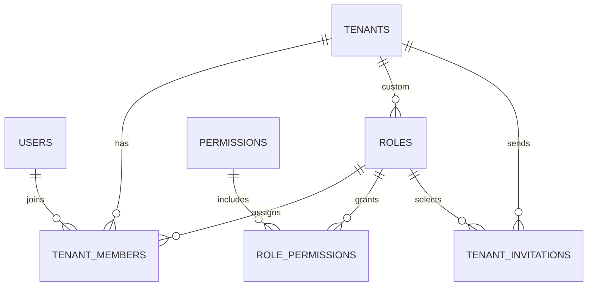

# Identity schema

**Implemented migration authority:** `kelolakelas-identity-service/migrations/00000000000000_init_schema.up.sql`.

| Tables | Important constraints/indexes |
|---|---|
| `users`, `tenants` | unique email/name; soft delete; tenants validate latitude/longitude pairing and ranges |
| `roles`, `permissions`, `role_permissions`, `tenant_members` | unique `(tenant_id,name)` and `(tenant_id,user_id)`; FKs to tenant/user/role/permission |
| `tenant_invitations` | unique token; tenant/role FKs; used/expiry fields |
| `tenant_wallets`, `user_wallets`, bank accounts, ledger entries, withdrawals | FK-backed identity financial tables; withdrawal status indexes |
| `seed_versions` | records seeder filename/checksum/application time |

No migration-level foreign keys link this schema to academic/billing databases.
