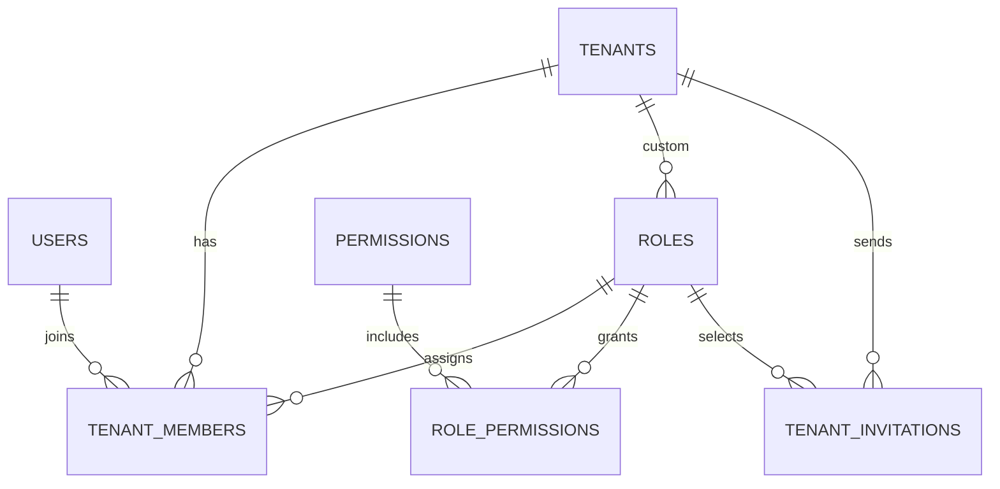

# Identity schema

**Implemented (KEL-169):** Existing timestamp columns and UTC connection remain unchanged; GORM now uses `database.UTCNow` as `NowFunc`, and explicit application timestamp writes use UTC. Invitation creation captures one UTC instant for `created_at`/`updated_at`, with `expires_at` exactly 48 hours later. Invite redeem/revoke, auth/reset/factor and role writes use consistent instants; authorization, expiry errors and JSON field names/RFC3339 format are unchanged. No migration or backfill: rows written before deploy keep their +7 h skew when previously persisted as Jakarta wall time.

Evidence: identity `pkg/database/db.go`, `internal/usecase/invitation_usecase.go`, `internal/repository/user_repository.go`, `internal/usecase/kel169_timestamp_test.go`, `internal/usecase/kel169_timestamp_postgres_test.go`; [PR #42](https://github.com/kelolakelas/kelolakelas-identity-service/pull/42), squash `c203d364a6cc2cb5119be0c82773275d54f0e3d8`. Operator API/web checks passed in Jakarta, UTC and America/New_York, including old invitations read by the new binary. Opt-in PostgreSQL round-trip/redeem tests require an isolated database via `KEL169_TEST_DATABASE_URL`.

**Implemented migration authority:** `kelolakelas-identity-service/migrations/00000000000000_init_schema.up.sql` plus the numbered migrations `000001_seed_versions` through `000014_chat_manage_permission`.

```mermaid
erDiagram
  USERS ||--o{ TENANT_MEMBERS : joins
  TENANTS ||--o{ TENANT_MEMBERS : has
  ROLES ||--o{ TENANT_MEMBERS : assigns
  TENANTS ||--o{ ROLES : custom
  ROLES ||--o{ ROLE_PERMISSIONS : grants
  PERMISSIONS ||--o{ ROLE_PERMISSIONS : includes
  TENANTS ||--o{ TENANT_INVITATIONS : sends
  ROLES ||--o{ TENANT_INVITATIONS : selects
```

| Tables | Important constraints/indexes |
|---|---|
| `users`, `tenants` | unique email/name; soft delete; tenants validate latitude/longitude pairing and ranges. Since KEL-89 (`000011_users_email_case_insensitive`) `users` also has the unique expression index `uq_users_email_lower` on `lower(email)`, which makes the account email case-insensitive; the original case-sensitive `users_email_key` remains ([ADR 0041](../adr/0041-case-insensitive-account-email.md)) |
| `roles`, `permissions`, `role_permissions`, `tenant_members` | unique `(tenant_id,name)` and `(tenant_id,user_id)`; FKs to tenant/user/role/permission. `roles.tenant_id` is nullable: a null row is a system role seeded for every tenant (the built-in `Creator` and `Teacher` roles), which is why a permission lookup counts an assignment only when `roles.tenant_id` equals the tenant being operated on or is null. Since KEL-59 (`000012_tenant_members_user_id_index`) `tenant_members` also has the non-unique index `idx_tenant_members_user_id` on `user_id`, because the unique `(tenant_id,user_id)` constraint leads with `tenant_id` and cannot serve a lookup by user alone |
| `tenant_invitations` | unique token; tenant/role FKs; used/expiry fields |
| `tenant_wallets`, `user_wallets`, bank accounts, ledger entries, withdrawals | FK-backed identity financial tables; withdrawal status indexes |
| `seed_versions` | records seeder filename/checksum/application time |

**Implemented (KEL-117):** migration `000014_chat_manage_permission` adds the `chat:manage` catalog entry and grants it only to the system `Creator` (`tenant_id IS NULL`) role when present; a later default seed supplies the grant if roles did not yet exist. `Teacher` and existing custom roles receive no automatic grant. The up SQL and seed are idempotent; down removes the system grant before deleting the catalog entry, but deliberately fails if another role still references that permission rather than revoking that role's grant silently. Evidence: `kelolakelas-identity-service/migrations/000014_chat_manage_permission.{up,down}.sql`, `seeders/000001_default_permissions_and_roles.sql`, `internal/migration/chat_manage_migration_integration_test.go`; identity [PR #34](https://github.com/kelolakelas/kelolakelas-identity-service/pull/34), squash `b05a137ba390604dd1ab02ebcd5ff2e8e14055e8`.

No migration-level foreign keys link this schema to academic/billing databases.

Migration `000012_tenant_members_user_id_index` (KEL-59) creates `idx_tenant_members_user_id` with `CREATE INDEX IF NOT EXISTS`, and its down migration drops only that index. It serves the existing active-membership lookup by user (`GetTenantMemberByUserID`), with no query or API change. The index is non-unique, since a user can belong to several tenants. It is built without `CONCURRENTLY`, like earlier migrations, so membership writes wait during the build. Evidence: `kelolakelas-identity-service/migrations/000012_tenant_members_user_id_index.{up,down}.sql`, `internal/migration/tenant_member_user_index_migration_integration_test.go` (PostgreSQL, gated on `KEL59_TEST_ADMIN_DATABASE_URL`; EXPLAIN of the repository SQL moves from `Seq Scan` cost 322 to `Bitmap Index Scan on idx_tenant_members_user_id` cost 11.69 on 12,000 memberships), identity [PR #32](https://github.com/kelolakelas/kelolakelas-identity-service/pull/32), squash `7d98535578cd78cde2972faad4ffe15c2e7b9d96`.
