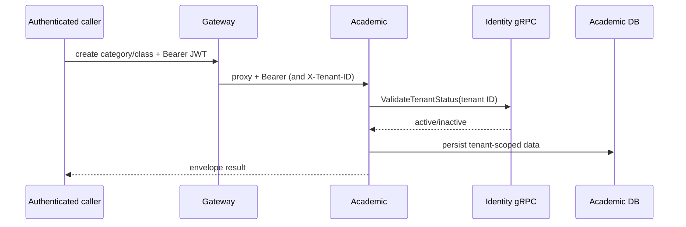

# Academic and enrollment flow

## Class lifecycle

Category/class/schedule handlers take a JWT-provided tenant context and persist through use cases/repositories. Class creation validates tenant status via the identity gRPC client before writing (`kelolakelas-academic-service/internal/usecase/class_creation_usecase.go:48`; `pkg/grpcclient/tenant_client.go`). Schedule creation produces recurring schedules/sessions according to schedule DTO/use-case logic; publication uses `PATCH /classes/:id/published`.

The public catalog reads only `is_published`/open catalog data and enriches tenant public information with identity gRPC (`internal/delivery/http/handler/catalog_handler.go`, `internal/usecase/catalog_usecase.go`). HTTP catalog reads are public; enrollment creation is not.

## Enrollment/payment initiation

**Initiator:** a JWT caller uses tenant enrollment or catalog enrollment. **Rules:** parent catalog enrollment requires a parent claim and `Idempotency-Key`; it verifies student ownership, class publication/enrollment status, capacity, and repeated-key compatibility. **Writes:** a pending academic enrollment, then payment transaction ID/checkout URL after billing reply. **Side effect:** academic calls billing `POST /internal/billing/transactions` with the internal credential. Evidence: `internal/delivery/http/handler/enrollment_handler.go:80-175`, `internal/usecase/enrollment_usecase.go`, `pkg/billing/client.go:45-75`.

Failures include missing key (400), forbidden non-parent catalog use (403), absent student/class (404), idempotency conflict/capacity/state conflict (409), and unenrollable class/student ownership (422), where explicitly mapped by the handler. A billing call failure can leave an existing pending enrollment; retry behavior uses idempotency logic.
