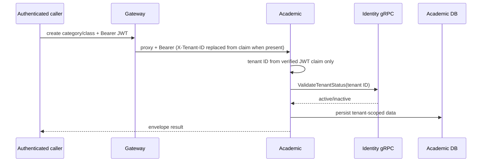
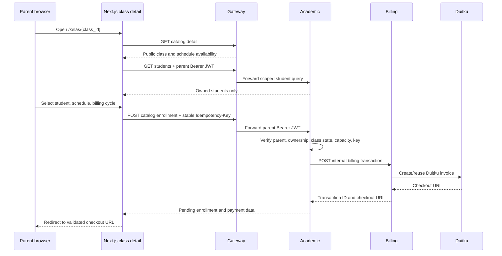

# Academic and enrollment flow



## Class lifecycle

Category/class/schedule handlers take a JWT-provided tenant context and persist through use cases/repositories. `tenantIDFromContext` resolves the tenant from the value `AuthMiddleware` stored out of the verified token and never reads a request header (`internal/delivery/http/handler/tenant_context.go`); a caller whose token carries no tenant claim receives 403 before the handler body runs. Class creation validates tenant status via the identity gRPC client before writing (`kelolakelas-academic-service/internal/usecase/class_creation_usecase.go:48`; `pkg/grpcclient/tenant_client.go`). Class attributes are changed through `PATCH /api/v1/classes/:id` behind the `class:update` permission: the class is loaded tenant-scoped, a foreign-tenant class is reported as 404 rather than 403, changing `type` is refused (422), and a price change applies only to future enrollments because each enrollment keeps the price snapshot it was created with. Schedule creation produces recurring schedules/sessions according to schedule DTO/use-case logic; publication uses `PATCH /classes/:id/published`.

The public catalog reads only `is_published`/open catalog data and enriches tenant public information with identity gRPC (`internal/delivery/http/handler/catalog_handler.go`, `internal/usecase/catalog_usecase.go`). HTTP catalog reads are public; enrollment creation is not.

## Enrollment/payment initiation

**Initiator:** a JWT caller uses tenant enrollment or catalog enrollment. **Rules:** parent catalog enrollment requires a parent claim and `Idempotency-Key`; it verifies student ownership, class publication/enrollment status, capacity, and repeated-key compatibility. A non-parent caller of the tenant route must present a JWT tenant claim equal to the `:tenant_id` path segment, otherwise the request is rejected with 403 before any use case runs. **Writes:** a pending academic enrollment, then payment transaction ID/checkout URL after billing reply. **Side effect:** academic calls billing `POST /internal/billing/transactions` with the internal credential. Evidence: `internal/delivery/http/handler/enrollment_handler.go:73-171`, `internal/usecase/enrollment_usecase.go`, `pkg/billing/client.go:45-75`.

Failures include missing key (400), forbidden non-parent catalog use (403), tenant-context mismatch or absent tenant claim (403), absent student/class (404), idempotency conflict/capacity/state conflict (409), and unenrollable class/student ownership (422), where explicitly mapped by the handler. A billing call failure can leave an existing pending enrollment; retry behavior uses idempotency logic.

### Parent checkout from the public catalog



The browser never supplies the authoritative price, tenant, parent ID, or billing transaction endpoint. The Server Action reads the HTTP-only session cookie, and the academic service remains the authorization and enrollment authority. Group enrollment requires a selected schedule; the academic service validates that the schedule belongs to the class and rechecks capacity transactionally. A retry of the mounted form reuses its same idempotency key; a fresh detail-page render starts a new intent.

## Parent student profile flow

```mermaid
sequenceDiagram
  participant P as Parent browser
  participant W as Next.js parent page/actions
  participant G as Gateway
  participant A as Academic
  participant DB as Academic DB
  P->>W: Open /dashboard/parent/students
  W->>G: GET /api/v1/students + Bearer JWT
  G->>A: Forward authenticated request
  A->>DB: List by authenticated parent user_id
  DB-->>A: Owned students only
  A-->>W: Student list or 401/403/5xx
  W-->>P: List, empty, forbidden, or API-error state
  P->>W: Create/update/delete student
  W->>G: POST/PATCH/DELETE /api/v1/students
  G->>A: Forward request
  A->>DB: Enforce ownership; reject active-enrollment delete with 409
  A-->>W: Success or validation/forbidden/conflict error
  W-->>P: Revalidated list and explicit action result
```

The parent route is also rejected by the web proxy for a valid non-parent session. The academic service remains the authorization authority; the web decodes only the session `user_id` claim to populate the create request required by the current API, while the service verifies that claim against the authenticated request.
