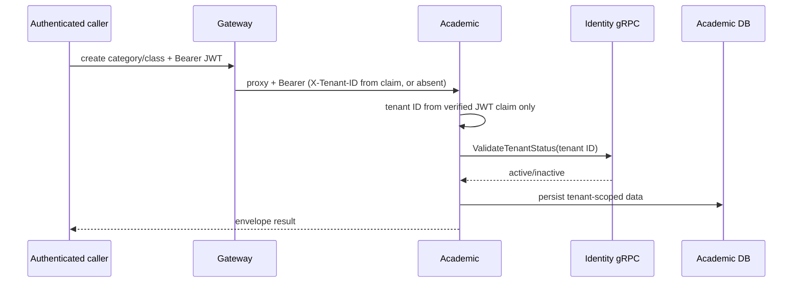
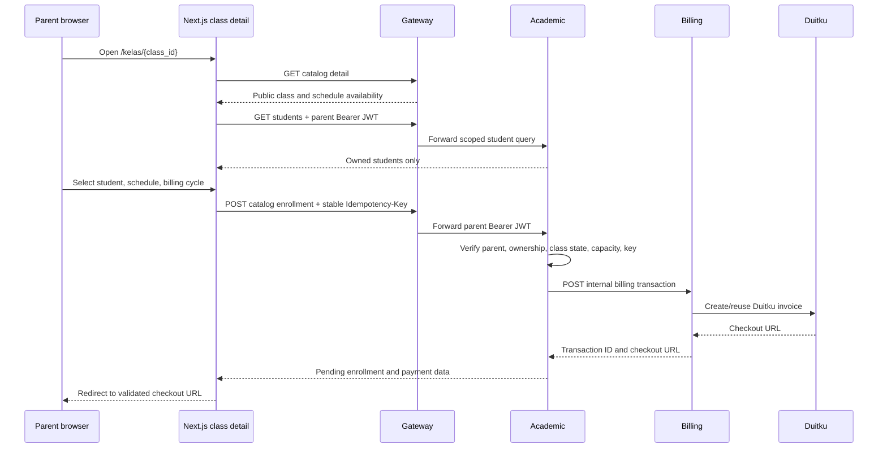

# Academic and enrollment flow

```mermaid
sequenceDiagram
  participant C as Authenticated caller
  participant G as Gateway
  participant A as Academic
  participant I as Identity gRPC
  participant DB as Academic DB
  C->>G: create category/class + Bearer JWT
  G->>A: proxy + Bearer (X-Tenant-ID from claim, or absent)
  A->>A: tenant ID from verified JWT claim only
  A->>I: ValidateTenantStatus(tenant ID)
  I-->>A: active/inactive
  A->>DB: persist tenant-scoped data
  A-->>C: envelope result
```

## Class lifecycle

Category/class/schedule handlers take a JWT-provided tenant context and persist through use cases/repositories. `tenantIDFromContext` resolves the tenant from the value `AuthMiddleware` stored out of the verified token and never reads a request header (`internal/delivery/http/handler/tenant_context.go`); a caller whose token carries no tenant claim receives 403 before the handler body runs. Class creation validates tenant status via the identity gRPC client before writing (`kelolakelas-academic-service/internal/usecase/class_creation_usecase.go:48`; `pkg/grpcclient/tenant_client.go`). Class attributes are changed through `PATCH /api/v1/classes/:id` behind the `class:update` permission: the class is loaded tenant-scoped, a foreign-tenant class is reported as 404 rather than 403, changing `type` is refused (422), and a price change applies only to future enrollments because each enrollment keeps the price snapshot it was created with. Schedule creation produces recurring schedules/sessions according to schedule DTO/use-case logic; publication uses `PATCH /classes/:id/published`.

The public catalog reads only `is_published`/open catalog data and enriches tenant public information with identity gRPC (`internal/delivery/http/handler/catalog_handler.go`, `internal/usecase/catalog_usecase.go`). HTTP catalog reads are public; enrollment creation is not.

## Permanent schedule and tutor changes

**Implemented (KEL-51):** `ChangeSchedulePermanent` and `ChangeTutorPermanent` lock the old schedule in a transaction, reject an `effective_date` outside its validity with HTTP 400 before writing, and close the old schedule on the preceding day. The replacement starts on the effective date, inherits the original end date (including an open end), capacity, location and private-class enrollment association; a tutor change substitutes only the tutor. Pending/active enrollments for the owning tenant and class move to the replacement in the same transaction, while cancelled/expired enrollments do not. A schedule change cancels future old sessions and generates replacement sessions through the current month; a tutor change moves scheduled future sessions to the replacement and new tutor. Any failed transfer or session write rolls the whole operation back. Existing `schedule:update` permission and tenant-scoped resource resolution remain in force. Evidence: academic `internal/usecase/schedule_usecase.go`, `internal/repository/{schedule,enrollment}_repository.go`, `internal/usecase/permanent_schedule_test.go`, `internal/repository/permanent_schedule_postgres_test.go`; PR [#17](https://github.com/kelolakelas/kelolakelas-academic-service/pull/17), squash `2f22558ca2cd5d01e6d8ad2e8d20c55daddfa558`.

## Session generation horizon

**Implemented (KEL-90):** creating a schedule or changing it permanently still generates sessions only through the end of the start month, and the response still returns only those sessions. Sessions after that month now come from the in-process `SessionGenerationWorker`, which runs once at startup and then every `SESSION_GENERATION_INTERVAL_MINUTES` (default 60). Each pass tops every live schedule up through the end of the month `SESSION_GENERATION_HORIZON_MONTHS` after the current one; the default of 1 means the end of next month.

- **Watermark.** Each schedule records `sessions_generated_until`, and the worker only creates dates after it. A session the tenant deleted (soft delete), rescheduled (the old row keeps status `rescheduled`; the new one-off row has no `schedule_id`) or cancelled through a permanent change is therefore never created again.
  - Schedule creation and a permanent schedule change set the watermark to the end of the start month.
  - A permanent tutor change hands the old watermark to the replacement along with the moved sessions.
- **Idempotency.** A partial unique index on `(schedule_id, session_date)` backs `INSERT ... ON CONFLICT DO NOTHING`. It also covers deleted and rescheduled rows.
- **Concurrency.** One schedule is handled per transaction, locked `FOR UPDATE SKIP LOCKED`. Repeated passes and several replicas therefore neither duplicate nor revive sessions.
- **Eligibility.** No new sessions for a deleted schedule, a schedule of a deleted class, a private schedule whose enrollment is no longer `pending`/`active`, or dates after `valid_until`. Past months are never backfilled.

See [ADR 0042](../adr/0042-rolling-session-generation-horizon.md). Evidence: academic `internal/usecase/session_generation_worker.go`, `internal/repository/session_generation_repository.go`, `internal/usecase/schedule_usecase.go`, `migrations/00001790492411_session_generation_horizon.up.sql`; tests `internal/usecase/session_generation_{worker,postgres}_test.go`; PR [#31](https://github.com/kelolakelas/kelolakelas-academic-service/pull/31), squash `f1f96d822bcb4f81efb9e04cd9bf81c8d354ca38`.

## Enrollment/payment initiation

**Initiator:** a JWT caller uses tenant enrollment or catalog enrollment for a group class; private classes require the request flow below. **Rules:** parent catalog enrollment requires a parent claim and `Idempotency-Key`; it verifies student ownership, class publication/enrollment status, capacity, and repeated-key compatibility. A non-parent caller of the tenant route must present a JWT tenant claim equal to the `:tenant_id` path segment, otherwise the request is rejected with 403 before any use case runs. **Writes:** a pending academic enrollment, then payment transaction ID/checkout URL after billing reply. **Side effect:** academic calls billing `POST /internal/billing/transactions` with the internal credential. Evidence: `internal/delivery/http/handler/enrollment_handler.go:73-171`, `internal/usecase/enrollment_usecase.go`, `pkg/billing/client.go:45-75`.

Failures include missing key (400), forbidden non-parent catalog use (403), tenant-context mismatch or absent tenant claim (403), absent student/class (404), idempotency conflict/capacity/state conflict (409), and unenrollable class/student ownership (422), where explicitly mapped by the handler. A billing call failure can leave an existing pending enrollment; retry behavior uses idempotency logic.

## Private class schedule request before checkout (KEL-107)

A parent submits weekly slots for an owned student and published/open private class using `POST /api/v1/catalog/classes/:class_id/schedule-requests`; academic records a `pending` request with token-derived parent identity/email and no enrollment, schedule or invoice. Input validation rejects invalid/overlapping slots; the partial unique index prevents two pending requests for the same student/class, including concurrent creates. Parent list/detail/cancel are parent-scoped; tenant list/detail/reject are tenant-scoped and permission-checked (`enrollment:read`/`enrollment:update`). A rejection can carry an optional reason and releases the pending uniqueness slot for a subsequent request. A conditional status update makes reject/cancel races single-winner: only pending transitions, while foreign IDs look absent. Direct private checkout is 422 `private_schedule_request_required` on both catalog and tenant enrollment routes; group checkout retains its existing invoice flow. Approval and invoice creation are implemented in KEL-108 (below). Evidence: academic `internal/usecase/private_schedule_request_usecase.go`, `internal/repository/private_schedule_request_repository.go`, `internal/delivery/http/handler/private_schedule_request_handler.go`, `migrations/00001790600000_private_schedule_requests.up.sql`; squash `41a73e8c2e9223285863b6830cc10ad5912e2723` and gateway squash `fef837a40edef676d86c7715a024e7b440f40c51`.

## Tenant approval of a private request (KEL-108)

**Implemented:** an authorized tenant member (`enrollment:update`) calls `POST /api/v1/schedule-requests/:id/approve` through the JWT-protected gateway proxy. Academic locks the request by ID and verified tenant in a database transaction; only `pending` (or an approved replay) is accepted. For a new approval it verifies the class is still published/open/private and the student still belongs to the saved parent, creates one pending enrollment, creates capacity-one schedules bound to that enrollment for each saved weekly slot, generates sessions through the current month, and marks the request `approved` atomically. The recurring session worker extends eligible schedules later. The request-derived enrollment key keeps retries from adding records; a foreign request is 404, rejected/cancelled 409, and unauthorized member 403.

After the commit, academic calls billing with the same stable key and saved parent email, outside the row lock; the returned transaction ID and checkout URL are written to the enrollment without clobbering webhook-driven activation. Since KEL-128 the same call also marks the request `private_schedule_request: true`, and billing sends the payment-link email to that saved parent address with the amount and exact expiry — independently of this response, so a Resend failure never fails the approval. The existing parent enrollment/payment listing (KEL-53) can show the pending checkout. An invoice timeout leaves an approved request and pending enrollment without checkout until retry; a platform-fee rejection drops the enrollment, resets the request to pending, and retries can restore that enrollment under the same key. Once billing confirms payment, the existing internal activation path changes the enrollment to `active`; sessions already generated from its schedules remain associated. No change was made to billing, the webhook or the web UI. Evidence: academic `internal/usecase/private_schedule_request_usecase.go` (`Approve`), `internal/repository/{private_schedule_request,enrollment}_repository.go`, `internal/usecase/private_schedule_approval_{test,postgres_test}.go`; [PR #35](https://github.com/kelolakelas/kelolakelas-academic-service/pull/35) squash `603b29aa0a14c2da04cede9da62f8504446c5151`; gateway [PR #29](https://github.com/kelolakelas/kelolakelas-api-gateway/pull/29) squash `2ce4b1b7024758d96f3506e8b938e3a55b315428`.

## Recommended private schedule purchase (KEL-115)

**Implemented (KEL-115):** An authorized tenant member rejects a pending request with validated `recommended_slots` and optional reason. The owning parent sees these fields in its scoped list/detail and may accept or decline the recommendation through the JWT-protected gateway. Acceptance locks the parent-scoped request and reuses the KEL-108 purchase operation with the recommended slots: one pending enrollment, capacity-one schedules and sessions, then the same billing key and checkout URL. The existing payment callback activates that enrollment. Decline is an atomic transition to `declined`; later acceptance returns 409. Competing accept/decline operations serialize on the request, and foreign parents/tenants cannot operate on it. Fee rejection retains the offer for retry; billing idempotency remains a separate billing-service contract. Plain rejection remains unchanged. Evidence: academic `internal/usecase/private_schedule_request_usecase.go`, `internal/repository/private_schedule_request_repository.go`, `internal/usecase/private_schedule_recommendation_postgres_test.go`; [academic PR #36](https://github.com/kelolakelas/kelolakelas-academic-service/pull/36) squash `9e80403031247f86682cd7ed7f411b1d8cfef49f`; [gateway PR #30](https://github.com/kelolakelas/kelolakelas-api-gateway/pull/30) squash `eacc28f45977af6d753e75ba1a00dd42c9132ff6`. UI and notifications remain outside KEL-115.

## Billing-driven suspension, resume, and end (KEL-149)

**Initiator:** billing calls one of three internal-credential endpoints when it must park or retire an enrollment whose payment lapsed or was refunded: `PUT /internal/enrollments/:id/suspend` (`active` → `suspended`), `PUT /internal/enrollments/:id/resume` (`suspended` → `active`), `PUT /internal/enrollments/:id/end` (`active`|`suspended` → `dropped`). **Rules:** every transition is idempotent — a replay on the target state answers the row unchanged. A suspended enrollment holds no seat (capacity predicates count only `pending`/`active`), so suspend frees the schedule slot; resume reclaims it under the enrollment row lock and the schedule lock with the same capacity and duplicate checks a new signup passes, and a full or ended schedule (or a student who re-enrolled meanwhile) answers 409 with the enrollment staying suspended for billing to retry. End writes the same terminal `dropped` state as a parent cancellation, so the seat is freed permanently and the student may enroll again; `pending` is refused because its invoice must be unwound by the cancel/release paths. A suspended enrollment is not an upcoming-session attendee and cannot be marked present; its history rows stay. **Writes:** the status move under lock, in one transaction. **Side effects:** suspended rows surface in web as `Ditangguhkan` on both the parent and tenant surfaces (see [web component](../components/web.md)). The rules for *when* billing calls these endpoints (dunning, refunds) are separate downstream issues that consume this contract (KEL-150, KEL-152) and out of scope here. See [ADR 0050](../adr/0050-enrollment-suspend-resume-end.md). Evidence: academic `internal/usecase/enrollment_usecase.go`, `internal/repository/enrollment_repository.go` (`ResumeUnderCapacity`), `internal/delivery/http/handler/enrollment_handler.go`; [academic PR #41](https://github.com/kelolakelas/kelolakelas-academic-service/pull/41), squash `4afb40acde884a2c61639c304c5cb5d9fdbb0fb4`.

## Parent cancellation of a pending enrollment

**Initiator:** a parent JWT caller uses `POST /api/v1/enrollments/:id/cancel` (KEL-27, [ADR 0016](../adr/0016-cancel-pending-enrollment.md)). **Rules:** the enrollment is loaded through the same parent-scoped access filter as the enrollment queries, so another parent's enrollment is reported as 404 rather than 403 and the parent learns nothing about its existence. An `active`, `suspended` (since KEL-149, [ADR 0050](../adr/0050-enrollment-suspend-resume-end.md)), or `completed` enrollment is refused with 409 before anything is written. **Writes:** academic first asks billing to withdraw the invoice at `POST /internal/billing/transactions/cancel`, then moves the enrollment `pending` → `dropped` under a row lock. **Side effect:** the seat returns to the catalog, because the capacity predicate counts only `pending`/`active` and `dropped` falls outside the unique partial index on `(student_id, class_id)`, so the same student can enroll again.

The billing withdrawal is what makes the operation safe to retry and safe to refuse:

- A transaction that can no longer be cancelled (already `paid`/`refunded`) makes the whole request 409 with the enrollment untouched, so a seat is never revoked for money the parent actually paid.
- An enrollment with no transaction at all is still cancellable, so an enrollment whose invoice creation never completed does not hold a seat forever.
- An unexpected billing failure is reported as 500 rather than treated as "no transaction", so a transient billing outage cannot drop a paid seat.
- An already-`dropped` enrollment is answered with 409, the same as any other finished state. The withdrawal still runs first, because such an enrollment can hold an invoice that was paid after its seat was released, and that case must be refused on the invoice state instead of reported as cancelled.

Failures mapped by the handler: malformed enrollment ID (400), missing parent identity or a non-parent caller (403), enrollment not found or owned by another parent (404), and any non-`pending` status or a settled invoice (409). Evidence: `internal/delivery/http/handler/enrollment_handler.go` (`Cancel`), `internal/usecase/enrollment_usecase.go` (`CancelPendingEnrollment`), `pkg/billing/client.go` (`CancelEnrollmentPayment`).

### Parent checkout from the public catalog

```mermaid
sequenceDiagram
  participant P as Parent browser
  participant W as Next.js class detail
  participant G as Gateway
  participant A as Academic
  participant B as Billing
  participant D as Duitku
  P->>W: Open /kelas/{class_id}
  W->>G: GET catalog detail
  G-->>W: Public class and schedule availability
  W->>G: GET students + parent Bearer JWT
  G->>A: Forward scoped student query
  A-->>W: Owned students only
  P->>W: Select student, schedule, billing cycle
  W->>G: POST catalog enrollment + stable Idempotency-Key
  G->>A: Forward parent Bearer JWT
  A->>A: Verify parent, ownership, class state, capacity, key
  A->>B: POST internal billing transaction
  B->>D: Create/reuse Duitku invoice
  D-->>B: Checkout URL
  B-->>A: Transaction ID and checkout URL
  A-->>W: Pending enrollment and payment data
  W-->>P: Redirect to validated checkout URL
```

The browser never supplies the authoritative price, tenant, parent ID, or billing transaction endpoint. The Server Action reads the HTTP-only session cookie, and the academic service remains the authorization and enrollment authority. Group enrollment requires a selected schedule; the academic service validates that the schedule belongs to the class and rechecks capacity transactionally. A retry of the mounted form reuses its same idempotency key; a fresh detail-page render starts a new intent.

## Parent student profile flow

```mermaid
sequenceDiagram
  participant P as Parent browser
  participant W as Next.js parent page/actions
  participant G as Gateway
  participant A as Academic
  participant DB as Academic DB
  P->>W: Open /dashboard/parent/students
  W->>G: GET /api/v1/students + Bearer JWT
  G->>A: Forward authenticated request
  A->>DB: List by authenticated parent user_id
  DB-->>A: Owned students only
  A-->>W: Student list or 401/403/5xx
  W-->>P: List, empty, forbidden, or API-error state
  P->>W: Create/update/delete student
  W->>G: POST/PATCH/DELETE /api/v1/students
  G->>A: Forward request
  A->>DB: Enforce ownership; reject active-enrollment delete with 409
  A-->>W: Success or validation/forbidden/conflict error
  W-->>P: Revalidated list and explicit action result
```

The parent route is also rejected by the web proxy for a valid non-parent session. The academic service remains the authorization authority; the web decodes only the session `user_id` claim to populate the create request required by the current API, while the service verifies that claim against the authenticated request.
