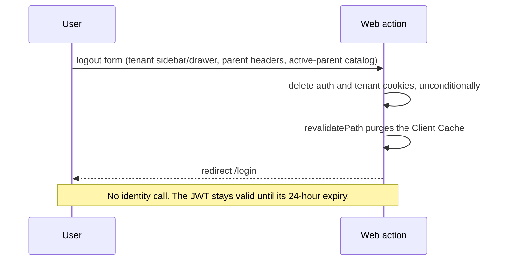

# Authentication, registration, and identity flow

```mermaid
sequenceDiagram
  participant U as User
  participant W as Web action
  participant G as Gateway
  participant I as Identity
  participant DB as Identity DB
  U->>W: registration or login form
  W->>W: Zod validation
  W->>G: POST /api/v1/auth/* or /tenants/register
  G->>I: proxy unchanged path/body
  I->>DB: validate/create/find user and membership
  I-->>W: standardized response; login/tenant register include JWT
  W-->>U: parent register returns to login; login/tenant register set HTTP-only cookie
```

## Password reset (KEL-66)

**Implemented backend, no web page yet:** the public gateway proxies `POST /api/v1/auth/password-reset/request` to identity. Identity looks up the email case-insensitively (excluding soft-deleted users), rotates a random 256-bit token under a user-row lock, stores only its SHA-256 hash and expiration, and asks Resend to send `${APP_URL}/reset-password?token=...`. Unknown addresses and delivery failures return the same generic 200 response as a delivered request; delivery failures are logged without the address or token. The token expires after `PASSWORD_RESET_TTL_MINUTES` (default 60). The `/reset-password` web page is a separate issue and is not currently available.

`POST /api/v1/auth/password-reset/confirm` takes the token and a password of at least six characters. Identity locks the user and token, rejects expired/used/rotated tokens with a generic 400, and atomically writes the new password hash, used timestamp, and user-specific session boundary. Login with the old password fails; login with the new password issues a JWT at or after that boundary. Gateway's protected route middleware verifies the JWT signature locally and asks identity's non-proxied `GET /api/v1/internal/session/check` for the committed boundary on every request. A pre-reset token gets 401; identity/DB unavailability gets 503. A reset does not invalidate another user's tokens. Evidence: identity PR #13 (`e5d5e2ba411c0b78b7e145aaaf9db3b838991dc8`), gateway PR #15 (`9d259ec3aa1b0d877bc9216150a4f1a72841ecb7`), [ADR 0030](../adr/0030-password-reset-and-gateway-session-revocation.md).

## Logout



**Implemented:** the web app now ends the browser session through the `logoutAction` Server Action (`kelolakelas-web/app/(auth)/logout/_actions/actions.ts`). It deletes both session cookies, calls `revalidatePath('/', 'layout')`, and redirects to `/login`. The cookie names come from `sessionCookieNames` in `kelolakelas-web/lib/logout.ts`, which applies the same `AUTH_COOKIE_NAME`/`TENANT_ID_COOKIE_NAME` fallbacks that login and registration use to write them and collapses them when both variables name the same cookie. The control is the `LogoutButton` form (`_components/LogoutButton.tsx`), a plain form with a `useFormStatus` submit control, so signing out works without client JavaScript and the pending state prevents a double submit. It appears in the tenant sidebar footer and the tenant mobile drawer footer, in the parent student-management and enrollment-history headers, and on the public catalog `/kelas` only when a parent session is active — `/kelas` is a parent's post-login destination, so the session would otherwise be unreachable from there. Evidence: `app/(auth)/logout/_actions/actions.ts`, `_actions/actions.test.ts`, `_components/LogoutButton.tsx`, `lib/logout.ts`, `lib/logout.test.ts`, `app/(dashboard)/dashboard/tenant/_components/{TenantSidebar,MobileNav}.tsx`, `app/(dashboard)/dashboard/parent/students/_components/StudentsManager.tsx`, `app/(dashboard)/dashboard/parent/enrollments/page.tsx`, `app/(public)/kelas/page.tsx`, [ADR 0022](../adr/0022-web-logout-ends-browser-session-only.md).

**Implemented behavior:** deletion is unconditional and idempotent. Upstream `ResponseCookies.delete` writes an already-expired cookie and tolerates a name that the request never carried, so signing out while already signed out — an expired cookie the proxy cleared, a second tab that signed out first, a stale back-button view — produces no error. `revalidatePath` runs before the redirect because otherwise the client router could serve a protected page it already cached and logout would appear to have failed until a hard reload. Logout adds no URL: `_actions` and `_components` are private Next.js folders and no `/logout` route is registered.

**Not implemented:** the session is a self-contained HS256 JWT with a 24-hour expiry and identity exposes no revocation endpoint or denylist, so logout removes the browser's copy of the token only. A token copied before logout remains accepted until it expires, and a second open tab loses the session on its next navigation or reload rather than immediately. The action documents this limitation in its own docblock. Revocation, an account profile page, and logout from all devices are out of scope.

## Parent registration

**Initiator/entry:** web `registerParent`, `POST /api/v1/auth/register`. It validates first/last name, email, password min 6, optional phone, and sends `is_parent:true` (`kelolakelas-web/app/(auth)/register/_schemas/schema.ts`, `_actions/actions.ts:25-83`). Identity binds the same essential fields, hashes password through its auth use case, and returns 201 user data without token (`kelolakelas-identity-service/internal/delivery/http/handler/auth_handler.go:24-91`).

**Implemented behavior:** the identity register response intentionally contains no token. The web action therefore does not create a session and returns to `/login?registered=1` with a confirmation message. The parent signs in explicitly; successful parent login routes to `/kelas`, which is an available public entry point for the purchase journey.

## Tenant registration and login

Tenant registration atomically creates an owner user, active tenant, member, and token through `RegisterTenantTx`, then optionally caches role permissions in Redis (`internal/usecase/tenant_usecase.go:81-142`). Login validates credentials and returns the token/user/tenant context (`auth_handler.go:94-142`). The web stores both the HTTP-only auth cookie and tenant-context cookie, then routes tenant users to `/dashboard/tenant` or a compatible requested dashboard path. JWT signs HS256 claims for 24 hours. Failure paths include binding 400, duplicate identity/tenant 409 and invalid credentials 401.

The web proxy performs an optimistic structural/expiry check to avoid treating malformed or expired cookies as sessions and clears those cookies before redirecting to login. It does not verify the JWT signature; protected backend routes remain the authoritative validation boundary.

## Invitations

Every tenant-scoped identity route (members, tutors, roles, tenant settings, and tenant location) resolves its tenant from the `tenant_id` claim of the validated token only (`internal/delivery/http/handler/tenant_context.go`). A token that carries no tenant claim — which is the case for every parent, because login issues a nil `tenant_id` when there is no active membership — is refused with 403 before the use case runs, so a parent cannot read or mutate another tenant's members, roles, or settings. The gateway removes any client-supplied `X-Tenant-ID` before proxying and republishes the header from the verified claim, and it refuses a non-parent token without a usable tenant claim with 401, so the header carries no caller authority (KEL-16 and KEL-18, [ADR 0010](../adr/0010-tenant-context-from-verified-jwt-claim-only.md), [ADR 0017](../adr/0017-gateway-context-header-trust-boundary.md)). There is no route for a user with several active memberships to choose among them; the token carries at most one `tenant_id`.

Authenticated callers create a role-targeted invitation using the tenant claim. The use case checks membership, persists token/expiry, and sends Resend email; verification/register check absent, expired, or used tokens. Evidence: `invitation_handler.go`, `internal/usecase/invitation_usecase.go`, `pkg/email/resend.go`. Email delivery is an external side effect; delivery was not executed in this review.

**Implemented:** the invitation email link is now followed in the browser. The recipient opens `/invitations/verify?token=…` in `kelolakelas-web`, which loads on the public surface (neither protected nor redirected by `proxy.ts`). The page performs `GET /api/v1/invitations/verify` server-side with `cache: 'no-store'` before rendering, and the result is classified into exactly one state: `valid`, `missing_token`, `not_found`, `expired`, `used`, `unavailable`, or `invalid`. Identity answers an expired token and an already-used token with the same `400` status, so the web classifier distinguishes them by the backend message; anything it cannot interpret — a `5xx`, malformed JSON, a network failure, or an unconfigured `GATEWAY_API_URL` — becomes `unavailable` and never `invalid`, so an infrastructure failure is not reported to the invitee as a bad link. On the valid path the invitee sees the invited address and the invitation expiry (formatted for `Asia/Jakarta`) and submits first/last name plus password through the `registerInvitedUser` Server Action to the public `POST /api/v1/invitations/register`; the email is read-only and never submitted from the browser, because identity reads the address, tenant, and role from the invitation row inside `RegisterInvitedUserTx`. Success redirects to `/login?registered=1` without a session, consistent with parent registration. The invitation token is stripped from the normalised invitation data and cannot be rendered or logged; the gateway access log records `URL.Path` only, so the `?token=…` query string never appears there ([ADR 0015](../adr/0015-gateway-request-correlation-and-access-log.md)). **Not implemented:** the identity verify response exposes `tenant_id` and `role_id` without display names and no public endpoint resolves them, so the page shows a generic tenant heading when the public catalog does not already expose that tenant, and it does not render the invited role. Evidence: `kelolakelas-web/app/(auth)/invitations/verify/page.tsx`, `_actions/actions.ts`, `_components/InvitationRegisterForm.tsx`, `lib/invitation.ts`, `lib/invitation.test.ts`.

**Not found:** refresh token, generic token denylist, email verification, OAuth, and multi-factor authentication routes. Password reset and reset-triggered gateway session revocation are implemented as described above, but neither logout-triggered revocation nor direct academic/billing session checks exist. Logout is implemented in the web app only and is documented under [Logout](#logout) above; identity has no logout endpoint.
