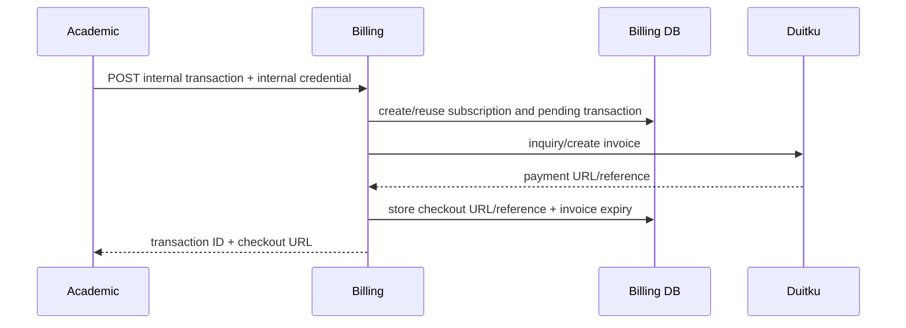

# Billing and subscriptions

`GenerateSubscriptionPayment` first tries to reuse an existing enrollment payment whose invoice is still valid, validates gross amount and fees, creates/reuses subscription, creates/reuses a pending transaction, attempts an invoice claim, then creates a Duitku invoice and stores the returned reference, payment URL, and the derived `invoice_expires_at`. It uses IDR, marks sandbox based on the configured Duitku URL, and sends a virtual-account payment method. A transaction that billing already marked `expired` can be re-invoiced through the same idempotent claim while the enrollment is still valid. Evidence: `internal/usecase/transaction_usecase.go:94-347`.

The `expiryPeriod` sent to Duitku and the stored `invoice_expires_at` are both derived from `SUBSCRIPTION_PAYMENT_EXPIRY_PERIOD_DAYS` (default `14` days), so the local deadline and the gateway deadline cannot drift apart. Previously the adapter sent an implicit `1440` minutes while nothing recorded a local deadline.

The database enforces important idempotency/uniqueness constraints, but migration `000003_subscription_renewals.up.sql` drops the unique `transactions(enrollment_id)` index introduced by `000002`; current repository/use-case behavior should be evaluated with renewal semantics before changing it.

When `SUBSCRIPTION_WORKER_ENABLED` is true, the billing process starts an in-process worker. It finds due subscriptions, creates renewal invoices, updates payment-link fields, sends Resend reminders, and handles expiry on the configured daily-like interval. Renewal invoices reset `invoice_expires_at`/`expired_at` so a new period never inherits the previous deadline. Email sends and Duitku calls were not executed. Evidence: `internal/usecase/subscription_worker.go`, `cmd/server/main.go:107-109`.

A second in-process worker performs local invoice expiry. It is enabled by
`TRANSACTION_EXPIRY_WORKER_ENABLED` (default true) at
`TRANSACTION_EXPIRY_WORKER_INTERVAL_MINUTES` (default 5) and moves overdue
`pending` transactions to `expired` in batches of 200 with one conditional
update per batch, so it is idempotent and safe when several billing replicas run
at once. Local expiry only removes rows from `pending`; a `resultCode=00`
callback that arrives afterwards still marks the transaction `paid` and keeps
`expired_at` as evidence, as described in
[ADR 0009](../adr/0009-local-invoice-expiry-without-losing-late-payments.md).
Evidence: `internal/usecase/transaction_expiry_worker.go`,
`internal/repository/transaction_repository.go:147-166`, `cmd/server/main.go:110-115`.
