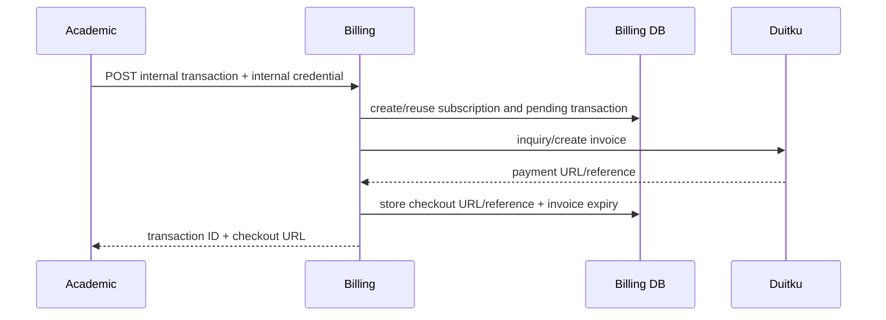

# Billing and subscriptions

`GenerateSubscriptionPayment` first tries to reuse an existing enrollment payment whose invoice is still valid, validates gross amount and fees, creates/reuses subscription, creates/reuses a pending transaction, attempts an invoice claim, then creates a Duitku invoice and stores the returned reference, payment URL, and the derived `invoice_expires_at`. It uses IDR, marks sandbox based on the configured Duitku URL, and sends a virtual-account payment method. A transaction that billing already marked `expired` can be re-invoiced through the same idempotent claim while the enrollment is still valid. Evidence: `internal/usecase/transaction_usecase.go:94-347`.

### Invoice claim exclusivity and recovery (KEL-24)

`creating` is the transient exclusivity claim that stops two concurrent requests from invoicing the same enrollment. The claim is a single conditional `UPDATE ... WHERE <predicate>` and the `RowsAffected == 1` result is the whole mechanism, so parallel requests resolve inside the database with no additional lock. `ClaimInvoice` (`internal/repository/transaction_repository.go:124`) matches `pending`/`failed` rows that have no payment link, plus `creating` rows whose claim is missing or older than the timeout; `ClaimReinvoice` (`:177`) adds the same stale-`creating` arm to the re-invoice path. Ownership is never permanent:

- **On provider failure** the claim is released through `RestoreFailedInvoiceClaim` (`:154`), which returns the row to `failed` and records the reason in `invoice_failure_reason`. The release is conditional on `status = 'creating' AND checkout_session_url IS NULL`, so only the row this call still owns is rewritten — a late provider response or a cancellation that won the race is never overwritten. The release is best-effort and never replaces the provider error, so the caller still learns why the invoice was not created (`internal/usecase/transaction_usecase.go:326,338`).
- **When the process dies** between taking the claim and storing the link, the claim stays unowned until `TRANSACTION_CLAIM_TIMEOUT_MINUTES` (default `10`, `internal/config/config.go:47`, defaulted from `domain.DefaultTransactionClaimTimeoutMinutes`) has elapsed, after which the next request may take it over.
- **On success** `MarkInvoiceIssued` (`:305`) clears `invoice_claimed_at` and `invoice_failure_reason` in the same write that stores the link, because the row is no longer being created.

The release deliberately leaves `invoice_claimed_at` populated as a record of when the attempt ran; the `failed` status is what makes the row claimable again. The subscription worker releases its own renewal claim on the same terms and skips a renewal whose claim is still fresh (`internal/usecase/subscription_worker.go:147,157`).

Setting `TRANSACTION_CLAIM_TIMEOUT_MINUTES` below the longest legitimate gateway response would let an in-flight attempt be invoiced twice. A second invoice reuses the same merchant order ID (`ClaimReinvoice` does not rewrite it), which is what Duitku deduplicates on, so the correct response to a slow gateway is to raise the timeout rather than lower it. Migration `20260922000000_invoice_claim_recovery` and its backfill are described in [billing schema](../data/billing-schema.md).

The `expiryPeriod` sent to Duitku and the stored `invoice_expires_at` are both derived from `SUBSCRIPTION_PAYMENT_EXPIRY_PERIOD_DAYS` (default `14` days), so the local deadline and the gateway deadline cannot drift apart. Previously the adapter sent an implicit `1440` minutes while nothing recorded a local deadline.

The database enforces important idempotency/uniqueness constraints, but migration `000003_subscription_renewals.up.sql` drops the unique `transactions(enrollment_id)` index introduced by `000002`; current repository/use-case behavior should be evaluated with renewal semantics before changing it.

When `SUBSCRIPTION_WORKER_ENABLED` is true, the billing process starts an in-process worker. It finds due subscriptions, creates renewal invoices, updates payment-link fields, sends Resend reminders, and handles expiry on the configured daily-like interval. Renewal invoices reset `invoice_expires_at`/`expired_at` so a new period never inherits the previous deadline. Email sends and Duitku calls were not executed. Evidence: `internal/usecase/subscription_worker.go`, `cmd/server/main.go:107-109`.

A second in-process worker performs local invoice expiry. It is enabled by
`TRANSACTION_EXPIRY_WORKER_ENABLED` (default true) at
`TRANSACTION_EXPIRY_WORKER_INTERVAL_MINUTES` (default 5) and moves overdue
`pending` transactions to `expired` in batches of 200 with one conditional
update per batch, so it is idempotent and safe when several billing replicas run
at once. Local expiry only removes rows from `pending`; a `resultCode=00`
callback that arrives afterwards still marks the transaction `paid` and keeps
`expired_at` as evidence, as described in
[ADR 0009](../adr/0009-local-invoice-expiry-without-losing-late-payments.md).
Evidence: `internal/usecase/transaction_expiry_worker.go`,
`internal/repository/transaction_repository.go:147-166`, `cmd/server/main.go:110-115`.
