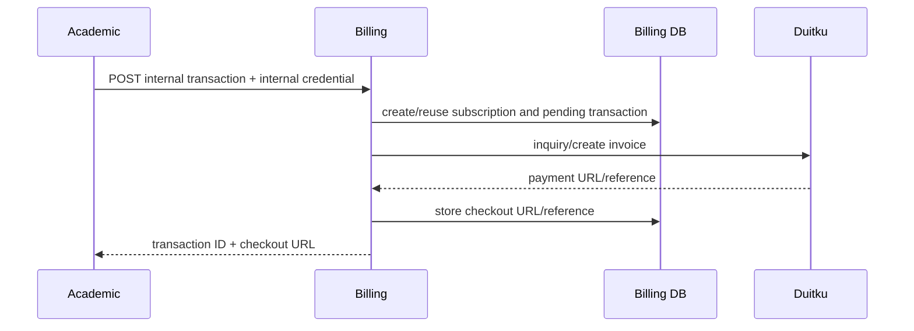

# Billing and subscriptions

`GenerateSubscriptionPayment` first tries to reuse an existing enrollment payment with a checkout URL, validates gross amount and fees, creates/reuses subscription, creates/reuses a pending transaction, attempts an invoice claim, then creates a Duitku invoice and stores returned reference/payment URL. It uses IDR, marks sandbox based on the configured Duitku URL, and sends a virtual-account payment method (`internal/usecase/transaction_usecase.go:51-208`).

The database enforces important idempotency/uniqueness constraints, but migration `000003_subscription_renewals.up.sql` drops the unique `transactions(enrollment_id)` index introduced by `000002`; current repository/use-case behavior should be evaluated with renewal semantics before changing it.

When `SUBSCRIPTION_WORKER_ENABLED` is true, the billing process starts an in-process worker. It finds due subscriptions, creates renewal invoices, updates payment-link fields, sends Resend reminders, and handles expiry on the configured daily-like interval. Email sends and Duitku calls were not executed. Evidence: `internal/usecase/subscription_worker.go`, `cmd/server/main.go:103-105`.
