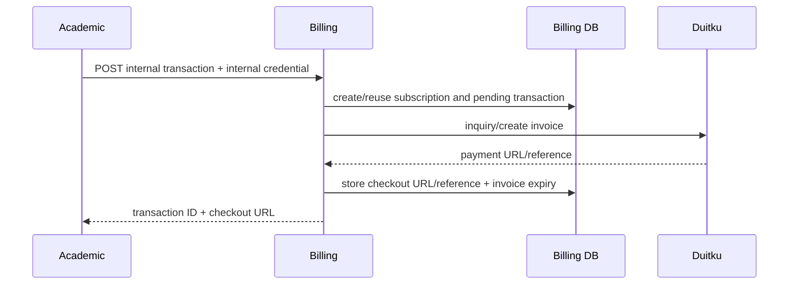

# Billing and subscriptions

## Manual full refund (KEL-152)

**Implemented:** A tenant actor with `billing:refund` records the external manual transfer with required reason/reference. Billing locks the tenant transaction and atomically writes immutable audit, `paid` → `refunded`, subscription cancellation and open unpaid renewal cancellation. Replays return the existing audit. Wallet/ledger and Academic source code are unchanged. Paid-only sales summaries and paid CSV exclude the refunded payment.

The durable `transaction_refunds` job uses existing Academic endpoints: active/suspended → `/end` → dropped; pending → neutralise queued activation and guard in-flight activation, `/end` conflict → `/release` → dropped; a release answering active must be followed by `/end`; dropped stays dropped; completed is untouched and does not invalidate the refund. Activation/resume and renewal guards serialize on transaction/subscription locks, preventing stale work from reactivating or billing after refund. HTTP success records the refund even while Academic is unavailable; failed cleanup is retried with persisted backoff, separately from payment reconciliation. See [API contract](../api/billing.md#manual-full-refund-kel-152) and [ADR 0060](../adr/0060-manual-refund-per-status-enrollment.md).

Evidence: billing `internal/repository/refund_repository.go`, `subscription_refund_guard.go`, `internal/usecase/{transaction_usecase,refund_worker,subscription_worker}.go`, `pkg/academic/refund.go`; billing PR #35 squash `db5cc401acffc04ecf681a857b91a6eeec5e626c`. Operator real-database gateway E2E: `.kel-autopilot/kel152/manual-e2e.md`, SUMMARY 42/42 PASS (outside repositories).

```mermaid
sequenceDiagram
  participant A as Academic
  participant B as Billing
  participant DB as Billing DB
  participant D as Duitku
  A->>B: POST internal transaction + internal credential
  B->>DB: create/reuse subscription and pending transaction
  B->>D: inquiry/create invoice
  D-->>B: payment URL/reference
  B->>DB: store checkout URL/reference + invoice expiry
  B-->>A: transaction ID + checkout URL
```

**Implemented (KEL-128, billing side):** after storing the invoice — and on an idempotent replay that reuses one — billing dispatches one payment-link email for invoices whose request carried `private_schedule_request` (set by academic's private approval; see [academic flow](academic.md)). The email goes to the persisted `billing_email` with the gross amount and exact stored `invoice_expires_at`, guarded by a dedicated conditional claim, a sent stamp and a per-minute retry worker, so a Resend failure never fails the approval and remains observable/retryable; the response still returns the manual checkout URL. See [billing component](../components/billing-service.md) for the full dispatch contract.

`GenerateSubscriptionPayment` first tries to reuse an existing enrollment payment whose invoice is still valid, validates gross amount and fees, creates/reuses subscription, creates/reuses a pending transaction, attempts an invoice claim, then creates a Duitku invoice and stores the returned reference, payment URL, and the derived `invoice_expires_at`. It uses IDR and marks sandbox based on the configured Duitku URL. Since KEL-125, a new enrollment transaction uses the validated `payment_method` from academic (`VC`, `VA`, `BC`, `SP`, `NQ`), defaulting to VC for omitted requests. Billing persists that choice before the claim and sends the persisted value to Duitku; an existing invoice keeps its link and channel on replay, and an expired invoice retains its channel on reissue (legacy empty method defaults to VC). Private approvals and renewals still request no channel and use their existing VC behavior; selecting a channel for private checkout is KEL-133. Academic's public and tenant enrollment handlers reject unsupported channels before reserving an enrollment, and billing independently rejects them before transaction writes. Evidence: academic `internal/usecase/enrollment_usecase.go`, `pkg/billing/client.go`; billing `internal/usecase/transaction_usecase.go`, `internal/repository/payment_method_postgres_test.go`; [academic PR #38](https://github.com/kelolakelas/kelolakelas-academic-service/pull/38) (`94b485ad1086379c32ece8af86545ef5ccca7e78`), [billing PR #25](https://github.com/kelolakelas/kelolakelas-billing-service/pull/25) (`f1e1a14cfe19b3f238b16c4676f9eced9f1a8093`). A transaction that billing already marked `expired` can be re-invoiced through the same idempotent claim while the enrollment is still valid. Evidence: `internal/usecase/transaction_usecase.go:94-347`.

**Implemented (KEL-99):** the fees are no longer taken from the request. Before any write, a new transaction reads identity's applied platform fee policy and computes `platform_fee = floor(gross × percent_bps / 10000) + fixed_fee` and `net_amount = gross - platform_fee - payment_gateway_fee`. It stores the policy version, bps and fixed fee as an immutable snapshot. Over-gross fees are refused with 422 `platform_fee_exceeds_gross`, and an unavailable or unapplied policy with 503 `platform_fee_policy_unavailable`; neither writes a subscription or transaction. A reused transaction keeps its snapshot. Renewal invoices are priced by the policy applied when the renewal is created, and none is created while the policy cannot be read. See [ADR 0044](../adr/0044-platform-fee-policy-applied-snapshot.md).

### Tenant manual withdrawal hold (KEL-143)

**Implemented:** the tenant sends `POST /api/v1/billing/withdrawals` through the gateway with `amount` and a required `idempotency_key`; billing requires `billing:withdraw` and refuses parents. After locking the tenant wallet row inside a database transaction, billing checks for a stored same-key request (return it unchanged), the Rp 50.000 default/configured minimum, one-open-request guard, available balance and a primary bank account. It freezes the bank destination in the withdrawal row, moves `amount` from available to pending, then writes a negative `withdrawal_hold` ledger entry. All writes commit or roll back together. Concurrent requests and payment crediting serialize on the wallet lock; a retry after a gateway timeout does not hold money twice. A tenant can read a paginated history and masked destination, or cancel a still-`requested` withdrawal through `DELETE /api/v1/billing/withdrawals/:id`. Cancellation conditionally moves the state to `cancelled`, returns the pending amount to available and writes a positive `withdrawal_release` ledger row in the same transaction; repeated/late cancellation returns 409. Admin processing and disbursement remain unimplemented, so `processing` is a future reserved state; platform-admin paid/rejected processing arrived in KEL-144 (next section). See [ADR 0056](../adr/0056-tenant-manual-withdrawal-hold.md). Evidence: billing `internal/usecase/withdrawal_usecase.go`, `internal/repository/withdrawal_repository.go`, `migrations/20261002000000_withdrawal_request_cancel.up.sql`; gateway `internal/delivery/http/router.go`; [billing PR #29](https://github.com/kelolakelas/kelolakelas-billing-service/pull/29) `6c70af4d3fb76e7257c4b2c7e813771b414358c1`, [gateway PR #34](https://github.com/kelolakelas/kelolakelas-api-gateway/pull/34) `20a3a521c2526e5ff9cce51483d8c9886015bfeb`.

### Platform manual withdrawal processing (KEL-144)
**Implemented:** an active platform admin lists the cross-tenant `requested` queue (`GET /api/v1/platform/withdrawals`, oldest first, paged, full frozen destination) through the gateway and records the off-chain transfer with `POST /api/v1/platform/withdrawals/:id/paid` (`{transfer_reference}`, required and globally unique) or rejects it with `POST /api/v1/platform/withdrawals/:id/reject` (`{reason}`, required). Billing checks the signed platform claim plus the live identity assignment and factor version on every call (403 revoked/non-admin, 503 identity outage). The decision is one wallet-locked transaction with a conditional `requested`-only claim: paid consumes the hold and writes `withdrawal_release` (+amount) plus `withdrawal_paid` (-amount); rejected returns the hold to available with one `withdrawal_release`. Concurrent admin decisions and a tenant cancel racing a decision leave exactly one winner (409 for the loser); a reused transfer reference rolls back to 409. Disbursement stays manual and off-chain — `paid` is the audit record, not a provider payout — and `processing` remains a reserved future state. See [ADR 0057](../adr/0057-platform-manual-withdrawal-processing.md). Evidence: billing `internal/usecase/platform_withdrawal.go`, `internal/repository/withdrawal_repository.go`, `migrations/20261002010000_manual_withdrawal_decisions.up.sql`; gateway `internal/delivery/http/router.go`; identity `internal/delivery/grpc/platform_admin_service.go`; [billing PR #30](https://github.com/kelolakelas/kelolakelas-billing-service/pull/30) `fcfd003c782bf15fc1830050085301508bc69f8c`, [gateway PR #35](https://github.com/kelolakelas/kelolakelas-api-gateway/pull/35) `d269d9b93c365c21c97ddae315785be963c67ee7`, [identity PR #37](https://github.com/kelolakelas/kelolakelas-identity-service/pull/37) `9ee07d3b17c508ce30c2a2ea3a5dc946706cbf2c`. Decision history arrived in KEL-163: the same endpoint with `?status=decided` returns only `paid`/`rejected` rows newest first (`decided_at DESC, id DESC`) with the full decision fields; any other `status` value answers 400 and omitting it keeps the `requested` queue. Evidence: billing `internal/repository/withdrawal_repository.go` (`ListDecided`), `migrations/20261002030000_withdrawal_decision_history.up.sql` (`idx_withdrawals_decided_history`); [billing PR #34](https://github.com/kelolakelas/kelolakelas-billing-service/pull/34) `1a513ad7c59981d3bb455da776619a4b74f6088d`.

### Tenant transaction paid-date filter and CSV export (KEL-147)

**Implemented:** `GET /api/v1/billing/transactions` accepts an optional `date_by` selector (`created_at` default, `paid_at`) choosing which column the `date_from`/`date_to` range filters on, so a tenant can pull the row-level transactions behind a summary period; list and export share `applyTransactionFilters`, so the predicates cannot drift apart. `GET /api/v1/billing/transactions/export` (registered before `/transactions/:id`, gateway forwards path and query unchanged) streams the same filters as a `text/csv` attachment defaulting to `status=paid`, `date_by=paid_at`, last 30 UTC days, reconciling with the summary by construction. Both are tenant-only (`billing:read`, parent 403 before identity). Rows stream in 500-row batches; no migration and no new index. See [ADR 0058](../adr/0058-tenant-transaction-paid-date-filter-and-csv-export.md). Evidence: billing `internal/domain/transaction_export.go`, `internal/usecase/transaction_usecase.go` (`ExportTransactions`), `internal/delivery/http/handler/transaction_handler.go`, `cmd/server/routes.go`; gateway `internal/delivery/http/router.go`; [billing PR #31](https://github.com/kelolakelas/kelolakelas-billing-service/pull/31) `49e275f2e8713dc7234e3e45fa6ca2e3f77707b0`, [gateway PR #36](https://github.com/kelolakelas/kelolakelas-api-gateway/pull/36) `89ae62ed084d5b1053bb6f0b833dcf80b9733932`.

### Private request approval invoice (KEL-108)

**Implemented:** academic's tenant approval of a private schedule request creates a pending enrollment and its schedules/sessions atomically, then calls the existing billing `GenerateInvoice` outside the request-row transaction. Billing receives the stored parent email and `private-request:<request UUID>` idempotency key; it creates or reuses the checkout transaction, and academic stores the transaction ID and URL on the enrollment. Parallel academic requests can call billing with the same key; billing's existing invoice claim and idempotency avoid duplicate transactions. The parent sees the pending payment through the existing transaction listing and KEL-53 resume-payment page. Billing's existing payment webhook activates the academic enrollment, and the existing expiry/release path still applies without changes. A transient invoice failure leaves an approved request and pending enrollment for a same-key retry; a platform-fee refusal returns 422, drops the enrollment and resets the request to pending, then a later retry restores the same enrollment if the policy changes. Evidence: academic `internal/usecase/private_schedule_request_usecase.go`, `internal/repository/enrollment_repository.go`, `internal/usecase/private_schedule_approval_{test,postgres_test}.go`; [academic PR #35](https://github.com/kelolakelas/kelolakelas-academic-service/pull/35), squash `603b29aa0a14c2da04cede9da62f8504446c5151`. No live Duitku or billing webhook was exercised by KEL-108's local tests.

### Invoice claim exclusivity and recovery (KEL-24)

`creating` is the transient exclusivity claim that stops two concurrent requests from invoicing the same enrollment. The claim is a single conditional `UPDATE ... WHERE <predicate>` and the `RowsAffected == 1` result is the whole mechanism, so parallel requests resolve inside the database with no additional lock. `ClaimInvoice` (`internal/repository/transaction_repository.go:124`) matches `pending`/`failed` rows that have no payment link, plus `creating` rows whose claim is missing or older than the timeout; `ClaimReinvoice` (`:177`) adds the same stale-`creating` arm to the re-invoice path. Ownership is never permanent:

- **On provider failure** the claim is released through `RestoreFailedInvoiceClaim` (`:154`), which returns the row to `failed` and records the reason in `invoice_failure_reason`. The release is conditional on `status = 'creating' AND checkout_session_url IS NULL`, so only the row this call still owns is rewritten — a late provider response or a cancellation that won the race is never overwritten. The release is best-effort and never replaces the provider error, so the caller still learns why the invoice was not created (`internal/usecase/transaction_usecase.go:326,338`).
- **When the process dies** between taking the claim and storing the link, the claim stays unowned until `TRANSACTION_CLAIM_TIMEOUT_MINUTES` (default `10`, `internal/config/config.go:47`, defaulted from `domain.DefaultTransactionClaimTimeoutMinutes`) has elapsed, after which the next request may take it over.
- **On success** `MarkInvoiceIssued` (`:305`) clears `invoice_claimed_at` and `invoice_failure_reason` in the same write that stores the link, because the row is no longer being created.

The release deliberately leaves `invoice_claimed_at` populated as a record of when the attempt ran; the `failed` status is what makes the row claimable again. The subscription worker releases its own renewal claim on the same terms and skips a renewal whose claim is still fresh (`internal/usecase/subscription_worker.go:147,157`).

Setting `TRANSACTION_CLAIM_TIMEOUT_MINUTES` below the longest legitimate gateway response would let an in-flight attempt be invoiced twice. A second invoice reuses the same merchant order ID (`ClaimReinvoice` does not rewrite it), which is what Duitku deduplicates on, so the correct response to a slow gateway is to raise the timeout rather than lower it. Migration `20260922000000_invoice_claim_recovery` and its backfill are described in [billing schema](../data/billing-schema.md).

The `expiryPeriod` sent to Duitku and the stored `invoice_expires_at` are both derived from `SUBSCRIPTION_PAYMENT_EXPIRY_PERIOD_DAYS` (default `14` days), so the local deadline and the gateway deadline cannot drift apart. Previously the adapter sent an implicit `1440` minutes while nothing recorded a local deadline.

The database enforces important idempotency/uniqueness constraints, but migration `000003_subscription_renewals.up.sql` drops the unique `transactions(enrollment_id)` index introduced by `000002`; current repository/use-case behavior should be evaluated with renewal semantics before changing it. Since KEL-59, the non-unique `idx_transactions_enrollment_created_at` on `(enrollment_id, created_at)` serves per-enrollment lookups again without restoring uniqueness (see [billing schema](../data/billing-schema.md)).

When `SUBSCRIPTION_WORKER_ENABLED` is true, the billing process starts an in-process worker. It finds active due subscriptions, creates renewal invoices, updates payment-link fields, and sends Resend reminders on the configured interval. Renewal invoices reset `invoice_expires_at`/`expired_at` so a new period never inherits the previous deadline. Email sends and Duitku calls were not executed. Evidence: `internal/usecase/subscription_worker.go`, `cmd/server/main.go`.

**Implemented (KEL-150):** strictly after `next_billing_date + SUBSCRIPTION_GRACE_PERIOD_DAYS` (default 7), the worker locks the active subscription, checks no paid transaction exists for that billing period, then atomically sets `suspended` and upserts one durable `subscription_lifecycle_reconciliations` suspend job. Suspended subscriptions leave the active-only invoice/reminder scan. The payment reconciliation worker claims the job and calls Academic's internal suspend endpoint. A confirmed late payment can settle an expired renewal: the callback locks the subscription, enqueues resume within its payment transaction, sets the subscription active and advances its billing date; Academic resume follows through the lifecycle job. The job serializes desired suspend/resume, retains retry errors, and records exhausted failures as `terminal_failed`, including a capacity 409. Operators with the internal credential can inspect `GET /internal/billing/subscription-lifecycle?status=terminal_failed` (maximum 200 newest records; status optional). There is no automatic requeue for a terminal lifecycle conflict. Migration `20261002020000_subscription_lifecycle` removes only pending legacy renewal release jobs; already claimed/completed release jobs remain evidence and may need operator investigation. Evidence: billing `internal/repository/subscription_lifecycle_repository.go`, `internal/usecase/{subscription_worker,reconciliation_worker,transaction_usecase}.go`, `cmd/server/routes.go`, PostgreSQL concurrent integration test; [ADR 0059](../adr/0059-renewal-dunning-lifecycle.md), [billing PR #33](https://github.com/kelolakelas/kelolakelas-billing-service/pull/33), squash `e99d273344225b78bf577408620cff2f5a178d03`.

A second in-process worker performs local invoice expiry. It is enabled by
`TRANSACTION_EXPIRY_WORKER_ENABLED` (default true) at
`TRANSACTION_EXPIRY_WORKER_INTERVAL_MINUTES` (default 5) and moves overdue
`pending` transactions to `expired` in batches of 200 with one conditional
update per batch, so it is idempotent and safe when several billing replicas run
at once. Local expiry only removes rows from `pending`; a `resultCode=00`
callback that arrives afterwards still marks the transaction `paid` and keeps
`expired_at` as evidence, as described in
[ADR 0009](../adr/0009-local-invoice-expiry-without-losing-late-payments.md).
Evidence: `internal/usecase/transaction_expiry_worker.go`,
`internal/repository/transaction_repository.go:147-166`, `cmd/server/main.go:110-115`.
