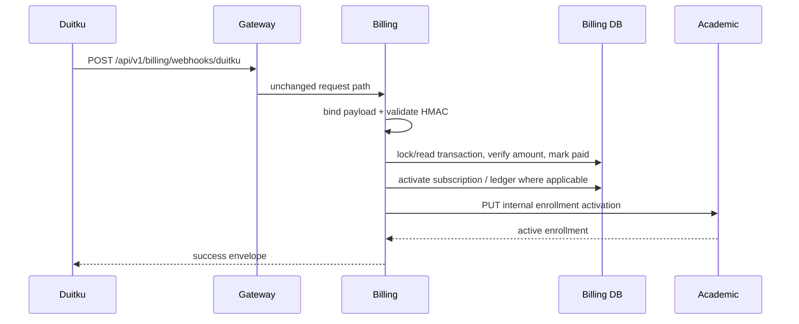

# Duitku payment callback

**Authentication:** the route is public by design; callback integrity comes from `DuitkuAdapter.ValidateCallbackSignature`. **Validation:** binding requires callback fields; signature failure is 400; use case loads/locks a transaction, treats paid callbacks as replay reconciliation, parses and compares amount, and handles result code `00` as paid. Evidence: `kelolakelas-billing-service/internal/delivery/http/handler/transaction_handler.go:220-255`, `internal/usecase/transaction_usecase.go:252-373`, `pkg/duitku/client.go:96-112`.

**Writes/side effects:** transaction status/paid timestamp; subscription activation/next billing date; where non-sandbox, wallet/ledger update; after the database transaction the academic enrollment activation call is attempted. The source comment explicitly says sandbox callbacks must not create real tenant balance/ledger entries. A downstream academic activation failure is returned after billing state is committed, creating a reconciliation concern; callback replay attempts activation again for paid rows.
