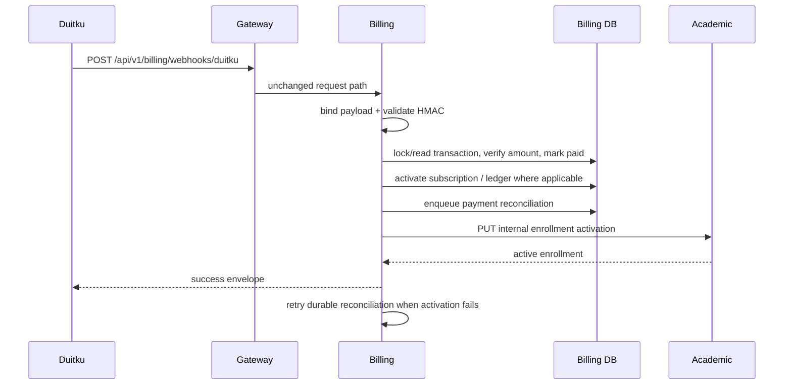

# Duitku payment callback

**Authentication:** the route is public by design; callback integrity comes from `DuitkuAdapter.ValidateCallbackSignature`. **Validation:** binding requires callback fields; signature failure is 401; use case loads/locks a transaction, treats paid callbacks as replay reconciliation, parses and compares amount, and handles result code `00` as paid. Evidence: `kelolakelas-billing-service/internal/delivery/http/handler/transaction_handler.go:220-255`, `internal/usecase/transaction_usecase.go:252-373`, `pkg/duitku/client.go:96-112`.

**Writes/side effects:** transaction status/paid timestamp; subscription activation/next billing date; where non-sandbox, wallet/ledger update; and a durable `payment_reconciliations` row in the same billing transaction. The source comment explicitly says sandbox callbacks must not create real tenant balance or ledger entries. Academic activation is attempted after the billing transaction commits. A failure is stored with the next retry time and does not require a provider callback replay; the in-process reconciliation worker retries it with a claim lease. Repeated callbacks reuse the existing transaction, subscription, ledger uniqueness, and reconciliation row.

The billing transaction response includes `reconciliation_status` (`active`,
`reconciling`, or `terminal_failed`), attempt count, next attempt time, and the
latest redacted error message where available. Academic's internal activation
endpoint remains idempotent: an already-active enrollment is returned as a
successful result.
