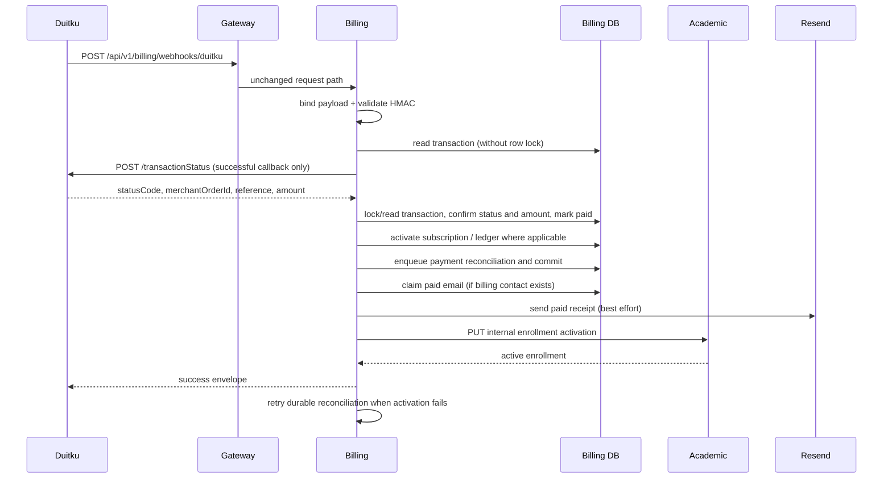
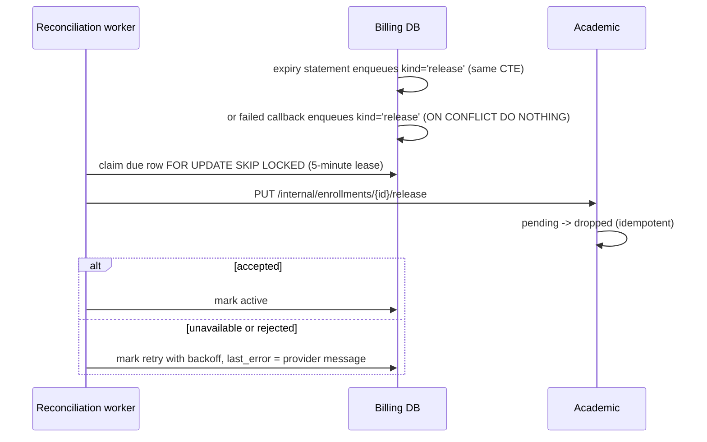
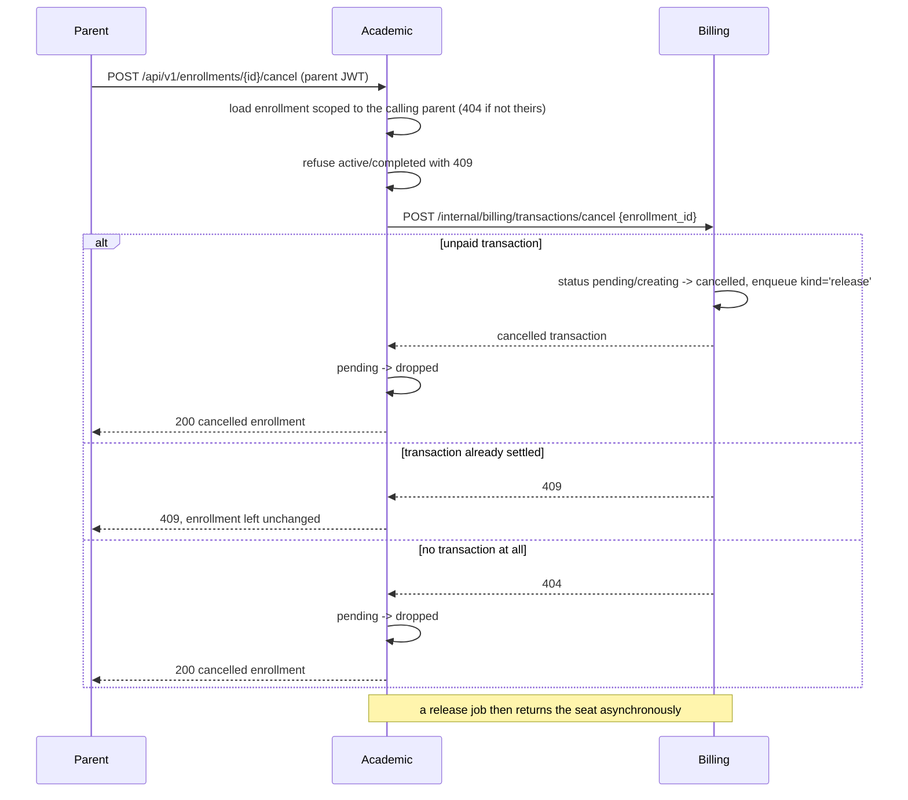

# Duitku payment callback



A separate local job moves overdue unpaid invoices out of `pending`:

```mermaid
sequenceDiagram
  participant W as Expiry worker
  participant DB as Billing DB
  W->>DB: UPDATE ... WHERE status='pending' AND invoice_expires_at <= now FOR UPDATE SKIP LOCKED
  DB-->>W: rows expired
  Note over W,DB: safe across replicas; never matches a paid row
  W->>DB: enqueue release reconciliation (same statement)
```

**Authentication:** the route is public by design; callback integrity comes from `DuitkuAdapter.ValidateCallbackSignature`. **Validation:** binding requires callback fields; signature failure is 401; use case loads/locks a transaction, treats paid callbacks as replay reconciliation, parses and compares amount, and handles result code `00` as paid. Evidence: `kelolakelas-billing-service/internal/delivery/http/handler/transaction_handler.go:239-283`, `internal/usecase/transaction_usecase.go:606-781`, `pkg/duitku/client.go:96-104`.

**Implemented (KEL-56):** A signed `00` callback is not sufficient evidence of settlement: before taking the row lock, billing reads the transaction and calls Duitku `POST /transactionStatus` once (except for an already-paid replay), using the configured bounded HTTP client. Inside the locked transaction, billing requires status `00`, matching merchant order, gross amount and nonempty reference (also matching the saved payment intent and callback reference where supplied). A pending/failed provider status, mismatch or unavailable status API returns a non-2xx callback response and leaves payment, wallet and ledger unchanged; a structured WARN is emitted for status rejection or provider call errors (an empty status response returns an error without a WARN). A later provider callback can retry. The row is rechecked under lock to keep concurrent callbacks idempotent; an already-paid replay does not query Duitku again. There is no polling or periodic status reconciliation. See [ADR 0033](../adr/0033-confirm-duitku-payment-status-before-settlement.md). Evidence: billing `pkg/duitku/client.go` (`TransactionStatus`), `internal/usecase/transaction_usecase.go` (`HandleDuitkuWebhook`, `handleDuitkuWebhookLocal`), `internal/usecase/transaction_status_confirmation_test.go`, `pkg/duitku/status_test.go`; PR #15 (`66597cdd5a5a0ee570534d34824c8e64b4bf5737`).

**Implemented (KEL-28):** After a committed `00` or `01`/`02` callback, Billing conditionally claims the transaction's `paid_email_sent_at` or `failed_email_sent_at` timestamp and sends one Indonesian HTML message to its stored `billing_email` through the bounded-timeout Resend client. The paid receipt includes the stored class name, gross IDR amount, and merchant order ID; the failed notice offers the stored checkout link when available, otherwise directs the parent to reopen the billing page. Dynamic class, ID, and link values are HTML-escaped; older transactions without `class_name` show “kelas Anda”, and those without `billing_email` are skipped. A reported provider failure logs a warning and conditionally releases that claim so a callback replay can retry without repeating the transaction transition; delivery failure never changes the callback result. A timeout after provider acceptance is inherently ambiguous, so a retry can duplicate delivery; a successful claim prevents normal replay duplicates. Evidence: billing `internal/usecase/transaction_usecase.go` (`HandleDuitkuWebhook`, `sendOutcomeEmail`), `internal/repository/transaction_repository.go` (`ClaimOutcomeEmail`, `ReleaseOutcomeEmailClaim`), `migrations/20260927000000_transaction_outcome_emails.up.sql`, `internal/usecase/transaction_usecase_test.go`; [billing PR #18](https://github.com/kelolakelas/kelolakelas-billing-service/pull/18), squash `f273afeff419bcb77fd510e7d945206fb48f91ad`.

**Result code handling.** Confirmed `00` marks the transaction `paid` and runs the paid side effects. `01`/`02` mark it `failed`, but only when the transaction is still `pending` or `creating`, so a callback can never downgrade a settled `paid` or `expired` row. A code outside `00`/`01`/`02` changes nothing: the service writes a structured `WARN` log with `merchant_order_id`, `transaction_id`, `enrollment_id`, `result_code`, `payment_code`, `reference`, and `transaction_status`, and still answers `200` so Duitku does not retry. Evidence: `internal/usecase/transaction_usecase.go:652-778`.

**Late payment after local expiry.** Billing records `transactions.invoice_expires_at` (the same window sent to Duitku) and `transactions.expired_at`. The expiry worker moves overdue `pending` rows to `expired` with a single conditional update guarded by `status = 'pending'` plus `FOR UPDATE SKIP LOCKED`, so it is idempotent and safe with several replicas. A `00` callback that arrives after that still wins: the transaction becomes `paid`, `expired_at` is retained as evidence, and subscription, wallet/ledger, and reconciliation side effects run normally. `01`/`02` cannot undo it. See [ADR 0009](../adr/0009-local-invoice-expiry-without-losing-late-payments.md). Evidence: `internal/repository/transaction_repository.go:125-166`, `internal/usecase/transaction_expiry_worker.go`, `internal/usecase/transaction_usecase.go:653-746`.

**Seat release after a failed or expired payment.** An unpaid enrollment used to keep its schedule seat `pending` forever, because the academic capacity predicate counts `status IN ('pending','active')`. Billing now ends the hold as well as the invoice (KEL-26, [ADR 0012](../adr/0012-release-enrollment-seat-on-failed-payment.md)):



The enrolment transition is deliberately asymmetric:

- `pending` becomes `dropped`, which frees the seat with no capacity-query change and does not block re-enrollment, because the unique partial index on `(student_id, class_id)` is also limited to `pending`/`active`.
- An already `dropped` enrollment answers success, so repeated notifications converge instead of erroring.
- An `active` enrollment is returned untouched: a late `01`/`02` callback must never revoke a seat that a confirmed `00` payment already activated.
- Any other status, including `completed`, answers 409 and the rejection is kept in the reconciliation row's `last_error`. That is what makes "the parent paid after the seat was released" visible to an operator rather than silently successful.

Cancelling a pending release is needed for one race: if the parent requests a new invoice for the same enrollment while a release job is queued but unclaimed, billing withdraws that job in the same flow that makes the transaction payable again. A release that has already been claimed or accepted is left alone. Evidence: `internal/usecase/transaction_usecase.go`, `internal/repository/transaction_repository.go`, `internal/repository/payment_reconciliation_repository.go`, `internal/usecase/reconciliation_worker.go`, `pkg/academic/client.go`, academic `internal/usecase/enrollment_usecase.go`.

**Parent cancellation of a pending enrollment.** Expiry and failure release a seat without the parent asking; a parent can also withdraw deliberately (KEL-27, [ADR 0016](../adr/0016-cancel-pending-enrollment.md)). The write order is billing first, then academic:



The order matters. Billing is asked first because it is the only side that can say "this hold is already paid for". If academic dropped the seat first and billing then refused, the seat would be gone for money the parent actually paid, and nothing in the system could restore it. Asking billing first means a refusal is harmless: the enrollment has not changed yet, so the parent gets a conflict and keeps both the seat and the payment.

Two details follow from that reasoning:

- An enrollment that is already `dropped` is answered with a conflict like any other finished state, not as a success. Cancellation is defined as "this request moved the enrollment out of `pending`", and a request that changes nothing has not cancelled anything. The withdrawal is still attempted first, because an enrollment that is already `dropped` can still hold an invoice that was paid after its seat was released; that case is refused on the invoice state and stays visible in the reconciliation row's `last_error`.
- An enrollment with no transaction at all is still cancellable, so an enrollment whose invoice creation never completed does not strand a seat.

A `00` callback that arrives after the cancellation behaves like a late payment after a seat release: the transaction becomes `paid` and the activation reconciliation converts the queued release job back into an activation attempt. Activation then answers 409 because the enrollment is `dropped`, and the rejection is recorded rather than silently successful, so an operator can see that money arrived for a seat that was already given back. Evidence: academic `internal/usecase/enrollment_usecase.go`, `internal/delivery/http/handler/enrollment_handler.go`; billing `internal/usecase/transaction_usecase.go`, `internal/repository/transaction_repository.go`.

**Writes/side effects:** transaction status/paid timestamp; subscription activation/next billing date; where non-sandbox, wallet/ledger update; and a durable `payment_reconciliations` row in the same billing transaction. The source comment explicitly says sandbox callbacks must not create real tenant balance or ledger entries. Academic activation is attempted after the billing transaction commits. A failure is stored with the next retry time and does not require a provider callback replay; the in-process reconciliation worker retries it with a claim lease. Repeated callbacks reuse the existing transaction, subscription, ledger uniqueness, and reconciliation row.

The billing transaction response includes `reconciliation_status` (`active`,
`reconciling`, or `terminal_failed`), `reconciliation_kind` (`activation` or
`release`), attempt count, next attempt time, and the
latest redacted error message where available. It also exposes
`invoice_expires_at` and `expired_at` so a parent-scoped list or detail view can
show the invoice deadline and whether billing already expired it locally.
Academic's internal activation endpoint remains idempotent: an already-active
enrollment is returned as a successful result. The release endpoint is
idempotent in the same way for an already-dropped enrollment.
