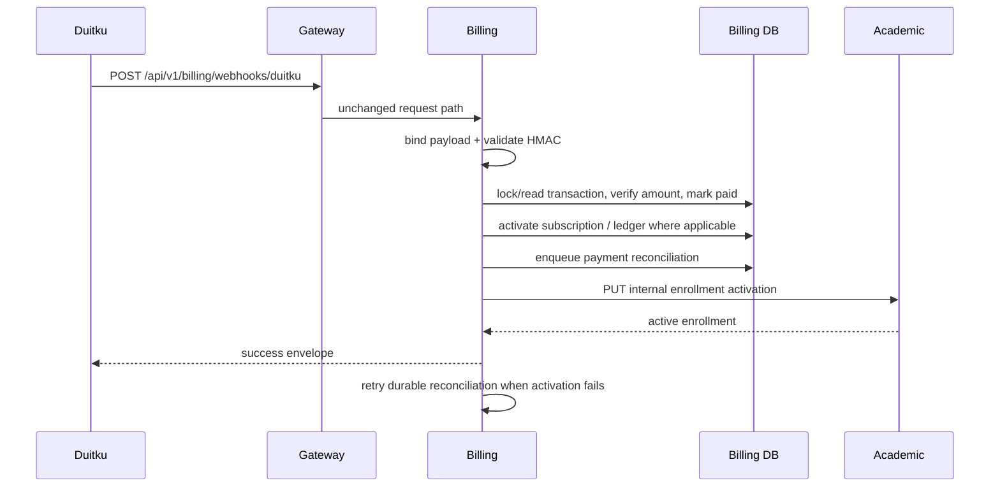
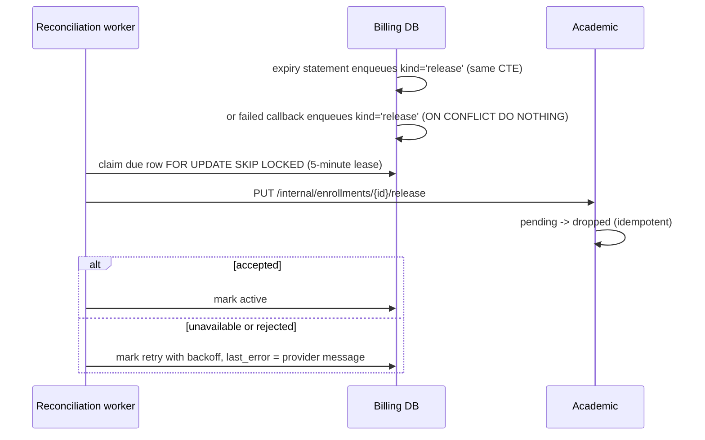

# Duitku payment callback



A separate local job moves overdue unpaid invoices out of `pending`:

```mermaid
sequenceDiagram
  participant W as Expiry worker
  participant DB as Billing DB
  W->>DB: UPDATE ... WHERE status='pending' AND invoice_expires_at <= now FOR UPDATE SKIP LOCKED
  DB-->>W: rows expired
  Note over W,DB: safe across replicas; never matches a paid row
  W->>DB: enqueue release reconciliation (same statement)
```

**Authentication:** the route is public by design; callback integrity comes from `DuitkuAdapter.ValidateCallbackSignature`. **Validation:** binding requires callback fields; signature failure is 401; use case loads/locks a transaction, treats paid callbacks as replay reconciliation, parses and compares amount, and handles result code `00` as paid. Evidence: `kelolakelas-billing-service/internal/delivery/http/handler/transaction_handler.go:205-247`, `internal/usecase/transaction_usecase.go:384-602`, `pkg/duitku/client.go:96-104`.

**Result code handling.** `00` marks the transaction `paid` and runs the paid side effects. `01`/`02` mark it `failed`, but only when the transaction is still `pending` or `creating`, so a callback can never downgrade a settled `paid` or `expired` row. A code outside `00`/`01`/`02` changes nothing: the service writes a structured `WARN` log with `merchant_order_id`, `transaction_id`, `enrollment_id`, `result_code`, `payment_code`, `reference`, and `transaction_status`, and still answers `200` so Duitku does not retry. Evidence: `internal/usecase/transaction_usecase.go:480-602`.

**Late payment after local expiry.** Billing records `transactions.invoice_expires_at` (the same window sent to Duitku) and `transactions.expired_at`. The expiry worker moves overdue `pending` rows to `expired` with a single conditional update guarded by `status = 'pending'` plus `FOR UPDATE SKIP LOCKED`, so it is idempotent and safe with several replicas. A `00` callback that arrives after that still wins: the transaction becomes `paid`, `expired_at` is retained as evidence, and subscription, wallet/ledger, and reconciliation side effects run normally. `01`/`02` cannot undo it. See [ADR 0009](../adr/0009-local-invoice-expiry-without-losing-late-payments.md). Evidence: `internal/repository/transaction_repository.go:125-166`, `internal/usecase/transaction_expiry_worker.go`, `internal/usecase/transaction_usecase.go:480-573`.

**Seat release after a failed or expired payment.** An unpaid enrollment used to keep its schedule seat `pending` forever, because the academic capacity predicate counts `status IN ('pending','active')`. Billing now ends the hold as well as the invoice (KEL-26, [ADR 0012](../adr/0012-release-enrollment-seat-on-failed-payment.md)):



The enrolment transition is deliberately asymmetric:

- `pending` becomes `dropped`, which frees the seat with no capacity-query change and does not block re-enrollment, because the unique partial index on `(student_id, class_id)` is also limited to `pending`/`active`.
- An already `dropped` enrollment answers success, so repeated notifications converge instead of erroring.
- An `active` enrollment is returned untouched: a late `01`/`02` callback must never revoke a seat that a confirmed `00` payment already activated.
- Any other status, including `completed`, answers 409 and the rejection is kept in the reconciliation row's `last_error`. That is what makes "the parent paid after the seat was released" visible to an operator rather than silently successful.

Cancelling a pending release is needed for one race: if the parent requests a new invoice for the same enrollment while a release job is queued but unclaimed, billing withdraws that job in the same flow that makes the transaction payable again. A release that has already been claimed or accepted is left alone. Evidence: `internal/usecase/transaction_usecase.go`, `internal/repository/transaction_repository.go`, `internal/repository/payment_reconciliation_repository.go`, `internal/usecase/reconciliation_worker.go`, `pkg/academic/client.go`, academic `internal/usecase/enrollment_usecase.go`.

**Writes/side effects:** transaction status/paid timestamp; subscription activation/next billing date; where non-sandbox, wallet/ledger update; and a durable `payment_reconciliations` row in the same billing transaction. The source comment explicitly says sandbox callbacks must not create real tenant balance or ledger entries. Academic activation is attempted after the billing transaction commits. A failure is stored with the next retry time and does not require a provider callback replay; the in-process reconciliation worker retries it with a claim lease. Repeated callbacks reuse the existing transaction, subscription, ledger uniqueness, and reconciliation row.

The billing transaction response includes `reconciliation_status` (`active`,
`reconciling`, or `terminal_failed`), `reconciliation_kind` (`activation` or
`release`), attempt count, next attempt time, and the
latest redacted error message where available. It also exposes
`invoice_expires_at` and `expired_at` so a parent-scoped list or detail view can
show the invoice deadline and whether billing already expired it locally.
Academic's internal activation endpoint remains idempotent: an already-active
enrollment is returned as a successful result. The release endpoint is
idempotent in the same way for an already-dropped enrollment.
