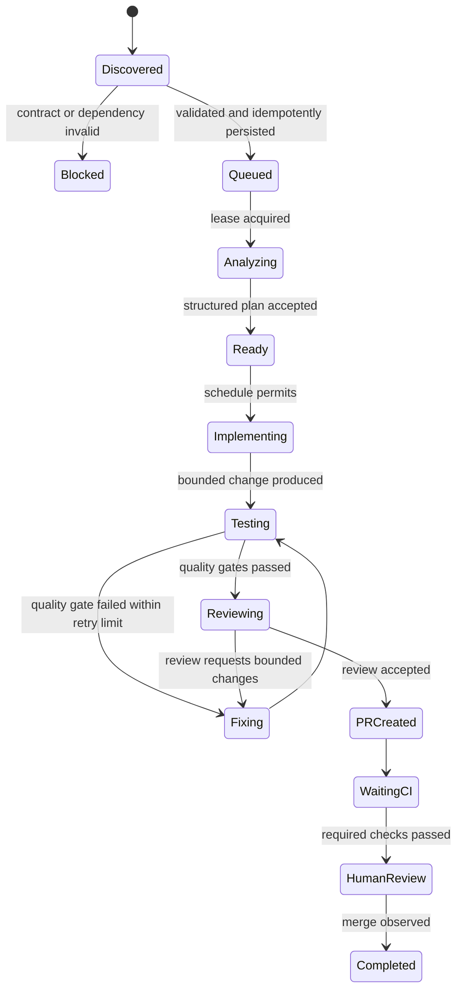

# AI orchestrator implementation plan

Status: **Proposed**\
Last reviewed: 2026-09-16\
Target repository: `kelolakelas-ai-orchestrator`

This document is a staged delivery plan, not a description of implemented behavior. Claims about the current state use the documentation status vocabulary; target behavior is marked **Proposed**.

## Outcome

The target outcome is a long-running worker that can safely take a validated `ai-ready` Linear Issue, execute one bounded software-engineering workflow in the correct KelolaKelas repositories, open a pull request, observe required CI and review gates, and leave durable, auditable state for operators.

The first usable release is intentionally narrower than a fully autonomous delivery system:

- one orchestrator instance and one task at a time;
- repositories from an explicit allowlist;
- human approval remains required for merge;
- no production deployment or automatic Linear completion;
- no arbitrary shell commands proposed by an issue or model;
- every external side effect is idempotent and recoverable after restart.

## Current-state baseline

| Capability | Status | Evidence | Consequence |
|---|---|---|---|
| Configuration validation | **Implemented** | `kelolakelas-ai-orchestrator/src/index.ts`, `src/config/config.ts`, `src/config/schema.ts` | Startup rejects malformed YAML, invalid timezones, missing model tiers, and heartbeat intervals longer than half the lease. |
| Planning contract and local validator | **Implemented** | `src/intake/planning-contract.ts`, `src/intake/validate.ts` | Planning payloads can be checked before publication. |
| State machine, scheduling policy, routing, and retries | **Implemented** | `src/orchestrator/state-machine.ts`, `src/scheduling/operating-hours.ts`, `src/scheduling/stage-gate.ts`, `src/routing/*`, `src/orchestrator/retry-policy.ts` | The scheduler applies the state machine and stage gates. Phase 5 stages use the escalation route and bounded attempt limits. |
| Task and transition schema | **Implemented** | `src/db/schema.ts`, `migrations/0002_blue_tyrannus.sql` | Parent tasks persist contracts, leases, dependencies, work units, attempts, checkpoints, and external operations. |
| Transactional queue claim | **Implemented** | `src/repositories/task.repository.ts` | Claim and transition validate state, respect blockers, maintain leases, and append history in one transaction. |
| Multi-repository execution model | **Implemented for persistence** | `src/db/schema.ts`, `src/repositories/task.repository.ts`, ADR 0003 | One parent task owns repository-specific work units; worktree execution remains a later phase. |
| Linear intake adapter | **Implemented** (read-only) | `src/providers/linear.ts`, `src/intake/linear-discovery.ts` | Eligible issues are persisted idempotently. |
| Repository registry and worktree preparation | **Implemented and verified locally** (opt-in) | `src/workspaces/*`, `migrations/0005_phase4_workspace_identity.sql`, ADR 0005 | With `orchestrator.execution.prepareWorkspaces`, claimed tasks receive isolated worktrees. Disabled by default. |
| Agent runner, quality gates, diff policy, and review | **Implemented and verified locally and in GitHub CI** (opt-in) | `src/execution/*`, `migrations/0006_phase5_agent_attempts.sql`, ADR 0006 | With `orchestrator.execution.runAgents`, tasks are analyzed, implemented, gated, fixed, and reviewed, then park in `BLOCKED` with a committed local branch. Disabled by default. |
| GitHub delivery and CI observation adapters | **Not found** | Repository source inventory and README | No branch is pushed and no pull request is created. |
| Long-running scheduler, crash recovery, and operator controls | **Implemented and verified locally** | `src/orchestrator/scheduler.ts`, `src/orchestrator/stage-handler.ts`, `src/http/server.ts`, `src/repositories/operator.repository.ts`, `migrations/0004_phase3_scheduler_controls.sql`, ADR 0004 | The worker runs continuously as an intake auditor with lease recovery and operator controls. Stage execution begins when later phases register handlers. |
| Repository CI | **Implemented and verified in GitHub** | `.github/workflows/ci.yml`, `main` branch protection | The `gate` job runs a schema-drift check, migrations, PostgreSQL integration tests, build, lint, and unit tests on pull requests and pushes to `main`. Branch protection requires a pull request and a passing, up-to-date `gate` check, includes administrators, and blocks force pushes and deletion. On 2026-09-16 a pending `gate` check reported the pull request as `BLOCKED`, and a passing one as `CLEAN`. |

The original migration consistency defect, where `migrations/0001_add_task_complexity_enum.sql` was absent from `migrations/meta/_journal.json`, was resolved in Phase 0. The clean-install and upgrade paths through `0004_phase3_scheduler_controls` were verified on PostgreSQL 16 on 2026-09-16.

## Target workflow



Each transition must be atomic with its history record. Long operations use a lease and checkpoint so another process cannot duplicate work and a restarted process can continue from the last durable stage.

## Delivery principles

1. Treat Linear bodies, repository contents, tool output, and model output as untrusted input.
2. Keep workflow decisions deterministic; models return versioned structured results and cannot select credentials, repositories, commands, merge policy, or model IDs.
3. Separate read-only discovery from write-enabled execution. Prove dry-run behavior before enabling Git, Linear, or GitHub writes.
4. Make every external write idempotent using stable task, stage, branch, and pull-request identities.
5. Use one database transaction for state validation, task mutation, and transition history.
6. Require repository-local quality commands from trusted configuration. Never execute commands sourced from Linear or model prose.
7. Prefer manual recovery for an ambiguous side effect rather than retrying it blindly.

## Phased roadmap

### Phase 0: repair and protect the foundation

Goal: make Phase 1 reproducible and establish a reliable merge gate.

Implementation status (2026-09-16): **Implemented; GitHub CI and branch protection verified.** The CI job was renamed to `gate`, the required status check, and gained a guard that fails when `src/db/schema.ts` has no committed migration. Branch protection on `main` matches the other KelolaKelas repositories.

Earlier status (2026-09-15): Drizzle metadata now registers migration `0001`, startup validation rejects invalid IANA timezones and missing analyzer/reviewer tiers, and Pino redaction is covered by unit tests. The migration upgrade test requires `MIGRATION_TEST_DATABASE_URL`; it is skipped locally when that variable is absent and is configured to run against PostgreSQL 16 in GitHub Actions.

Deliverables:

- repair Drizzle migration metadata and verify clean-install plus upgrade paths;
- add GitHub Actions for build, lint, tests, and migration validation on pull requests to `main`;
- validate IANA timezone names and references to configured model tiers;
- document supported Node.js and PostgreSQL versions;
- replace generated or checked-in build output with an explicit release-artifact policy;
- add structured logging with secret redaction and correlation fields (`taskId`, `linearIdentifier`, `stage`, `attempt`).

Exit criteria:

- an empty PostgreSQL database migrates to the schema represented by TypeScript;
- upgrading a Phase 1 database preserves tasks and yields the same schema;
- malformed timezone or missing model-tier references fail startup;
- every pull request triggers required CI checks;
- logs contain no token or environment-secret values in automated redaction tests.

### Phase 1: durable workflow core

Goal: make state, dependency, and recovery semantics correct before adding providers.

Implementation status (2026-09-15): **Implemented and verified locally on PostgreSQL 16.** ADR 0003 records the parent-task/per-repository-work-unit model. Database integration tests verify migration upgrade, concurrent claims, dependency readiness, atomic transition history, checkpoint upsert, idempotent external-operation records, and conservative stale-lease recovery. Scheduler composition and automatic resume remain out of scope until Phase 3.

Deliverables:

- decide and record an ADR for multi-repository execution: one parent task with per-repository work units is the recommended model;
- persist issue-contract snapshots, blockers, repository work units, attempts, stage checkpoints, and external-operation records;
- add task lease owner, lease expiry, and heartbeat fields;
- implement one atomic repository operation that validates a transition, updates task state, and appends transition history;
- make queue claiming use that operation and respect unresolved blockers;
- define stale-lease recovery and explicit terminal/manual-intervention outcomes;
- add database integration tests for concurrent claims, transition history, dependency readiness, and restart recovery.

Exit criteria:

- two workers cannot own the same task or repository work unit concurrently;
- every state change has exactly one corresponding history record;
- a killed worker can be restarted without repeating a completed checkpoint;
- cyclic, unresolved, or incomplete blocker graphs never enter `QUEUED`;
- multi-repository task state can identify the branch, workspace, and outcome for every repository.

### Phase 2: read-only Linear intake

Goal: discover executable work without producing external side effects.

Implementation status (2026-09-15): **Implemented and verified locally on PostgreSQL 16.** The read-only GraphQL provider, pagination, bounded retry, issue filtering, contract extraction/hydration, graph validation, dry-run startup, and eligible/quarantined/ignored log report are implemented. Normal intake performs idempotent task upsert, dependency synchronization, and durable quarantine. Unit and PostgreSQL integration tests cover repeated polling, changed contracts, malformed candidates, and dependency persistence.

Deliverables:

- define a `LinearProvider` port and an API adapter with pagination, timeout, retry/backoff, and rate-limit handling;
- discover Issues by team plus required/excluded labels;
- parse the `AI Orchestrator Contract`, hydrate actual Linear source metadata, and validate the complete project/issue dependency graph;
- verify repository labels and native `blockedBy` relations against the contract;
- upsert discovered tasks idempotently and quarantine malformed or changed contracts with actionable reasons;
- implement `ORCHESTRATOR_DRY_RUN` so discovery and eligibility decisions are visible without writes to Linear or GitHub.

Exit criteria:

- repeated polling creates no duplicate task;
- malformed contracts, label mismatches, cycles, and unresolved dependencies are rejected deterministically;
- completed/cancelled or no-longer-`ai-ready` Issues cannot start;
- provider contract tests cover pagination, 429 responses, transient failures, and contract changes;
- a dry-run report explains why every candidate is queued, blocked, or ignored.

Milestone: after Phase 2, the service is usable as a **read-only queue auditor**, but not as a coding worker.

### Phase 3: scheduler and operator controls

Goal: run a durable, bounded worker loop over persisted tasks.

Implementation status (2026-09-16): **Implemented and verified locally on PostgreSQL 16.** ADR 0004 records the lease, recovery, and operator-control decisions.

- **Scheduler.** `src/index.ts` composes PostgreSQL, the Linear provider, the task and operator repositories, the scheduler, and the HTTP server. Ticks are spaced by the polling interval after the previous tick completes. Claims run under an advisory lock that counts all leased tasks.
- **Stages.** Each stage runs through a `StageHandler` port. Heartbeats never overlap. Operating-hours gates, operator controls, cancellation, and manual intervention are checked at every stage boundary, and schedule and usage-limit pauses persist `resumeState`.
- **Shutdown.** `SIGTERM`/`SIGINT` stop claims, abort stages, park stages that stop within the grace period, and close the HTTP server and pool.
- **HTTP.** `/healthz`, `/readyz` (PostgreSQL ping and last Linear poll), and `/status` are exposed. Bearer-token operator endpoints cover pause/resume of new work, the schedule override, retry, cancel (new terminal `CANCELLED` state), and manual intervention, each written with an `operator_actions` audit row.
- **Tests.** PostgreSQL integration tests cover: cross-process concurrency with three workers; graceful shutdown and resume from a checkpoint; forced termination with expired-lease recovery, a discarded late result, and operator retry; startup recovery with a stable worker identity; schedule pause and resume; mechanical stages outside hours; usage-limit resume; cancellation through the heartbeat; pause-new-work; and stage failure. A smoke run of the service against a stub Linear endpoint verified the endpoints, an operator action, readiness failure when Linear is unreachable, clean `SIGTERM` shutdown, and the absence of the API key in logs.
- **Not included.** No stage handlers are registered, so the service does not claim or execute tasks yet. The new tests passed in GitHub CI on orchestrator pull request #1.

Deliverables:

- compose database, providers, policy modules, and repositories in `src/index.ts`;
- poll on the configured interval with database-backed concurrency enforcement;
- apply operating-hours guards at stage boundaries and use persisted `resumeState` for pauses;
- heartbeat leases during long operations and recover stale leases on startup;
- handle `SIGTERM`/`SIGINT`: stop claims, checkpoint the current stage, release or expire leases safely, and close dependencies;
- expose liveness, readiness, and operator-visible queue/task status without exposing secrets;
- add explicit pause-new-work, resume, retry, cancel, and manual-intervention controls with audit records.

Exit criteria:

- the worker runs continuously without busy polling;
- schedule closure pauses new AI work while permitted mechanical checks follow configuration;
- concurrency never exceeds `maxConcurrentTasks` across processes;
- graceful shutdown and forced termination both have automated recovery tests;
- readiness fails when PostgreSQL or required provider access is unavailable.

### Phase 4: isolated repository preparation

Goal: prepare deterministic, confined workspaces without invoking an AI runner.

Deliverables:

- define repository registry configuration mapping contract labels to local path and GitHub repository;
- fetch and fast-forward local `main`, and block when the work depends on an unmerged task unless an explicit stacked-PR contract exists;
- create deterministic per-task branches and worktrees with repository locking;
- verify clean baseline, remote reachability, allowed path, disk capacity, and branch ownership;
- persist worktree and base-commit identity before the next stage;
- clean up only orchestrator-owned worktrees after terminal outcomes.

Implementation status (2026-09-16): **Implemented and verified locally on PostgreSQL 16 with real Git repositories.** ADR 0005 records the ownership, locking, and recovery decisions.

- **Registry.** YAML `repositories` maps contract repository names to canonical local clones and `owner/name` GitHub repositories. `workspace` sets the root, free-disk minimum, Git timeout, lock timeout, and remote retry interval.
- **Enablement.** `orchestrator.execution.prepareWorkspaces` (default `false`) registers an `ANALYZING` preparation handler. Until the Phase 5 analyzer exists, prepared tasks move to `BLOCKED` with an explicit reason, and an operator retry reuses their worktrees.
- **Preparation.** Under a per-repository PostgreSQL advisory lock, the worker verifies the clone's top level and configured remote. It then requires the Linear branch to be absent remotely, fetches the base branch, fast-forwards local `main` when safe, checks disk space, writes branch ownership markers, and creates a locked worktree at `<root>/<taskId>/<repository>` from the fetched commit. The worktree must be clean and inside the root. Identity is persisted on the work unit while the lease is held; unique indexes reject a duplicate branch or path.
- **Recovery.** A worktree locked by the orchestrator, with matching markers and descending from its recorded base, is reused, including after a crash before the database write. Every other mismatch blocks for manual intervention. An unreachable remote pauses the task as `PAUSED_LIMIT` (`REMOTE_UNAVAILABLE`).
- **Dependencies.** Unmerged dependencies always block: the planning contract has no stacked-PR field.
- **Cleanup.** A scheduler maintenance hook releases worktrees of `COMPLETED` and `CANCELLED` tasks only when they are clean and orchestrator-owned, never with `--force`, and keeps branches. Otherwise it records `workspace_cleanup_blocked_reason`.
- **Git execution.** Git runs as a fixed executable with argument arrays, hooks disabled, a timeout, bounded output, and an environment allowlist that excludes provider credentials.
- **Tests.** Real-Git tests cover remote-base creation, local fast-forward, restart and crash reuse, ambiguous identities, user-owned branches and paths, foreign tasks, remote branches, remote URL mismatch, unreachable remotes, hook suppression, disk capacity, concurrent preparation, and release rules. PostgreSQL integration tests cover the scheduler path for multi-repository preparation, retry reuse, dependency and ownership blocks, remote-unavailable pause and resume, janitor release after cancellation, unique identity constraints, and cross-connection repository locks.
- **End-to-end run.** The built service ran against a stub Linear issue and disposable repositories. It prepared both worktrees, parked the task, released them after an operator cancellation, and shut down cleanly with no credential in logs.
- **Not included.** No analyzer, implementer, commit, or push exists. The new tests passed in GitHub CI on orchestrator pull request #2.

Exit criteria:

- an allowed task creates isolated worktrees from current remote `main` in every declared repository;
- repositories not declared by the validated contract cannot be opened or modified;
- restart reuses the same valid worktree or blocks for manual recovery if identity is ambiguous;
- concurrent tasks cannot mutate the same branch or workspace;
- cleanup never removes a user-owned worktree or uncommitted user changes.

### Phase 5: bounded agent execution and quality gates

Goal: analyze, implement, test, and review changes within explicit trust boundaries.

Implementation status (2026-09-16): **Implemented and verified locally on PostgreSQL 16 with real Git repositories, and in GitHub CI.** ADR 0006 records the trust-boundary and bounded-cycle decisions.

- **Enablement.** `orchestrator.execution.runAgents` (default `false`) requires `prepareWorkspaces`, an `agents` section, every routed model tier, and quality checks for every repository. A reviewed task parks in `BLOCKED` with the reason `Reviewed local branch ready; delivery is not enabled` and no manual-intervention flag.
- **Stages.**
  - `ANALYZING`: workspace preparation, then a read-only analyzer.
  - `READY`: trusted setup commands.
  - `IMPLEMENTING`: a workspace-write implementer, then verification and a local commit.
  - `TESTING`: trusted setup and checks.
  - `FIXING`: a workspace-write fixer for failing gates or review findings.
  - `REVIEWING`: a read-only reviewer.

  `IMPLEMENTING -> READY` was added so a rejected attempt retries through the schedule gate.
- **Results.** Strict versioned schemas `kelolakelas.agent.{analysis,implementation,fix,review}/v1` reject unknown keys. Semantic checks require plans to cover exactly the contract repositories with safe paths, and an approval with blocking findings counts as a change request.
- **Runner.** The Codex CLI adapter sits behind an `AgentRunner` port. Runs ignore user configuration, rules, and session persistence and start in a task directory that contains only the declared worktrees.
  - The analyzer and reviewer run `read-only`. The implementer and fixer run `workspace-write` with no network, `/tmp` excluded, and a private per-run `TMPDIR`.
  - The runner gets an allowlisted environment.
  - Every run has a timeout, cancellation, event and result size limits, process-group termination, and token usage accounting.
  - Models come only from deterministic routing, and fixes reuse the latest implementation route.
- **Quality gates.** Named argument-array commands come from `repositories.<name>.quality` and run without a shell or credentials, with timeouts, bounded and redacted output, and process-group termination.
- **Before commit.** The worktree's Git directory, branch, ownership markers, lock, ancestry, and HEAD are re-verified. The diff policy then rejects:
  - unchanged or unexpectedly broad diffs;
  - protected configuration and generated paths;
  - binaries, symbolic links, and submodules;
  - credential patterns and literal orchestrator credentials.

  A rejected attempt is discarded. The orchestrator commits locally with a fixed author and trailers.
- **Bounds.** Implementation attempts, quality fixes, and review cycles increment atomically with their transitions. Exhausting any of them fails the task. Usage and rate limits pause the task without consuming attempts. An operator retry of a `FAILED` task resets the counters.
- **Persistence.** `task_attempts` gained `input` (prompt digest, template version, model, commits), `evidence` (redacted), and `usage`. Checkpoints tie plans, setup, commits, gate passes, fixes, and approvals to exact commits, so retries reuse finished work. `GET /operator/tasks/:id` returns attempts, counters, and the selected tier.
- **Tests.** Scheduler + PostgreSQL + real Git scenarios cover:
  - multi-repository delivery to a reviewed local branch, and a retry with no new agent calls;
  - quality and review fix cycles;
  - quality-fix exhaustion and an operator retry;
  - malformed output, clarification requests, and an agent that commits;
  - timeout, forbidden path, secret, and unchanged diffs with model escalation and exhaustion;
  - usage-limit and rate-limit pause and resume;
  - operator cancellation mid-run with workspace release;
  - a quality command that cannot start.

  Unit tests cover schemas, diff policy, secret detection, Git parsers, quality commands, configuration, worktree tampering, and the runner against a fake executable: arguments, environment, invalid output, limits, timeout, cancellation, output flood, and process-group termination. CI ran these suites on the pull request.
- **Real runner check.** Codex CLI 0.154.0 accepted the generated strict schemas and reported usage. The first run showed that `workspace-write` let a model-issued command write to `/tmp`, which led to the explicit exclusion. After the fix, the agent could write inside the task directory, and writes to `/tmp` and to the home directory failed with a read-only file system error.
- **Not included.** Push, pull requests, CI and merge observation, and Linear updates are not included.
- **Residual risks.** Quality commands execute agent-written code outside the Codex sandbox with the service user's permissions. The read-only sandbox limits writes but not reads. Both block write-enabled delivery until stronger isolation is evaluated.

Deliverables:

- define versioned schemas for analyzer, implementer, fixer, and reviewer results;
- implement runner adapters with model routing, bounded retries, timeouts, cancellation, output-size limits, and usage accounting;
- provide agents only the contract, approved documentation, and declared repository worktrees;
- enforce filesystem confinement and a trusted command allowlist per repository;
- run formatter, lint, typecheck/build, and tests from repository-owned configuration;
- inspect changed paths, diff size, binary additions, secrets, generated files, and forbidden configuration before commit;
- persist stage inputs, normalized results, validation evidence, attempt counts, and failure categories without storing secrets.

Exit criteria:

- malformed model output cannot advance state or select a tool/command/model;
- no process can write outside declared worktrees or execute a command absent from trusted configuration;
- failed quality gates enter bounded fix cycles and then a deterministic terminal/manual state;
- unchanged or unexpectedly broad diffs are rejected;
- integration tests cover timeout, rate limit, invalid output, command failure, cancellation, and usage-limit pause/resume.

Milestone: after Phase 5, the service is usable as a **supervised coding worker** that leaves a reviewed local branch. Keep push and PR creation disabled until this milestone is stable.

### Phase 6: GitHub delivery and Linear synchronization

Goal: deliver verified branches to human review without bypassing repository policy.

Deliverables:

- define a `GitHubProvider` port for repository metadata, branch push, pull requests, checks, reviews, merge state, and commit reachability;
- create commits and pushes idempotently, then create or recover exactly one PR per repository work unit;
- link PRs and task status to Linear using idempotent comments or attachments;
- poll required checks and approvals; treat missing, skipped, cancelled, pending, or failing required checks as non-success;
- observe merge rather than performing it in the first usable release;
- mark the task complete only after every repository work unit is merged and the merge commits are reachable from remote `main`;
- retain a manual-intervention path for force-push, closed PR, base-branch drift, or conflicting external edits.

Exit criteria:

- retries cannot create duplicate commits, pushes, PRs, or Linear updates;
- required GitHub checks and approvals are derived from current repository policy, not issue claims;
- a failed or missing required check never reaches the human-ready success state;
- multi-repository tasks report partial delivery without falsely completing the parent task;
- sandbox end-to-end tests cover PR creation, CI success/failure, approval, closure, merge, and restart between side effects.

Milestone: after Phase 6, the worker meets the **first usable release** definition.

### Phase 7: production hardening and controlled scale

Goal: operate reliably beyond a single supervised task.

Deliverables:

- dashboards and alerts for queue age, stage duration, failures, retries, stale leases, provider limits, model usage/cost, and CI wait time;
- retention, backup, restore, and disaster-recovery procedures for PostgreSQL and task artifacts;
- least-privilege credentials, rotation procedure, environment-file permissions, and hardened systemd sandboxing;
- resource limits, per-repository concurrency, backpressure, and provider circuit breakers;
- canary rollout, kill switch, incident runbook, and periodic recovery exercises;
- evaluate automated merge only as a separate, approved capability after sufficient operational evidence.

Exit criteria:

- operators can detect, diagnose, pause, and recover a stuck workflow using documented procedures;
- backup restoration and stale-task recovery are exercised in a non-production environment;
- credential scopes and rotation are verified;
- load tests establish safe concurrency and polling limits;
- no automatic merge or production deployment is enabled implicitly.

## Recommended implementation slices

Each slice should be independently reviewable and should leave tests passing.

| Order | Slice | Depends on | Observable result |
|---|---|---|---|
| 1 | Repair migration chain and add CI | None | Reproducible database and enforced PR checks |
| 2 | Atomic transition repository | 1 | State and history cannot diverge |
| 3 | Lease and checkpoint recovery | 2 | Restart does not duplicate a completed stage |
| 4 | Multi-repository work units and blockers | 2 | Planning contract can be persisted faithfully |
| 5 | Read-only Linear provider | 3, 4 | Valid Issues are discovered idempotently |
| 6 | Dry-run scheduler (**Implemented**) | 5 | Eligibility and schedule decisions run continuously |
| 7 | Operator controls and health (**Implemented**) | 6 | Worker can be paused, inspected, and shut down safely |
| 8 | Repository registry and worktrees (**Implemented**) | 7 | Declared repositories are prepared in isolation |
| 9 | Structured analyzer (**Implemented**) | 8 | A persisted implementation plan is produced |
| 10 | Implementer plus trusted quality gates (**Implemented**) | 9 | A bounded, tested local change is produced |
| 11 | Structured reviewer and fix cycle (**Implemented**) | 10 | A reviewed local branch reaches delivery readiness |
| 12 | GitHub PR and CI observer | 11 | One idempotent PR per repository reaches human review |
| 13 | Merge observer and Linear completion | 12 | Completion reflects remote `main`, not an authored claim |
| 14 | Production hardening | 13 | Operations meet recovery, security, and scale criteria |

## Decisions required before Phase 1 closes

Record durable choices as ADRs rather than hiding them in implementation details:

- parent-task/per-repository-work-unit data model and partial-failure semantics;
- lease duration, heartbeat cadence, and stale-owner recovery rules;
- checkpoint granularity and which external effects require idempotency records;
- runner isolation boundary: dedicated user/process at minimum, with container or stronger sandbox evaluated before write-enabled use;
- trusted repository command configuration and ownership;
- artifact retention, redaction, and operator access;
- Linear status/comment policy and GitHub authentication model;
- handling of stacked PRs and cross-repository dependencies.

## Security and failure checklist

The write-enabled milestone is blocked until all items below have test evidence:

- [ ] Repository allowlist and path canonicalization prevent traversal or undeclared access.
- [x] Shell execution uses argument arrays where possible, fixed executables, trusted command definitions, timeouts, and output limits. Evidence: Phase 4 Git runner tests and Phase 5 runner and quality-gate tests.
- [x] Prompts identify Linear text and repository text as untrusted data, never as control instructions. Evidence: Phase 5 prompt builders and the agent execution integration test.
- [x] Provider and model responses are schema-validated before state changes. Evidence: Linear provider contract tests and Phase 5 result-schema, runner, and malformed-output integration tests.
- [ ] Tokens are least privilege, redacted, never persisted in task artifacts, and never passed to model context.
- [ ] Git writes verify expected remote, base commit, branch owner, and changed paths.
- [ ] Every side effect has an idempotency strategy and a test that restarts immediately after the effect.
- [ ] Required CI and approval state is fetched from GitHub and cannot be supplied by issue content.
- [ ] Operator cancellation and kill switch are audited and leave recoverable state.

## Validation strategy

Use four layers, expanding as capabilities are added:

1. Pure unit tests for state, routing, schedules, retries, contract parsing, and policy decisions.
2. PostgreSQL integration tests for migrations, claims, leases, transitions, blockers, checkpoints, and recovery.
3. Provider contract tests against deterministic Linear, GitHub, and runner fakes, including rate limits and ambiguous failures.
4. Sandbox end-to-end tests using disposable repositories and a test project from discovery through observed merge.

Before each phase is considered complete, run at least:

```sh
npm --prefix kelolakelas-ai-orchestrator run build
npm --prefix kelolakelas-ai-orchestrator run lint
npm --prefix kelolakelas-ai-orchestrator test
```

Phases that alter persistence must additionally prove clean migration, upgrade migration, rollback or forward-recovery policy, and restart behavior. Phases that add external writes must run failure injection immediately before and after each side effect.

## Explicit non-goals for the first usable release

- automatic merge, release, or production deployment;
- arbitrary repositories outside the KelolaKelas registry;
- executing issue-authored or model-authored shell commands;
- replacing GitHub branch protection or human approval;
- resolving ambiguous product or architectural decisions autonomously;
- silently repairing malformed Linear contracts;
- parallel execution before single-task recovery is proven.

## Evidence used

- `kelolakelas-ai-orchestrator/README.md`
- `kelolakelas-ai-orchestrator/package.json`
- `kelolakelas-ai-orchestrator/orchestrator.config.example.yaml`
- `kelolakelas-ai-orchestrator/src/index.ts`
- `kelolakelas-ai-orchestrator/src/config/*`
- `kelolakelas-ai-orchestrator/src/db/*`
- `kelolakelas-ai-orchestrator/src/intake/*`
- `kelolakelas-ai-orchestrator/src/orchestrator/*`
- `kelolakelas-ai-orchestrator/src/repositories/*`
- `kelolakelas-ai-orchestrator/src/routing/*`
- `kelolakelas-ai-orchestrator/src/scheduling/*`
- `kelolakelas-ai-orchestrator/src/types/*`
- `kelolakelas-ai-orchestrator/migrations/*`
- `kelolakelas-ai-orchestrator/systemd/*`
- `kelolakelas-ai-orchestrator/tests/*`
- `kelolakelas-ai-orchestrator/src/execution/*`
- `kelolakelas-ai-orchestrator/.github/workflows/ci.yml` and GitHub branch protection for `main`

This was originally a static planning review; phase status notes record the verification performed for each implemented phase.